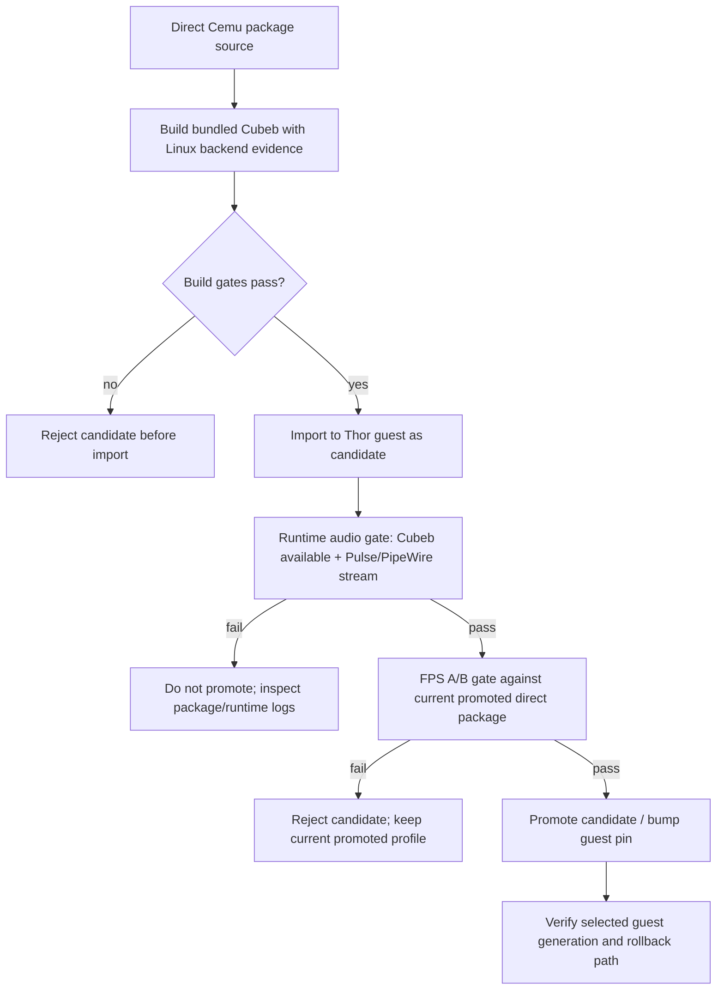

# fix: Restore Cemu Cubeb audio without regressing SM8550 performance

## Summary

Fix the SM8550 guest Cemu audio regression by making the existing direct ROCKNIX-style Cemu package expose a usable Cubeb Linux backend, then prove the fix through build evidence, runtime PipeWire/Pulse stream evidence, and BOTW FPS regression gates before promotion. The plan deliberately preserves the known-good custom Cemu performance posture and treats nixpkgs Cemu, host audio binds, and ROCKNIX Mesa passthrough as diagnostics only.

**Target repos:** this plan is stored in the `rocknix` repo, but implementation spans `rocknix-nix-guest` and `rocknix`. `nix-sm8550` appears to be a legacy package-only predecessor/mirror for this workflow and is not a deliverable for this fix. Paths in each implementation unit are repo-relative to the named target repo.

---

## Problem Frame

System audio in the Nix guest works through PipeWire/Pulse, but promoted Cemu remains silent: the Cemu Audio API dropdown is empty, logs show `Cubeb: not supported` / `can't create cubeb audio api`, and no Cemu sink-input appears. A generic/dynamic nixpkgs Cemu path has the right audio dependencies but previously crashed or regressed BOTW to about 1 FPS, so the fix must stay inside the direct custom Cemu package and validation envelope.

---

## Requirements

- R1. Cemu Settings > Audio API is populated on SM8550 guest builds; Cubeb initializes successfully instead of reporting unsupported.
- R2. BOTW creates a Pulse/PipeWire audio stream and emits audible sound through the guest-owned speaker sink.
- R3. The direct Cemu performance posture is preserved: pinned Cemu commit, bundled Cubeb, classic SDL2, package-owned wrapper, installed resources/gameProfiles, no dynamic `libcubeb`, and native Nix Mesa/Freedreno runtime.
- R4. The fix is auditable from package artifacts: build output must prove Pulse/ALSA backend support was compiled or linked into bundled Cubeb, and must fail if only `HAS_CUBEB` is present without a Linux backend.
- R5. Validation must block promotion on Cemu crashes, missing audio streams, stale guest service harness assumptions, or material FPS/frame-pacing regression against the current direct package baseline.
- R6. Existing user Cemu settings are migrated safely enough that stale `<Audio>` fields do not keep upgraded devices silent.
- R7. The validated package source and shipping pin/rootfs seed are kept in sync so the tested build is the one shipped to Thor/SM8550 devices.

---

## Scope Boundaries

- Do not replace the direct Cemu package with nixpkgs Cemu or add dynamic `libcubeb` to any shipping/product candidate. Dynamic `libcubeb` may be used only as a diagnostic comparison that cannot be promoted.
- Do not fix audio by binding host `/usr`, host `/lib`, host ALSA config, host PipeWire/Pulse sockets, or raw host `/run/udev` into the guest.
- Do not make ROCKNIX Mesa passthrough the product path; it remains diagnostic-only.
- Do not broaden this into a full Cemu runtime peelback or unrelated input/controller refactor.
- Do not change BOTW gameplay presets beyond what is needed to run repeatable validation.

### Deferred to Follow-Up Work

- A dedicated Cemu-only demotion command can be added later if full guest generation rollback is insufficient after this fix.
- Synchronizing the package-only `nix-sm8550` mirror is out of scope for this fix; current evidence shows `rocknix-nix-guest` is the authoritative shipping guest source consumed by ROCKNIX.
- Broad cleanup of remote Cemu campaign/host-control helpers that are not invoked by the audio/FPS promotion gate is deferred; update them later if they remain useful diagnostic surfaces.
- Longer-term cleanup or archival of the legacy package-only mirror should be handled separately if it continues to cause confusion.
- Bluetooth/headphone-specific audio routing polish is deferred until speaker output works reliably through the default Pulse sink.

---

## Context & Research

### Relevant Code and Patterns

- `rocknix-nix-guest` target repo:
  - `packages/cemu/package.nix` owns the direct ROCKNIX-style Cemu derivation, wrapper, runtime data assertions, and build evidence.
  - `packages/cemu/manifest.nix` pins Cemu source and ROCKNIX patches.
  - `packages/cemu/settings.SM8550.xml` seeds default SM8550 Cemu settings.
  - `modules/audio.nix` owns guest PipeWire, pipewire-pulse, WirePlumber, AYN Odin2 UCM, and `PULSE_SERVER=unix:/run/user/0/pulse/native`.
  - `profiles/main-space.nix` owns guest session environment, including Cemu launch environment and performance policy.
  - `launchers/start_cemu_guest.sh` normalizes `CEMU_BIN` to `bin/cemu` so the package wrapper owns Vulkan/runtime library setup.
  - `launchers/remote-cemu-*.sh` provide build fingerprinting, runtime A/B, live campaigns, cleanup, and promotion helpers.
  - `scripts/static-checks.sh` is the existing repo-level static gate for Cemu package shape and guest audio policy.
- `nix-sm8550` legacy context, not a target repo for this fix:
  - Its `README.md` describes a package-only boundary, while `rocknix-nix-guest/README.md` now owns guest profiles, package derivations, launch adapters, and rootfs outputs.
  - Its Cemu package currently matches the guest package file, but ROCKNIX host packaging fetches `simonwjackson/rocknix-nix-guest`, not `nix-sm8550`.
- `rocknix` target repo:
  - `projects/ROCKNIX/packages/tools/rocknix-guest-substrate/package.mk` pins the guest source/rootfs seed used by the host image.
  - `projects/ROCKNIX/packages/tools/rocknix-guest-substrate/system.d/rocknix-guest.service` owns the nspawn boundary and `/dev/snd` pass-through.
  - `projects/ROCKNIX/packages/tools/rocknix-guest-substrate/tests/guest-substrate-static-checks.sh` and `tests/guest-substrate-runtime-smoke.sh` guard substrate contracts.

### Institutional Learnings

- `rocknix-nix-guest/docs/solutions/performance-issues/rocknix-layer14-cemu-performance-audit-2026-05-09.md`: the winning Cemu path is the direct ROCKNIX-style Nix package with bundled Cubeb/classic SDL2/resources/Nix Vulkan loader/native Nix Mesa; generic nixpkgs Cemu and ROCKNIX Mesa passthrough are not product paths.
- `rocknix-nix-guest/docs/plans/2026-05-11-002-refactor-sm8550-guest-owned-audio-plan.md`: audio policy belongs in the guest; do not solve app audio with host ALSA/PipeWire binds.
- `rocknix-nix-guest/docs/solutions/runtime-errors/guest-pipewire-dummy-sink-missing-udev-sound-records-rocknix-2026-05-13.md`: `/dev/snd` alone is insufficient; staged udev and real WirePlumber sink visibility remain validation prerequisites.
- `rocknix-nix-guest/docs/plans/2026-05-11-001-refactor-cemu-guest-owned-runtime-peelback-plan.md`: package-owned facts, guest-session policy, and validation helpers must stay separated.
- `rocknix-nix-guest/docs/solutions/developer-experience/rocknix-stage10-generation-switch-proof-sm8550-2026-05-13.md`: selected/running guest generation is authoritative; source changes do not matter until the intended generation/rootfs is selected.

### External References

- Cemu commit `6f6c1299e29fa6e1062ae283a035b4ef787cc397` enables Cubeb via `ENABLE_CUBEB` but `HAS_CUBEB=1` does not prove Pulse/ALSA backend availability.
- Bundled Cubeb submodule `2071354a69aca7ed6df3b4222e305746c2113f60` defaults `LAZY_LOAD_LIBS=ON`; with headers present it compiles Pulse/ALSA backend sources and dlopens `libpulse.so.0` / `libasound.so.2` at runtime.
- Cubeb with `LAZY_LOAD_LIBS=OFF` uses pkg-config and direct `libpulse`/`libasound` linkage, making backend availability auditable through ELF `NEEDED` entries while still avoiding dynamic `libcubeb`.
- Nix packaging guidance for dlopen-based dependencies favors explicit runtime dependencies or scoped wrappers over global host library exposure.

---

## Key Technical Decisions

- Keep the direct package as the only product candidate: this preserves the known-good FPS path and avoids the nixpkgs Cemu crash/performance regression.
- Treat `HAS_CUBEB=1` as insufficient evidence: the build must prove at least one Linux backend is compiled/available, preferably Pulse with ALSA fallback.
- Prefer Cemu → bundled Cubeb → PulseAudio client API → `pipewire-pulse` for SM8550 speaker output; ALSA is fallback evidence, not the primary user-facing route.
- Evaluate direct-link Cubeb backend mode as the safer Nix default if it does not reintroduce the crash/performance issue; otherwise use lazy dlopen with explicit wrapper/library-path evidence and stronger runtime proof.
- Keep `bin/cemu` as the package-owned entry point; launching raw `bin/Cemu` remains diagnostic only because it bypasses package-owned Vulkan/audio runtime setup.
- Make remote validation harnesses service-name tolerant before trusting A/B results, because several scripts still reference `rocknix-guest-v2.service` while the host now uses `rocknix-guest.service`.
- Promote only after same-session audio and FPS evidence passes; package build success alone is not enough.

---

## Open Questions

### Resolved During Planning

- Should the fix use nixpkgs Cemu because it has audio dependencies? No. It is out of scope because it is the known crash/performance-risk path.
- Should audio be fixed through host binds? No. Existing Layer 14 audio plans make the guest the audio policy owner.
- Which runtime audio route should be validated first? Pulse via guest `pipewire-pulse`, because system audio and mpv already work there and Cubeb prefers Pulse on Linux.

### Deferred to Implementation

- Whether direct-link mode (`LAZY_LOAD_LIBS=OFF`) is stable on Thor: build evidence can be planned, but only runtime validation can prove it avoids the observed wx/GTK crash and FPS regression.
- Exact Cemu settings migration shape for all historical `settings.xml` variants: implementation should characterize current and backup copies before writing the narrowest safe patch.
- Exact FPS thresholds for final promotion: the implementer should compute them from the current promoted baseline in the same session, then apply the plan’s no-material-regression rule.

---

## High-Level Technical Design

> *This illustrates the intended approach and is directional guidance for review, not implementation specification. The implementing agent should treat it as context, not code to reproduce.*

---

## Implementation Units

### U1. Add Cubeb Linux backend build evidence and hard gates

**Goal:** Make the direct Cemu package fail early unless bundled Cubeb includes a usable Linux audio backend, and preserve enough artifacts to explain the selected backend mode.

**Requirements:** R1, R3, R4

**Dependencies:** None

**Files:**
- Modify (`rocknix-nix-guest`): `packages/cemu/package.nix`
- Modify (`rocknix-nix-guest`): `scripts/static-checks.sh`
- Test (`rocknix-nix-guest`): `scripts/static-checks.sh`

**Approach:**
- Characterize the current partial audio candidate first, including existing `libpulseaudio`/`alsa-lib` inputs and wrapper library-path behavior, before blessing or replacing it.
- Keep Cemu on the bundled Cubeb path; do not add nixpkgs `cubeb` as a build input and do not accept `NEEDED libcubeb`.
- Add package evidence that distinguishes “Cemu compiled with Cubeb API” from “Cubeb compiled with Pulse/ALSA backend sources.”
- Gate on build artifacts such as `CMakeCache.txt`, `build.ninja`, `compile_commands.json`, link lines, ELF dynamic entries, and string/symbol evidence so a backend-less Cubeb build cannot pass silently.
- Record backend mode in `nix-support/rocknix-cemu-build/manifest.txt` so later runtime reports can compare candidates without reverse-engineering the derivation.

**Execution note:** Start with characterization of the current promoted package evidence, then add failing package/static checks before changing the Cemu derivation.

**Patterns to follow:**
- Existing `readelf-dynamic.txt`, `cubeb-evidence.txt`, `manifest.txt`, and runtime data assertions in `packages/cemu/package.nix`.
- Existing grep-based static gates in `scripts/static-checks.sh`.

**Test scenarios:**
- Happy path: package evidence contains bundled Cubeb, no dynamic `libcubeb`, and explicit Pulse/ALSA backend evidence -> static checks pass.
- Error path: Cemu has `HAS_CUBEB=1` but no `cubeb_pulse`/`cubeb_alsa` evidence -> package build or static check fails with a backend-specific message.
- Error path: package accidentally links dynamic `libcubeb` -> package build fails before install output is accepted.
- Integration: package/static checks enforce the Cemu audio evidence contract in the authoritative guest repo.

**Verification:**
- Both target repos reject backend-less bundled Cubeb builds.
- Build artifacts explain whether the candidate uses direct-linked Pulse/ALSA or lazy dlopen backend resolution.
- No package gate allows a generic nixpkgs Cemu/cubeb substitution.

---

### U2. Implement the bundled Cubeb Pulse/ALSA package fix without changing the Cemu performance posture

**Goal:** Produce a Cemu package candidate whose Audio API list is non-empty because bundled Cubeb can initialize a Linux backend, while preserving the FPS-critical direct-package shape.

**Requirements:** R1, R2, R3, R4

**Dependencies:** U1

**Files:**
- Modify (`rocknix-nix-guest`): `packages/cemu/package.nix`
- Test (`rocknix-nix-guest`): `scripts/static-checks.sh`

**Approach:**
- Keep source commit, ROCKNIX patches, classic SDL2, bundled Cubeb, runtime resources, ELF `EXEC`, and package wrapper ownership unchanged.
- Add the narrow Pulse/ALSA build inputs needed by bundled Cubeb.
- Prefer an auditable package mode where Pulse/ALSA backend support is visible in build/ELF evidence; if direct linking reproduces the wx/GTK crash or FPS issue, fall back to lazy dlopen but require stronger wrapper/runtime proof.
- If keeping lazy dlopen, ensure the package wrapper’s runtime library path is correctly separated and scoped only to Cemu; do not rely on global shell state.
- Preserve `bin/cemu` as the supported entry point and ensure `start_cemu_guest.sh` continues to normalize diagnostic `CEMU_BIN` values to the wrapper when possible.

**Execution note:** Treat direct-link and lazy-dlopen modes as candidates that must pass the same runtime and FPS gates; do not promote based on package evidence alone.

**Patterns to follow:**
- Direct package replica logic in `packages/cemu/package.nix`.
- Package wrapper Vulkan-loader pattern already used for Cemu.
- Cemu launcher normalization in `launchers/start_cemu_guest.sh`.

**Test scenarios:**
- Happy path: built candidate keeps no `NEEDED libcubeb`, includes backend evidence, and launches through `bin/cemu` with a valid Vulkan loader path.
- Happy path: Cemu logs `Cubeb: available` and the Settings Audio API dropdown includes a selectable backend.
- Error path: wrapper path concatenation or missing runtime dependency prevents Vulkan or Cubeb backend discovery -> runtime gate fails and candidate is rejected.
- Error path: direct-linked Pulse/ALSA mode crashes at launch -> candidate is rejected without replacing the promoted baseline.
- Integration: importing the candidate into the Thor guest store and launching through `CEMU_BIN=<candidate>/bin/cemu` exercises the same wrapper path that promotion would use.

**Verification:**
- Candidate preserves direct-package fingerprints and adds usable audio backend evidence.
- No dynamic `libcubeb` appears.
- Cemu launches far enough to initialize Vulkan and audio without the backend-empty dropdown failure.

---

### U3. Add safe Cemu audio settings migration for upgraded devices

**Goal:** Prevent stale or experimental Cemu audio settings from keeping existing user state silent after the package backend is fixed.

**Requirements:** R1, R2, R6

**Dependencies:** U2

**Files:**
- Modify (`rocknix-nix-guest`): `launchers/start_cemu_guest.sh`
- Modify (`rocknix-nix-guest`): `launchers/cemu-storage-adapter.sh`
- Modify (`rocknix-nix-guest`): `packages/cemu/settings.SM8550.xml`
- Test (`rocknix-nix-guest`): `scripts/static-checks.sh`

**Approach:**
- Keep storage compatibility/migration in the guest adapter layer, not in the generic package derivation.
- Back up `settings.xml` before any migration.
- Normalize only audio fields needed for Cemu to choose the current default Pulse sink: API should target Cubeb once available, stale device IDs should not force an absent sink, and pad/input devices should remain conservative.
- Do not overwrite graphics packs, controller profiles, saves, shader caches, or BOTW-specific performance settings.

**Patterns to follow:**
- Existing `cemu-storage-adapter.sh` ownership of `/storage` compatibility.
- Existing `settings.SM8550.xml` as seed-only default, not a destructive user-state source.
- Current BOTW helper’s backup-before-mutation posture.

**Test scenarios:**
- Happy path: fresh missing settings file is seeded with Cubeb/default audio fields and existing Cemu state paths remain intact.
- Happy path: existing settings with stale `TVDevice` is backed up and narrowed to default-sink selection without changing graphics pack presets.
- Edge case: settings file has API `0` or empty/invalid device entries -> migration fixes only audio fields.
- Error path: settings file cannot be written -> launch aborts or logs a clear warning without deleting user state.
- Integration: after migration, Cemu no longer reports “failed to find selected device” for TV audio.

**Verification:**
- Existing BOTW saves/config paths remain untouched.
- A migrated settings file lets Cemu enumerate and select the Cubeb/default audio path.
- Backups make the migration reversible for manual recovery.

---

### U4. Repair validation harness drift and add audio-specific gates

**Goal:** Make the Cemu validation harness trustworthy for the current host service names and add first-class audio correctness checks alongside FPS checks.

**Requirements:** R2, R5

**Dependencies:** U1, U2

**Files:**
- Modify (`rocknix-nix-guest`): `launchers/remote-cemu-build-fingerprint.sh`
- Modify (`rocknix-nix-guest`): `launchers/remote-cemu-cleanup.sh`
- Modify (`rocknix-nix-guest`): `launchers/remote-cemu-runner.sh`
- Modify (`rocknix-nix-guest`): `launchers/remote-cemu-runtime-ab.sh`
- Modify (`rocknix-nix-guest`): `launchers/README.md`
- Test (`rocknix-nix-guest`): `scripts/static-checks.sh`

**Approach:**
- Replace hard-coded stale guest service names in the promotion-critical harness path with a configurable service variable defaulting to current `rocknix-guest.service`.
- Extend build fingerprint reports to include Cubeb backend evidence, `libpulse`/`libasound` evidence, package wrapper runtime path, and whether the candidate was launched through `bin/cemu` or raw `bin/Cemu`.
- Extend runtime A/B reports to capture `wpctl status`, `pactl info`, default sink, sink-inputs while Cemu is running, relevant Cemu audio log lines, and PipeWire/WirePlumber errors.
- Treat missing Cemu stream, `Cubeb: not supported`, `can't create cubeb audio api`, or `failed to find selected device` as validation failures for audio candidates.

**Patterns to follow:**
- Existing remote Cemu report directories under `/storage/.guest/runs/<timestamp>-...`.
- Existing exact-name cleanup and stale-window cleanup behavior.
- Existing build fingerprint report structure.

**Test scenarios:**
- Happy path: validation scripts resolve the current guest service by default and still allow an override for older images.
- Happy path: candidate run captures both FPS and audio evidence in the child run directory.
- Error path: guest has Dummy Output or no Pulse socket -> audio gate fails before promotion.
- Error path: Cemu runs but has no Pulse/PipeWire sink-input -> audio gate fails even if FPS is good.
- Integration: runtime A/B can compare current promoted Cemu vs candidate with identical profile, power, and session envelope.

**Verification:**
- Harness output is sufficient to answer “which package, which wrapper, which Cubeb backend, which sink, and what FPS?” from artifacts alone.
- Stale service names no longer invalidate validation on current Thor builds.

---

### U5. Run same-session audio and FPS promotion gates

**Goal:** Prove on Thor/bandai that the candidate fixes Cemu audio and does not regress BOTW performance before replacing the promoted package or shipping a new image/rootfs.

**Requirements:** R2, R3, R5

**Dependencies:** U2, U3, U4

**Files:**
- Create (`rocknix-nix-guest`): `launchers/remote-cemu-import.sh`
- Modify (`rocknix-nix-guest`): `launchers/remote-cemu-promote.sh`
- Modify (`rocknix-nix-guest`): `launchers/README.md`
- Test (`rocknix-nix-guest`): `scripts/static-checks.sh`

**Approach:**
- Provide a repeatable candidate-closure import path into the guest store without changing the current promoted profile; this may be a small helper around `nix-store --export/import` or an equivalent documented `nix copy` flow.
- Launch candidate through `CEMU_BIN=<candidate>/bin/cemu` and the normal guest Cemu launcher.
- Confirm runtime audio readiness first: real speaker sink, Pulse socket, Cubeb available, Cemu sink-input present, and user-audible BOTW sound.
- Run same-session current-vs-candidate A/B using an established BOTW profile and the performance helper’s affinity/power policy.
- Fail promotion on crash signatures, missing audio stream, visible severe slowdown, material FPS/frame-pacing regression, or inability to restore the previous Cemu profile.
- Promote only after evidence passes and no Cemu process is running.

**Patterns to follow:**
- `remote-cemu-promote.sh` profile-based rollback path.
- Cemu performance audit’s same-session A/B discipline.
- Stage/generation verification pattern from the generation switch proof docs.

**Test scenarios:**
- Happy path: candidate closure import is repeatable from a fresh build output, candidate produces audible BOTW audio, `pactl` shows a Cemu sink-input, and FPS metrics are within the accepted baseline envelope.
- Error path: candidate has audio but crashes or severely regresses FPS -> do not promote; current promoted package remains launchable.
- Error path: candidate has good FPS but no sink-input/audio -> do not promote.
- Error path: Cemu is running during promotion attempt -> promotion refuses or requires cleanup before changing the profile.
- Integration: after promotion, launching through the default promoted path uses the same wrapper/package that passed candidate validation.

**Verification:**
- The validation report contains package fingerprint, audio evidence, FPS comparison, crash-log scan, and cleanup proof.
- Current promoted package rollback remains available until the new path is proven.
- User confirms BOTW audio is audible after launch.

---

### U6. Sync source-of-truth and host shipping pins after validation

**Goal:** Ensure the validated Cemu/audio fix is the one shipped by the ROCKNIX host image and not just a manually imported candidate on Thor.

**Requirements:** R5, R7

**Dependencies:** U5

**Files:**
- Modify (`rocknix-nix-guest`): `packages/cemu/package.nix`
- Modify (`rocknix-nix-guest`): `scripts/static-checks.sh`
- Modify (`rocknix`): `projects/ROCKNIX/packages/tools/rocknix-guest-substrate/package.mk`
- Modify (`rocknix`): `projects/ROCKNIX/packages/tools/rocknix-guest-substrate/tests/guest-substrate-static-checks.sh`
- Test (`rocknix`): `projects/ROCKNIX/packages/tools/rocknix-guest-substrate/tests/guest-substrate-static-checks.sh`

**Approach:**
- Land the package fix in the authoritative guest repo first.
- Do not spend implementation time mirroring into `nix-sm8550`; document it as legacy/out of scope for this shipment if it comes up during review.
- Build/publish the guest rootfs seed from the validated guest source.
- Update the ROCKNIX host substrate pin/rootfs seed URL and SHA only after the runtime validation report identifies the same source/package output.
- Verify selected/running guest generation on Thor after image update or guest promotion.

**Patterns to follow:**
- Rootfs seed workflow documented in `rocknix-nix-guest/.github/workflows/build-rootfs-seed.yml`.
- Host pin variables in `projects/ROCKNIX/packages/tools/rocknix-guest-substrate/package.mk`.
- Existing host substrate static checks for pinned guest/rootfs integrity.

**Test scenarios:**
- Happy path: ROCKNIX host pin references the guest source/rootfs seed that contains the validated Cemu audio fix.
- Error path: host substrate pin SHA does not match the published rootfs seed -> static check fails.
- Error path: someone attempts to use `nix-sm8550` as the shipping source -> documentation points them back to `rocknix-nix-guest` as authoritative for this shipment.
- Integration: after update/reboot, the live guest generation resolves to the expected source and Cemu still passes the audio/FPS smoke gate.

**Verification:**
- Source, rootfs seed, host pin, and live selected guest generation all point at the validated fix.
- There is a repeatable path from repo commit to Thor runtime behavior.

---

## System-Wide Impact

- **Interaction graph:** Cemu package wrapper feeds runtime library visibility into `start_cemu_guest.sh`; `start_cemu_guest.sh` relies on guest session env from `profiles/main-space.nix`; audio services come from `modules/audio.nix`; host substrate only supplies `/dev/snd` and staged udev.
- **Error propagation:** Package backend failures should fail the build or validation report, not silently become an empty Cemu dropdown. Runtime audio failures should block promotion, not full guest boot.
- **State lifecycle risks:** `settings.xml` migration can affect existing users; backups and narrow audio-only edits are required. Promotion must not occur while Cemu is running.
- **API surface parity:** `CEMU_BIN` diagnostic override, promoted profile path, and remote validation scripts must all launch the package wrapper consistently.
- **Integration coverage:** Unit/static checks cannot prove sound; runtime validation must include Cemu logs, Pulse/PipeWire stream visibility, and user-audible confirmation.
- **Unchanged invariants:** The host remains recovery/substrate owner only; guest owns audio policy; Cemu package owns generic runtime evidence; BOTW helper remains a validation workload and preset selector.

---

## Risks & Dependencies

| Risk | Mitigation |
|------|------------|
| Direct-linked Pulse/ALSA backend reproduces wx/GTK crash or performance regression | Treat backend mode as a candidate; require launch/audio/FPS gates before promotion and keep current promoted profile intact. |
| Lazy dlopen mode compiles Pulse/ALSA but cannot find libraries at runtime | Add scoped wrapper/runtime evidence and sink-input validation; reject candidate if Cemu logs backend failure. |
| Build evidence proves Cubeb API but not backend support | Gate on backend-specific objects/defines/strings or ELF evidence, not `HAS_CUBEB` alone. |
| Existing bad audio settings keep upgraded devices silent | Add backup-preserving audio-only settings migration. |
| Validation harness references stale service names | Make guest service configurable and default to `rocknix-guest.service` before trusting reports. |
| Audio fix validates manually but does not ship | Sync guest source/rootfs seed and ROCKNIX host pin only after validation identifies the matching package output. |
| FPS gates are noisy due to thermal/power differences | Use same-session A/B with existing power/affinity helper and include thermal/process evidence in reports. |

---

## Documentation / Operational Notes

- Update Cemu launcher documentation with the audio validation gate and backend evidence interpretation.
- Record final Thor validation artifacts under `/storage/.guest/runs/` and reference them in the PR/commit notes.
- Keep rollback instructions explicit: current promoted profile or full guest generation rollback remains available until the new package is proven after reboot.
- If the final accepted solution uses lazy dlopen instead of direct linking, document why direct linking was rejected and what runtime evidence replaces ELF `NEEDED` proof.

---

## Sources & References

- Related code (`rocknix-nix-guest`): `packages/cemu/package.nix`
- Related code (`rocknix-nix-guest`): `modules/audio.nix`
- Related code (`rocknix-nix-guest`): `launchers/start_cemu_guest.sh`
- Related code (`rocknix-nix-guest`): `launchers/remote-cemu-runtime-ab.sh`
- Legacy context (`nix-sm8550`, not a target for this fix): `packages/cemu/package.nix`
- Related code (`rocknix`): `projects/ROCKNIX/packages/tools/rocknix-guest-substrate/package.mk`
- Related learning: `rocknix-nix-guest/docs/solutions/performance-issues/rocknix-layer14-cemu-performance-audit-2026-05-09.md`
- Related plan: `rocknix-nix-guest/docs/plans/2026-05-11-002-refactor-sm8550-guest-owned-audio-plan.md`
- Related learning: `rocknix-nix-guest/docs/solutions/runtime-errors/guest-pipewire-dummy-sink-missing-udev-sound-records-rocknix-2026-05-13.md`
- External source: Cemu `6f6c1299e29fa6e1062ae283a035b4ef787cc397` CMake/Cubeb integration
- External source: Cubeb submodule `2071354a69aca7ed6df3b4222e305746c2113f60` backend selection and `LAZY_LOAD_LIBS` behavior
