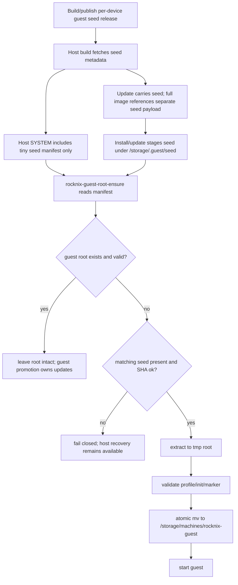

# fix: Move SM8550 guest seeds out of SYSTEM for offline installs

## Summary

Keep SM8550 host images and update tarballs within the 2GB `/flash/SYSTEM` budget by removing the multi-GB NixOS guest rootfs seed from the immutable host squashfs. Instead, ship a small seed manifest in `SYSTEM`, stage the real seed as a tier-2 offline payload under `/storage/.guest/seed/` via update tar or manual full-image install, and have `rocknix-guest-root-ensure` verify and consume that local seed before starting the guest.

---

## Problem Frame

The `7145959382` build succeeded but produced a `SYSTEM` payload around 2.9GB because it embedded `guest-rootfs-seed.tar.zst` in `/usr/lib/rocknix-guest-substrate/`. Sobo's `/flash` partition is 2GB, so the update flow correctly refused the install, and the full image artifact also could not contain a valid `SYSTEM` file. The seed must remain available offline, but it cannot live inside `SYSTEM`.

---

## Requirements

- R1. The SM8550 host `SYSTEM` image must stay below the existing 2GB `/flash` partition limit.
- R2. First boot on a device with wiped/missing `/storage/machines/rocknix-guest` must work without network when a matching local seed payload is present.
- R3. Update-tar installs must be able to stage a tier-2 seed payload into `/storage` before the initramfs cleanup removes `/storage/.update` contents.
- R4. Full-image installs must provide a documented offline path for placing the tier-2 seed payload where first boot can consume it.
- R5. `rocknix-guest-root-ensure` must verify the local seed against a host-shipped manifest before extraction, then keep the existing atomic tmp-root validation and activation behavior.
- R6. Existing valid guest roots must not be destructively overwritten just because a newer seed exists; reseeding an existing root must require explicit operator intent.
- R7. Missing, partial, mismatched, or corrupt seed payloads must fail closed into host-recoverable state rather than starting a broken guest or boot-looping.
- R8. The design must support per-device SM8550 seeds, at least Thor and Odin2Portal, without accidentally applying an Odin2Portal seed on Thor.
- R9. Static and runtime checks must prevent regressions that re-embed the seed in `SYSTEM`, skip seed verification, or let update cleanup delete the staged seed.

---

## Scope Boundaries

- Do not resize `/flash`, change the partition table, or require users to repartition existing devices.
- Do not rely on network availability for the primary first-boot path.
- Do not place multi-GB rootfs seed payloads under `${INSTALL}` or anywhere that is packed into `SYSTEM`.
- Do not make the root ensure service build the guest from source.
- Do not make guest promotion responsible for first-boot seeding; promotion still updates an already bootable guest.
- Do not silently wipe an existing valid guest root during normal update.

### Deferred to Follow-Up Work

- Shrinking the NixOS guest closure itself: still valuable, but not required to unblock update/full-image size limits.
- Fully automated full-image storage-partition prepopulation: this plan supports the hooks and local seed path first; installer UX can be improved separately.
- Publishing a Thor rootfs seed release: required before installing on Bandai/Thor, but separate from the host staging mechanism.

---

## Context & Research

### Relevant Code and Patterns

- `projects/ROCKNIX/packages/tools/rocknix-guest-substrate/package.mk` currently fetches guest source and rootfs seed material, SHA-verifies them, and installs substrate files into `SYSTEM`.
- `projects/ROCKNIX/packages/tools/rocknix-guest-substrate/scripts/rocknix-guest-root-ensure` already supports compressed seed archives and atomically seeds `/storage/machines/rocknix-guest` through a tmp root.
- `projects/ROCKNIX/packages/tools/rocknix-guest-substrate/system.d/rocknix-guest-root-ensure.service` runs before guest startup, requires `/storage` and `/flash`, and is recovery-gated by `rocknix.safe=1` and `/flash/rocknix.no-nspawn`.
- `projects/ROCKNIX/packages/sysutils/busybox/scripts/init` owns update application in initramfs, AVFS-mounts update tarballs read-only under `/storage/.update/.tmp/avfs/.../target`, and deletes `/storage/.update/*` during cleanup.
- `scripts/image` creates update tar artifacts from `target/` and builds the full image payload.
- `projects/ROCKNIX/packages/tools/rocknix-guest-substrate/tests/guest-substrate-static-checks.sh` is the main contract gate for substrate shell/unit behavior.
- `projects/ROCKNIX/packages/tools/rocknix-guest-substrate/tests/guest-substrate-runtime-smoke.sh` is the on-device smoke gate.
- `packages/mediacenter/LibreELEC-settings/scripts/factory-reset` hard reset deletes or reformats `/storage`; any seed stored only in `/storage` is not expected to survive hard reset.

### Institutional Learnings

- SM8550 is now a single thin-host product shape: host is recovery/update/container substrate; guest owns the product surface.
- Recovery inputs are intentionally limited to `/flash/rocknix.no-nspawn` and `rocknix.safe=1`; the early target generator owns target selection.
- The guest source of truth lives in `rocknix-nix-guest`; host contracts are copied from that repo at build time.
- Prior rootfs seed publishing already split large GitHub release assets and verified the reassembled SHA.
- Sobo demonstrated the failure mode: the update tar's `SYSTEM` grew to about 2.9GB and initramfs refused it because `/flash` is 2GB.

### External References

- None needed. This plan is driven by local ROCKNIX boot/update constraints and GitHub release asset behavior already observed in this workflow.

---

## Key Technical Decisions

- **Use a tier-1 manifest in `SYSTEM`, not a tier-1 seed payload.** The host image needs only enough immutable information to identify and verify the correct tier-2 seed: revision, device/compatible selector, filename, size, SHA256, and release/source metadata.
- **Use `/storage/.guest/seed/` as the canonical tier-2 staging area.** `/storage/.guest` is already the explicit host/guest control seam, is writable, is not swept by initramfs update cleanup, and is already used by substrate promotion/import state. The seed path remains host-owned even though it sits under the seam.
- **Use runtime compatible-string dispatch for per-device seeds.** The tier-1 manifest should enumerate compatible-string entries, and `rocknix-guest-root-ensure` should read `/proc/device-tree/compatible` to select the matching staged seed. This avoids adding a host build matrix axis for Thor vs Odin2Portal.
- **Let SM8550 update tarballs carry the seed under `target/seed/`, then hoist it before writing `SYSTEM`.** The initramfs should AVFS-mount the update tar, verify the seed from the mounted `target/seed/` path, copy it into `/storage/.guest/seed/`, and only then write the new `SYSTEM`; otherwise a crash between `SYSTEM` write and seed staging can leave a new host looking for a missing seed.
- **Do not consume a newer seed over an existing valid guest root unless explicitly requested.** Normal update should stage the seed for future recovery/fresh-root tests but leave the running persistent root to the promotion path.
- **Verify seed bytes at consumption time.** Once the seed is stored in writable `/storage`, SHA verification must happen in `rocknix-guest-root-ensure` immediately before extraction, not only during CI or package build.
- **Treat hard factory reset as destructive to the local seed.** Because hard reset reformats or deletes `/storage`, recovery documentation must state that a local seed must be re-copied after hard reset unless the full installer later learns to prepopulate storage again.

---

## Open Questions

### Resolved During Planning

- Should first boot depend on network? No. Host networking is not guaranteed before the guest exists, and Tailscale is guest-owned.
- Should `/flash/SYSTEM` be resized? No. That would be destructive, device-specific, and incompatible with existing update assumptions.
- Should the full seed remain in `SYSTEM` compressed? No. Even compressed, the Odin2Portal seed makes `SYSTEM` exceed the 2GB partition.
- Should `/storage/.update` be the long-lived seed location? No. Initramfs cleanup deletes that directory after successful update.

### Deferred to Implementation

- Exact manifest format: JSON is preferred for extensibility, but the implementer may choose shell-readable key/value if it keeps busybox parsing safer.
- Exact full-image installer hook: implementation should inspect current image/install tooling and choose the smallest path that can copy a seed into `/storage/.guest/seed/` or document manual two-file install.

---

## High-Level Technical Design

> *This illustrates the intended approach and is directional guidance for review, not implementation specification. The implementing agent should treat it as context, not code to reproduce.*

---

## Implementation Units

### U1. Replace embedded seed payload with a manifest-only host contract

**Goal:** Keep `SYSTEM` small by removing the copied `guest-rootfs-seed.tar.zst` from `${INSTALL}` while preserving immutable metadata needed to verify a local tier-2 seed.

**Requirements:** R1, R5, R8, R9

**Dependencies:** None

**Files:**
- Modify: `projects/ROCKNIX/packages/tools/rocknix-guest-substrate/package.mk`
- Modify: `projects/ROCKNIX/packages/tools/rocknix-guest-substrate/tests/guest-substrate-static-checks.sh`

**Approach:**
- Keep build-time seed URL/SHA variables so CI can validate the published seed when desired, but do not copy the seed archive into `${INSTALL}`.
- Install a small manifest under `/usr/lib/rocknix-guest-substrate/` that records each supported compatible string, expected seed revision, SHA256, size if known, filename, and source URL(s).
- Preserve fail-closed behavior for missing seed pins; a host build should not ship without knowing what seed it expects.
- Invert the current static-check expectation that requires `guest-rootfs-seed.tar.zst` in the host package: checks should reject any `package.mk` line that copies `guest-rootfs-seed*` into `${INSTALL}` and should require manifest-only metadata instead.

**Patterns to follow:**
- Existing SHA verification and placeholder fail-closed checks in `package.mk`.
- Existing grep/order assertions in `guest-substrate-static-checks.sh`.

**Test scenarios:**
- Happy path: `package.mk` installs seed manifest metadata and does not install `guest-rootfs-seed.tar.zst` into `${INSTALL}`.
- Error path: placeholder seed SHA or missing seed URL metadata still fails static checks/build contract.
- Error path: any future `cp` of the seed tarball into `/usr/lib/rocknix-guest-substrate/` is rejected by static checks.
- Integration: full SM8550 image build produces a `SYSTEM` small enough to fit the 2GB `/flash` partition.

**Verification:**
- Static checks pass and prove manifest-only packaging.
- The generated `SYSTEM` no longer contains a multi-GB seed archive.

### U2. Teach root ensure to consume verified tier-2 seeds from `/storage/.guest/seed/`

**Goal:** Let first boot seed the guest root from a local offline payload outside `SYSTEM`, while preserving the existing atomic activation and recovery-safe failure behavior.

**Requirements:** R2, R5, R6, R7, R8, R9

**Dependencies:** U1

**Files:**
- Modify: `projects/ROCKNIX/packages/tools/rocknix-guest-substrate/scripts/rocknix-guest-root-ensure`
- Modify: `projects/ROCKNIX/packages/tools/rocknix-guest-substrate/tests/guest-substrate-static-checks.sh`
- Modify: `projects/ROCKNIX/packages/tools/rocknix-guest-substrate/tests/guest-substrate-runtime-smoke.sh`

**Approach:**
- Add an env-overridable tier-2 seed directory, defaulting to `/storage/.guest/seed`.
- Replace the default seed archive path under `/usr/lib/rocknix-guest-substrate/` with manifest-driven lookup of `/storage/.guest/seed/<expected-filename>`; retain env overrides for fixtures and manual diagnostics.
- Read `/proc/device-tree/compatible`, match it against the host-shipped manifest, resolve the expected seed file, and verify SHA256 before extraction.
- Preserve current behavior when `/storage/machines/rocknix-guest` is already valid: validate and exit rather than reseeding. U5 owns explicit reseed mechanics.
- Keep symlink, mountpoint, lock, tmp marker, profile, `/init`, and `/sbin/init` validation unchanged.

**Patterns to follow:**
- Existing `seed_guest_root`, `validate_rootfs`, `cleanup_stale_helper_temps`, and lock handling in `rocknix-guest-root-ensure`.
- Existing env-override style in substrate scripts so tests can use temporary fixtures.

**Test scenarios:**
- Happy path: with missing guest root and matching seed in `/storage/.guest/seed`, root ensure verifies SHA, extracts to tmp, validates, and activates root.
- Happy path: with existing valid guest root and newer staged seed, root ensure exits without modifying the root because U5 owns explicit reseed.
- Error path: missing seed file produces a clear failure and leaves no activated partial root.
- Error path: SHA mismatch prevents extraction and leaves the staged seed untouched for diagnosis.
- Error path: archive extracts but rootfs lacks `/nix`, selected profile, or executable init; activation does not happen.
- Edge case: interrupted prior extraction with owned in-progress marker is cleaned; unowned temp path is refused.
- Integration: runtime smoke can report whether tier-2 seed is present, missing, consumed, or mismatched.

**Verification:**
- Fixture tests cover archive seeding from `/storage/.guest/seed`.
- Existing root preservation is proven so normal updates do not wipe user guest state.

### U3. Add update-tar tier-2 seed staging before SYSTEM write

**Goal:** Allow update tarballs to carry an offline seed payload and stage it into `/storage/.guest/seed/` before initramfs writes the new `SYSTEM` and before `/storage/.update` cleanup runs.

**Requirements:** R1, R3, R5, R7, R8, R9

**Dependencies:** U1

**Files:**
- Modify: `scripts/image`
- Modify: `projects/ROCKNIX/packages/sysutils/busybox/scripts/init`
- Modify: `projects/ROCKNIX/packages/tools/rocknix-guest-substrate/tests/guest-substrate-static-checks.sh`

**Approach:**
- Extend SM8550 update artifact generation so the update tar includes the seed payload under `target/seed/`, making it reachable after the existing AVFS update flow rebinds `UPDATE_DIR` to the mounted `target/` directory.
- Extend `check_update` with this exact order: AVFS-mount the update tar, verify the seed under `${UPDATE_DIR}/seed/`, ensure `/storage` has at least the staged seed size free while the source tar is still present, copy the seed into `/storage/.guest/seed/`, then write the new `SYSTEM` to `/flash`, then run normal cleanup.
- Ensure initramfs cleanup never deletes the already-hoisted seed; the source tar under `/storage/.update` can still be deleted normally.
- Keep compatibility checks and MD5 checks for `KERNEL`/`SYSTEM` unchanged.

**Patterns to follow:**
- Existing initramfs update ordering and cleanup in `projects/ROCKNIX/packages/sysutils/busybox/scripts/init`.
- Existing update tar creation in `scripts/image`.

**Test scenarios:**
- Happy path: update tar with seed payload under `target/seed/` stages seed to `/storage/.guest/seed/`, verifies it, writes `SYSTEM`, and cleanup leaves staged seed intact.
- Error path: seed SHA mismatch aborts before writing the new `SYSTEM`.
- Error path: insufficient `/storage` space for seed staging aborts before writing the new `SYSTEM`.
- Error path: update tar without required SM8550 seed metadata fails clearly or follows an explicit compatibility rule.
- Integration: static checks prove seed staging occurs before `update_file System` and before cleanup.

**Verification:**
- An SM8550 update tar no longer contains an oversized `SYSTEM` and carries the seed payload under `target/seed/`.
- Update failure modes preserve the currently bootable host image.

### U4. Support offline full-image/two-file install flow

**Goal:** Provide a practical full-install path where the host image stays small and the user can supply the seed locally without network.

**Requirements:** R2, R4, R5, R7, R8

**Dependencies:** U1, U2

**Files:**
- Modify: `scripts/image`
- Modify: `scripts/mkimage`
- Modify: `projects/ROCKNIX/packages/tools/rocknix-guest-substrate/tests/guest-substrate-static-checks.sh`

**Approach:**
- Keep the full host image valid without embedding the seed in the FAT `/flash` partition; artifact publication and pairing lives in U7.
- Make the expected manual install location unambiguous: `/storage/.guest/seed/<manifest-expected-name>.tar.zst` plus any sidecar needed by the manifest.
- If the full-image creation path can prepopulate the storage partition safely, add that hook; otherwise explicitly document the two-file install as the supported first step.
- Keep missing-seed behavior recoverable: host SSH/recovery should come up and report the missing seed rather than producing an invalid image artifact or broken `SYSTEM`.
**Patterns to follow:**
- Existing GitHub artifact naming for `ROCKNIX-image-*` and `ROCKNIX-update-*`.
- Existing rootfs seed release assets from `rocknix-nix-guest`.

**Test scenarios:**
- Happy path: full image artifact contains a valid `SYSTEM` file under 2GB.
- Happy path: after flashing full image and copying seed to `/storage/.guest/seed`, first boot seeds guest root offline.
- Error path: full image without seed boots host recovery/SSH and reports missing seed clearly.
- Integration: full-image install documentation points at the same manifest-selected seed filename and `/storage/.guest/seed/` location used by update installs.

**Verification:**
- The generated full image can be inspected and contains `KERNEL` and `SYSTEM`.
- The generated image does not depend on network to seed when a local seed is present.

### U5. Add explicit reseed and stale-root policy

**Goal:** Prevent stale `/storage` from hiding first-boot bugs while also preventing normal updates from destructively overwriting a valid guest root.

**Requirements:** R2, R6, R7, R9

**Dependencies:** U2

**Files:**
- Modify: `projects/ROCKNIX/packages/tools/rocknix-guest-substrate/scripts/rocknix-guest-root-ensure`
- Modify: `projects/ROCKNIX/packages/tools/rocknix-guest-substrate/scripts/rocknix-guest-activation-audit`
- Modify: `projects/ROCKNIX/packages/tools/rocknix-guest-substrate/tests/guest-substrate-static-checks.sh`
- Modify: `projects/ROCKNIX/packages/tools/rocknix-guest-substrate/tests/guest-substrate-runtime-smoke.sh`

**Approach:**
- Define a clear operator-controlled reseed trigger: `/flash/rocknix.reseed-guest` for devices and an env override for tests. Operators create the `/flash` flag explicitly from recovery/SSH after remounting `/flash` writable.
- When reseed is requested, require guest service to be inactive, verify the seed first, stage a replacement root separately, validate it, rename the previous root to `<root>.previous`, activate the new root atomically, and clear `/flash/rocknix.reseed-guest` only after success.
- If the replacement validates but the old root cannot be moved aside, fail closed and leave the old root active.
- Make audit output show current guest root revision, seed-complete revision, manifest expected revision, staged seed status, and reseed flag status.
- Do not treat a post-promotion root as stale merely because its original seed-complete marker is older than the current manifest.

**Patterns to follow:**
- Read-only posture of `rocknix-guest-activation-audit`.
- Existing manual hold files under `/storage/.guest`.

**Test scenarios:**
- Happy path: explicit reseed flag on a stopped guest replaces a valid old root with a validated new root.
- Error path: reseed flag while guest is active is refused.
- Error path: reseed candidate validates poorly and the original root remains available.
- Edge case: promoted guest revision newer than seed marker is not falsely considered stale.
- Integration: audit reports seed/root state without mutating anything.

**Verification:**
- Operators have a supported clean-root test path without wiping unrelated `/storage` data.
- Normal update leaves existing roots intact.

### U6. Refresh recovery and install documentation

**Goal:** Make the new two-tier layout understandable from device recovery without relying on conversation history.

**Requirements:** R4, R7, R8

**Dependencies:** U1, U2, U3, U4, U5

**Files:**
- Modify: `documentation/PER_DEVICE_DOCUMENTATION/SM8550/README.md` or create a focused SM8550 seed note under `documentation/PER_DEVICE_DOCUMENTATION/SM8550/`
- Modify in `rocknix-nix-guest`: `docs/contracts/HOW-TO-FALL-BACK.md`
- Modify in `rocknix-nix-guest`: `README.md`
- Modify: `projects/ROCKNIX/packages/tools/rocknix-guest-substrate/tests/guest-substrate-static-checks.sh` if new copied-doc assertions are required

**Approach:**
- Document the two-file offline install/update flow, including where to copy seed payloads and how to verify the expected SHA.
- Document the failure mode: missing seed means host should remain recoverable, but guest will not start.
- Document Thor vs Odin2Portal seed selection so users do not install a seed for the wrong SM8550 device.
- Update fallback docs in `rocknix-nix-guest` because host image copies those docs from the guest source.
- Land guest-repo documentation changes first, then bump `PKG_NIX_GUEST_REV`/SHA in the host before enabling any static check that requires those copied docs.

**Patterns to follow:**
- Existing copied contract docs from `rocknix-nix-guest/docs/contracts/`.
- Existing SM8550 per-device docs.

**Test scenarios:**
- Test expectation: documentation review plus optional static-check assertions for required copied docs once the host is bumped to a guest revision containing them.

**Verification:**
- A recovery SSH user can identify expected seed path, expected SHA, and safe reseed/recovery steps from on-device docs.

### U7. Update CI and artifact gates for split host/seed delivery

**Goal:** Ensure CI proves the host artifact is installable and the seed artifact is available without reintroducing the over-2GB `SYSTEM` regression.

**Requirements:** R1, R3, R4, R8, R9

**Dependencies:** U1, U3, U4

**Files:**
- Modify: `.github/workflows/build-nightly.yml`
- Modify: `.github/workflows/build-aarch64.yml`
- Modify: `.github/workflows/build-aarch64-image.yml`
- Modify: `.github/workflows/build-image-only.yml`
- Modify: `projects/ROCKNIX/devices/SM8550/options`
- Modify: `projects/ROCKNIX/packages/tools/rocknix-guest-substrate/tests/guest-substrate-static-checks.sh`

**Approach:**
- Declare an SM8550 host image budget such as `SM8550_FLASH_PARTITION_BUDGET_MIB=1900` in `projects/ROCKNIX/devices/SM8550/options` and have CI fail if generated `SYSTEM` is missing or exceeds that budget.
- Publish or reference the matching tier-2 seed artifact clearly alongside the host artifacts; update-tar artifacts should carry the seed under `target/seed/`, while full-image artifacts should point to the separate seed asset/manual staging path.
- Keep PR/static checks manifest-only where possible; reserve multi-GB seed download verification for release/nightly paths that need end-to-end proof.
- If the fast-iteration CI path has file-based allowlists, block it for the specific initramfs update, image layout, and seed staging files touched here unless its artifact checks are intentionally expanded.

**Patterns to follow:**
- Existing build integrity gates in `.github/workflows/build-nightly.yml` and `.github/workflows/build-image-only.yml`.
- Existing rootfs seed release workflow in `rocknix-nix-guest`.

**Test scenarios:**
- Happy path: CI fails if the full image artifact lacks `SYSTEM`.
- Happy path: CI fails if `SYSTEM` exceeds the configured SM8550 partition budget.
- Error path: CI fails if an SM8550 host artifact lacks seed manifest metadata.
- Error path: CI fails if a seed artifact is present but does not match the manifest SHA.

**Verification:**
- The artifact list makes it obvious which host image/update pairs with which guest seed.
- Future over-size images fail before anyone attempts to install them.

---

## System-Wide Impact

- **Interaction graph:** The change crosses build packaging (`package.mk`), update tar/image creation (`scripts/image`, `scripts/mkimage`), initramfs update application (`busybox/scripts/init`), first-boot seeding (`rocknix-guest-root-ensure`), recovery docs, and CI artifact validation.
- **Error propagation:** Seed staging errors during update must abort before writing `SYSTEM`; seed consumption errors during boot must prevent guest startup but leave host recovery available.
- **State lifecycle risks:** `/storage/.update` is temporary and swept; `/storage/.guest/seed` is persistent across normal updates but not hard factory reset; `/storage/machines/rocknix-guest` remains the authoritative guest root.
- **API surface parity:** Any device-specific seed manifest must align with the guest repo's device-profile/compatible dispatch so Thor and Odin2Portal cannot drift.
- **Integration coverage:** Unit-style shell fixtures are not enough; at least one update artifact inspection and one wiped-root on-device or image-root smoke should validate the cross-layer flow.
- **Unchanged invariants:** Recovery flags remain `/flash/rocknix.no-nspawn` and `rocknix.safe=1`; guest promotion remains separate from first-boot seeding; existing valid guest roots are not replaced by default.

---

## Risks & Dependencies

| Risk | Mitigation |
|------|------------|
| Tier-2 seed is staged after `SYSTEM`, leaving a new host without matching seed after power loss | AVFS-mount update tar, verify/copy seed into `/storage/.guest/seed`, then write `SYSTEM` |
| AVFS teardown or `/storage/.update` cleanup happens before seed hoist | Hoist seed out of `${UPDATE_DIR}/seed/` while AVFS is still mounted and statically assert ordering |
| `/storage` lacks temporary headroom because the update tar and staged seed coexist until cleanup | Check free space is at least the seed size before copying the seed to `/storage/.guest/seed/` |
| Wrong device seed is consumed | Manifest must encode device/compatible identity and root ensure must match before extraction |
| Existing guest root hides fresh-seed bugs | Add explicit reseed flag and validation workflow for clean-root tests |
| Hard factory reset removes `/storage/.guest/seed` | Document this as destructive and require re-copying the seed or a future storage-prepopulation installer enhancement |
| Multi-GB seed checks slow every PR | Keep PR/static checks manifest-only; run full seed byte verification on release/nightly artifact paths |
| Full image artifact appears successful but lacks `SYSTEM` | Add artifact inspection gate for `SYSTEM` presence and size |

---

## Documentation / Operational Notes

- Sobo/Odin2Portal should use the Odin2Portal seed; Bandai/Thor must wait for a Thor seed or per-device manifest support.
- Update tar is no longer a single self-contained `/flash` payload for SM8550; it either carries or is paired with a tier-2 seed payload staged into `/storage`.
- For data-preserving updates, existing `/storage/machines/rocknix-guest` remains intact; the staged seed is for missing-root/reseed/fresh-install cases.
- For clean validation, operators should either wipe only `/storage/machines/rocknix-guest` with a matching seed staged, or use the explicit reseed flag once implemented.

---

## Alternative Approaches Considered

- **Keep seed compressed in `SYSTEM`:** rejected because the compressed Odin2Portal seed makes `SYSTEM` exceed sobo's 2GB `/flash` partition.
- **Download seed on first boot:** rejected as the primary path because host network is not guaranteed and Tailscale is guest-owned.
- **Resize `/flash`:** rejected because it is destructive, device-specific, and incompatible with the existing update fleet.
- **Shrink the guest closure first:** useful long-term, but too uncertain to be the immediate solution for an update-blocking partition limit.
- **Use `/storage/.update` as persistent seed storage:** rejected because initramfs cleanup deletes it after update.

---

## Success Metrics

- SM8550 `SYSTEM` remains comfortably below 2GB after host build.
- Full image artifact contains both `KERNEL` and `SYSTEM` and passes size inspection.
- Update tar install on sobo no longer fails at `Checking size: FAILED` due to seed bloat.
- Wiped guest root plus staged matching seed boots into the Odin2Portal guest without network.
- Missing or mismatched seed leaves host SSH recovery available with clear logs.

---

## Sources & References

- Related code: `projects/ROCKNIX/packages/tools/rocknix-guest-substrate/package.mk`
- Related code: `projects/ROCKNIX/packages/tools/rocknix-guest-substrate/scripts/rocknix-guest-root-ensure`
- Related code: `projects/ROCKNIX/packages/sysutils/busybox/scripts/init`
- Related code: `scripts/image`
- Related code: `packages/mediacenter/LibreELEC-settings/scripts/factory-reset`
- Related test: `projects/ROCKNIX/packages/tools/rocknix-guest-substrate/tests/guest-substrate-static-checks.sh`
- Related test: `projects/ROCKNIX/packages/tools/rocknix-guest-substrate/tests/guest-substrate-runtime-smoke.sh`
- Guest source repo: `rocknix-nix-guest/docs/contracts/HOW-TO-FALL-BACK.md`
