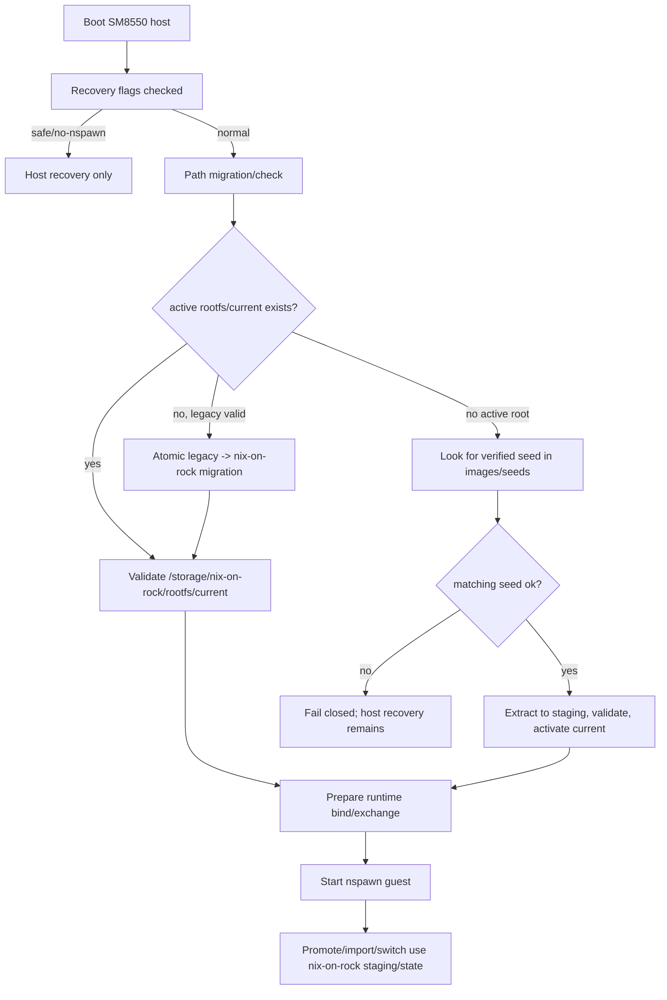

# refactor: Establish nix-on-rock storage contract

## Summary

Replace the prototype-shaped SM8550 storage seam (`/storage/.guest` plus `/storage/machines/rocknix-guest`) with a deliberate, visible `/storage/nix-on-rock` contract. The plan keeps the working thin-host/guest architecture intact while introducing a safe migration path, preserving recovery flags, and tightening tests/docs around path ownership.

---

## Problem Frame

The SM8550 custom build now works: the ROCKNIX host boots, stages offline guest seeds, starts the NixOS main system, and remains recoverable over SSH. The remaining problem is architectural hygiene: the host/guest seam still exposes prototype names and mixed-purpose directories that make the product contract harder to reason about and easier to regress.

---

## Requirements

- R1. The durable host↔Nix main-system storage contract must use a visible, intentional root under `/storage/nix-on-rock`.
- R2. The new layout must separate active rootfs data, image/seed artifacts, operator requests, observed state, and transient staging.
- R3. Existing devices with `/storage/machines/rocknix-guest` and `/storage/.guest` must migrate without reseeding, data loss, or generation loss.
- R4. Fresh installs with only a staged offline seed must still boot without network and fail closed when the seed is missing, corrupt, or incompatible.
- R5. Normal updates must continue to stage rootfs seeds before writing `SYSTEM`, while preserving the in-the-wild update-tar `target/seed/` payload contract.
- R6. Recovery affordances must remain stable: `/flash/rocknix.no-nspawn`, `rocknix.safe=1`, and `/flash/rocknix.reseed-guest` stay valid.
- R7. The host must preserve the single intentional host↔guest exchange seam and avoid broad product-storage binds.
- R8. Static and runtime checks must enforce the new path contract, migration behavior, update staging order, and backcompat window.
- R9. User-facing SM8550 docs and shipped fallback notes must describe the new layout and the legacy-path migration clearly.

---

## Scope Boundaries

- Do not shrink the NixOS guest closure or change its package set.
- Do not replace `systemd-nspawn` or rework cgroup/device passthrough.
- Do not change the partition layout, `/flash` size, or internal install formatting.
- Do not rename `/flash/rocknix.no-nspawn`, `rocknix.safe=1`, or `/flash/rocknix.reseed-guest` in this plan.
- Do not rename the update tar's `target/seed/` wire layout in this plan.
- Do not rename systemd units, the `--machine=rocknix-guest` label, or `ROCKNIX_GUEST_*` environment overrides in this plan unless needed as additive aliases.
- Do not rename guest-root internal marker files such as `etc/rocknix-guest-revision` or `etc/rocknix-guest-root-seed-complete` in this plan.

### Deferred to Follow-Up Work

- Remove legacy `/storage/.guest` and `/storage/machines/rocknix-guest` compatibility after at least one successful release window.
- Coordinate a guest-side native path rename so the guest no longer needs to see any legacy `/storage/.guest` compatibility bind.
- Rename the package directory or shipped helper names from `rocknix-guest-*` to `nix-on-rock-*` if the storage contract lands cleanly.
- Move persistent substrate logs into `/storage/nix-on-rock/log/` if a concrete writer/reader is added.
- Replace hardcoded `/dev/input/event*` and `/dev/snd/pcm*` passthrough with generated device allowlists.
- Clean stale real-device artifacts discovered in storage audits that are unrelated to the new contract.

---

## Context & Research

### Relevant Code and Patterns

- `projects/ROCKNIX/packages/tools/rocknix-guest-substrate/package.mk` installs the immutable host substrate, guest source, seed manifest, runtime smoke test, and fallback docs.
- `projects/ROCKNIX/packages/tools/rocknix-guest-substrate/scripts/rocknix-guest-root-ensure` owns first-boot seeding, explicit reseed, root validation, symlink rejection, and atomic root activation.
- `projects/ROCKNIX/packages/tools/rocknix-guest-substrate/scripts/rocknix-guest-start` builds the `systemd-nspawn` argument list, binds the host/guest exchange path, and applies runtime `DeviceAllow=` entries.
- `projects/ROCKNIX/packages/tools/rocknix-guest-substrate/scripts/rocknix-guest-promote` stages packaged guest source and switches the selected guest profile.
- `projects/ROCKNIX/packages/tools/rocknix-guest-substrate/scripts/rocknix-guest-generation-import` and `projects/ROCKNIX/packages/tools/rocknix-guest-substrate/scripts/rocknix-guest-generation-switch` use `/storage/.guest` for manual A/B generation state.
- `projects/ROCKNIX/packages/tools/rocknix-guest-substrate/system.d/rocknix-guest.service` records the current working directory and recovery gating for the guest service.
- `projects/ROCKNIX/packages/sysutils/busybox/scripts/init` stages `target/seed/` update payloads into the persistent storage seam before writing `SYSTEM`.
- `scripts/image` packages the SM8550 update seed payload outside `SYSTEM`.
- `projects/ROCKNIX/packages/tools/rocknix-guest-substrate/tests/guest-substrate-static-checks.sh` is the main literal contract gate for paths, service wiring, update order, and prohibited regressions.
- `projects/ROCKNIX/packages/tools/rocknix-guest-substrate/tests/guest-substrate-runtime-smoke.sh` is the on-device smoke surface for the active root, staged seed, service health, and recovery posture.
- `documentation/PER_DEVICE_DOCUMENTATION/SM8550/README.md` is the host-repo user-facing path contract and must change in lockstep.
- Guest-repo contract docs under `rocknix-nix-guest: docs/contracts/` are the source for copied on-image docs. The active docs that need this pass are `HOW-TO-FALL-BACK.md`, `layer14-main-space-contract.md`, `layer14-soak-checklist.md`, and likely `layer14-dev-env-profile.md` for its live-edit examples. Older layer9–13 contracts and historical plans mention legacy paths but are archival unless explicitly marked current.

### Institutional Learnings

- `docs/plans/2026-05-15-001-fix-offline-guest-seed-staging-plan.md` established the offline seed split: small manifest in `SYSTEM`, multi-GB seed outside `SYSTEM`, and first-boot extraction from persistent storage.
- Recent SM8550 fixes show that recovery substrate spans multiple packages: guest-substrate scripts, busybox init/generator, openssh, iwd, virtual image packaging, and CI artifact checks.
- Prior seam renames were safest when shipped as rename + compatibility first, then compatibility removal in a later commit/release.
- Contract docs are centralized in the `rocknix-nix-guest` source tarball; host docs and copied fallback material must be kept in sync when user-facing paths change.

### External References

- `systemd-nspawn` convention places machine root filesystems under `/var/lib/machines/<machine>`, but this build uses `--directory=` and `--register=no`; a clearer storage contract can choose a product-specific rootfs path.
- Container/storage tools commonly distinguish rootfs/container state, images, staging, and logs; those conventions support the proposed internal split.
- Appliance-style systems such as balenaOS separate read-only host OS from persistent state partitions; this supports treating `/storage/nix-on-rock` as a deliberate product contract rather than hidden scratch.

---

## Key Technical Decisions

- **Canonical durable root:** Use `/storage/nix-on-rock` for all persistent host-managed Nix-on-ROCK state. It is visible, specific, and durable without overloading hidden dotdirs or generic names.
- **Internal layout:** Use `rootfs/`, `images/`, `requests/`, `state/`, and `staging/` because they map to standard operational concepts rather than implementation-era names. Defer `log/` until this work moves a concrete persistent log writer.
- **Rootfs shape:** Use `/storage/nix-on-rock/rootfs/current` for the active NixOS root and `/storage/nix-on-rock/rootfs/previous` for explicit reseed rollback. This avoids awkward `rootfs.previous` siblings while keeping active and rollback roots adjacent.
- **Seed image shape:** Stage offline rootfs seed archives under `/storage/nix-on-rock/images/seeds/`, optionally nested by compatible/device when multiple SM8550 variants are supported.
- **Request vs state split:** Files representing desired operator/updater intent belong under `requests/`; facts observed or written by the host substrate belong under `state/`.
- **Staging split:** Packaged source, import candidates, promote result handoffs, and migration-in-progress material belong under `staging/`; they are transitional, not durable truth.
- **Recovery exception:** Keep `/flash/rocknix.*` flags unchanged. Their names are already public recovery affordances and are more valuable as stable operator strings than as part of a vocabulary cleanup.
- **Wire-format exception:** Keep update tar `target/seed/` unchanged. The rename is for persistent on-device layout, not published artifact compatibility.
- **Compatibility window:** New helpers default to the new path contract but detect and migrate legacy paths. Legacy aliases remain for one release window and are later rejected by static checks.
- **Guest-view compatibility:** Initially bind the new host exchange/staging area to the guest in a way that preserves the guest's legacy expectations. A native guest-side rename is follow-up work.

---

## Open Questions

### Resolved During Planning

- Should the durable path stay hidden with a dot prefix? No. The seam is operationally important and should be inspectable.
- Should the path be named after ROCKNIX? No. `nix-on-rock` better names the combined Nix-on-ROCK seam without making the host distro the center of the storage contract.
- Should `/storage` remain the physical home? Yes. `/flash` is small/FAT, the host root is immutable, and `/storage` is the durable large writable partition.
- Should recovery flags be renamed for vocabulary consistency? No. They are public, externally readable recovery contracts and should remain stable.

### Deferred to Implementation

- Exact low-level alias implementation: U3 fixes the semantic model as one canonical host exchange directory plus a legacy guest-visible bind; implementation should choose the safest unit/script mechanics for that model.
- Exact fixture harness for migration tests: implementation should extend the existing shell static-check fixture style rather than inventing a separate test runner.

---

## Output Structure

```text
/storage/nix-on-rock/
  rootfs/
    current/                 # active extracted NixOS root filesystem
    previous/                # explicit reseed rollback root
  images/
    seeds/                   # offline rootfs seed archives and per-seed metadata
  requests/                  # operator/updater intent files such as manual holds
  state/                     # observed substrate facts, migration version, activation state
  staging/                   # packaged source, imports, promote handoffs, tmp migration work
```

Deferred until a concrete writer exists:

```text
/storage/nix-on-rock/log/    # persistent substrate logs
```

Legacy paths remain migration inputs, not the new contract:

```text
/storage/machines/rocknix-guest      -> /storage/nix-on-rock/rootfs/current
/storage/machines/rocknix-guest.previous -> /storage/nix-on-rock/rootfs/previous
/storage/.guest/seed                 -> /storage/nix-on-rock/images/seeds
/storage/.guest/rocknix-guest-manual-generation-hold -> /storage/nix-on-rock/requests/manual-generation-hold
/storage/.guest/rocknix-guest-generation-switch-a -> /storage/nix-on-rock/state/generation-switch-a
/storage/.guest/rocknix-guest-generation-import-candidate -> /storage/nix-on-rock/staging/generation-import-candidate
/storage/.guest/rocknix-guest-promote-system-path -> /storage/nix-on-rock/staging/guest-exchange/rocknix-guest-promote-system-path
/storage/.guest/rocknix-nix-guest-packaged -> /storage/nix-on-rock/staging/guest-exchange/rocknix-nix-guest-packaged
```

---

## High-Level Technical Design

> *This illustrates the intended approach and is directional guidance for review, not implementation specification. The implementing agent should treat it as context, not code to reproduce.*



---

## Implementation Units

### U1. Define the nix-on-rock storage contract and path resolver

**Goal:** Establish one source of truth for the new persistent layout and make helper scripts consume named path defaults instead of repeating prototype path literals.

**Requirements:** R1, R2, R7, R8

**Dependencies:** None

**Files:**
- Create: `projects/ROCKNIX/packages/tools/rocknix-guest-substrate/scripts/nix-on-rock-paths`
- Modify: `projects/ROCKNIX/packages/tools/rocknix-guest-substrate/package.mk`
- Modify: `projects/ROCKNIX/packages/tools/rocknix-guest-substrate/tests/guest-substrate-static-checks.sh`

**Approach:**
- Introduce a shared shell-readable path contract that defines the canonical `/storage/nix-on-rock` root and subdirectories for rootfs, images, requests, state, and staging.
- Replace the current `MACHINES_ROOT` containment assumption with a `/storage/nix-on-rock` contract validator: validate `/storage` and `/storage/nix-on-rock` are not symlinks, create required subdirectories, and restrict legacy `MACHINES_ROOT` semantics to migration/backcompat only.
- Keep existing `ROCKNIX_GUEST_*` env overrides as compatibility inputs, but make their default values resolve to the new path contract.
- Install the resolver with the other substrate helpers so all scripts can source the same defaults.
- Add static checks that require the new canonical root and guard against reintroducing `/storage/.guest` or `/storage/machines/rocknix-guest` as default write targets outside compatibility code.

**Patterns to follow:**
- Env-overridable defaults at the top of existing substrate scripts.
- Literal grep assertions and negative assertions in `projects/ROCKNIX/packages/tools/rocknix-guest-substrate/tests/guest-substrate-static-checks.sh`.

**Test scenarios:**
- Happy path: helper scripts source the shared path resolver and report `/storage/nix-on-rock` defaults when no env overrides are set.
- Happy path: default path validation accepts `/storage/nix-on-rock/rootfs/current` without requiring it to live under `/storage/machines`.
- Edge case: existing `ROCKNIX_GUEST_*` overrides still redirect fixtures to temporary paths.
- Error path: static checks fail if a script writes to legacy paths as a default rather than through explicit migration/backcompat handling.
- Integration: package install includes the resolver with executable permissions and shell syntax checks.

**Verification:**
- The new path resolver is installed and all feature-bearing substrate scripts use it or explicitly justify why they do not.
- Static checks describe the new path contract and fail on accidental legacy-default regressions.

### U2. Add an idempotent legacy-layout migration gate

**Goal:** Safely migrate already-running devices from legacy storage paths to `/storage/nix-on-rock` before root-ensure can decide to seed a fresh root.

**Requirements:** R3, R4, R6, R8

**Dependencies:** U1

**Files:**
- Create: `projects/ROCKNIX/packages/tools/rocknix-guest-substrate/scripts/nix-on-rock-migrate`
- Modify: `projects/ROCKNIX/packages/tools/rocknix-guest-substrate/package.mk`
- Modify: `projects/ROCKNIX/packages/tools/rocknix-guest-substrate/system.d/rocknix-guest-root-ensure.service`
- Modify: `projects/ROCKNIX/packages/tools/rocknix-guest-substrate/scripts/rocknix-guest-root-ensure`
- Modify: `projects/ROCKNIX/packages/tools/rocknix-guest-substrate/tests/guest-substrate-static-checks.sh`

**Approach:**
- Run migration before any root mutation or seed extraction.
- Take the same root mutation lock used by root-ensure so migration cannot race with reseed or guest startup.
- Detect valid legacy roots at `/storage/machines/rocknix-guest` and move them atomically to `/storage/nix-on-rock/rootfs/current` on the same filesystem.
- Migrate rollback roots from `/storage/machines/rocknix-guest.previous` to `/storage/nix-on-rock/rootfs/previous` when present.
- Move legacy seed/control/staging files from `/storage/.guest` into the new subdirectories according to their semantic role.
- Use temporary in-progress markers under `staging/` while migration is active, then write a completed layout-version/migration marker under `state/` only after migration succeeds.
- Fail closed if both new and legacy active roots exist with conflicting contents, if a legacy root is invalid, if an in-progress marker is ambiguous, or if a path is symlinked unexpectedly.

**Patterns to follow:**
- `rocknix-guest-root-ensure` lock handling, symlink rejection, valid-root checks, tmp markers, and journald-friendly `log()` output.
- The prior rename playbook: compatibility first, rejection later.

**Test scenarios:**
- Happy path: populated legacy active root migrates to `rootfs/current` without reseeding and keeps selected profile/init markers intact.
- Happy path: legacy `.previous` rollback root migrates to `rootfs/previous`.
- Happy path: legacy staged seed under `/storage/.guest/seed` migrates to `images/seeds` and is still selected by compatible string.
- Edge case: re-running migration after success is a no-op and does not rewrite active state.
- Error path: valid legacy root plus conflicting new root fails closed rather than overwriting either tree.
- Error path: invalid legacy root blocks fresh seeding until an operator resolves it, preventing accidental data loss.
- Error path: interrupted in-progress migration marker without active root causes a clear failure and does not seed over possible user data.

**Verification:**
- A fixture representing an old working device migrates to the new tree and starts root validation from `rootfs/current`.
- A fixture representing a clean full install with only a seed still proceeds to seed extraction.

### U3. Move root lifecycle and guest startup to the new contract

**Goal:** Make root-ensure, prep, start, promote, generation import/switch, audit, and smoke checks use `/storage/nix-on-rock` paths while preserving one-release compatibility for the guest's legacy view.

**Requirements:** R1, R2, R3, R4, R6, R7, R8

**Dependencies:** U1, U2

**Files:**
- Modify: `projects/ROCKNIX/packages/tools/rocknix-guest-substrate/scripts/rocknix-guest-root-ensure`
- Modify: `projects/ROCKNIX/packages/tools/rocknix-guest-substrate/scripts/rocknix-guest-prep`
- Modify: `projects/ROCKNIX/packages/tools/rocknix-guest-substrate/scripts/rocknix-guest-start`
- Modify: `projects/ROCKNIX/packages/tools/rocknix-guest-substrate/scripts/rocknix-guest-promote`
- Modify: `projects/ROCKNIX/packages/tools/rocknix-guest-substrate/scripts/rocknix-guest-generation-import`
- Modify: `projects/ROCKNIX/packages/tools/rocknix-guest-substrate/scripts/rocknix-guest-generation-switch`
- Modify: `projects/ROCKNIX/packages/tools/rocknix-guest-substrate/scripts/rocknix-guest-activation-audit`
- Modify: `projects/ROCKNIX/packages/tools/rocknix-guest-substrate/scripts/rocknix-guest-soak`
- Modify: `projects/ROCKNIX/packages/tools/rocknix-guest-substrate/system.d/rocknix-guest.service`
- Modify: `projects/ROCKNIX/packages/tools/rocknix-guest-substrate/tests/guest-substrate-runtime-smoke.sh`
- Modify: `projects/ROCKNIX/packages/tools/rocknix-guest-substrate/tests/guest-substrate-static-checks.sh`

**Approach:**
- Change the active guest root default to `/storage/nix-on-rock/rootfs/current`.
- Change explicit reseed rollback to `/storage/nix-on-rock/rootfs/previous`.
- Change seed lookup to `/storage/nix-on-rock/images/seeds` after migration/backcompat lookup.
- Move manual hold, generation-switch, import provenance, packaged-source, and promote handoff files into `requests/`, `state/`, and `staging/` based on whether each file represents intent, durable fact, or transient handoff.
- Update `rocknix-guest.service` `WorkingDirectory=` and `rocknix-guest-start` `--directory=` to the new active root.
- Use a single host exchange directory, defaulting to `/storage/nix-on-rock/staging/guest-exchange`, for guest-visible host handoffs during the transition.
- Bind that single host exchange directory to the guest-visible legacy path `/storage/.guest` during the compatibility window. This creates one source of truth with a legacy guest alias, not two active seams.
- Split host paths from guest-visible paths in nsenter commands so host reads/writes canonical `/storage/nix-on-rock/...` locations while current guest-compatible commands can still address `/storage/.guest` where required.
- Keep `--machine=rocknix-guest`, service names, recovery conditions, and `ROCKNIX_GUEST_*` env names stable in this unit.

**Patterns to follow:**
- Existing root validation and selected-profile authority under `/nix/var/nix/profiles/per-user/root/rocknix-guest-system`.
- Existing prohibition on broad product storage binds in static checks.
- Existing runtime smoke format for reporting active root, seed, and service state.

**Test scenarios:**
- Happy path: active root at `rootfs/current` validates and guest starts through `systemd-nspawn`.
- Happy path: fresh boot with a verified seed under `images/seeds` extracts to `rootfs/current`.
- Happy path: existing valid `rootfs/current` plus newer staged seed exits without reseeding.
- Happy path: manual generation hold survives migration and still prevents promotion.
- Happy path: imported generation provenance and switch-A state survive migration and are reported by audit.
- Error path: missing or corrupt seed under `images/seeds` fails closed with host recovery still available.
- Error path: a script sees legacy paths without a completed migration marker and refuses to mutate rather than silently forking state.
- Integration: guest startup binds only the single intended exchange/staging seam, exposed through the compatibility alias when necessary, and does not bind `/storage/roms`, `/storage/.config/Cemu`, or other product state.

**Verification:**
- Static checks prove new defaults, legacy compatibility, recovery gating, and product-bind exclusions.
- Runtime smoke can distinguish new-layout success, legacy-layout migration, missing seed, and recovery-mode behavior.

### U4. Update install/update seed staging for the new persistent layout

**Goal:** Preserve the successful offline seed/update behavior while staging seed archives into the new `images/seeds` location.

**Requirements:** R4, R5, R8

**Dependencies:** U1, U2

**Files:**
- Modify: `projects/ROCKNIX/packages/sysutils/busybox/scripts/init`
- Modify: `projects/ROCKNIX/packages/tools/rocknix-guest-substrate/tests/guest-substrate-static-checks.sh`

**Approach:**
- Keep update tar artifacts carrying seed archives under `target/seed/`.
- Change initramfs staging destination from the legacy storage seam to `/storage/nix-on-rock/images/seeds` after verifying the seed against the manifest.
- During the compatibility window, make initramfs tolerate both old and new manifest/runtime path names if that is required for skew-safe updates.
- Keep the ordering invariant: stage and verify seed before writing `SYSTEM`.
- Leave `scripts/image` and workflow files untouched unless implementation finds a concrete persistent-path literal, new helper allowlist gap, or failing artifact check.

**Patterns to follow:**
- Existing `stage_guest_rootfs_seed_update` ordering and free-space checks in `projects/ROCKNIX/packages/sysutils/busybox/scripts/init`.
- Existing artifact budget and seed layout assertions in CI workflows.
- Existing `assert_order` checks in `guest-substrate-static-checks.sh`.

**Test scenarios:**
- Happy path: update tar with `target/seed/<archive>` stages the seed into `images/seeds` before `SYSTEM` is written.
- Happy path: already-staged matching seed is left intact or overwritten only after verification according to existing staging semantics.
- Error path: missing manifest or mismatched SHA aborts before writing `SYSTEM`.
- Error path: insufficient `/storage` free space aborts before writing `SYSTEM`.
- Compatibility: legacy update tar `target/seed/` layout remains accepted.
- Integration: image/update CI still verifies `SYSTEM` budget and seed artifact presence.

**Verification:**
- Static checks prove seed staging order and destination.
- CI artifact checks continue to pass for SM8550 thin-host update builds.

### U5. Update documentation and on-device operator guidance

**Goal:** Make the new contract understandable to operators and future agents without requiring them to reverse-engineer migration behavior from scripts.

**Requirements:** R1, R2, R3, R6, R9

**Dependencies:** U1, U2, U3, U4

**Files:**
- Modify: `documentation/PER_DEVICE_DOCUMENTATION/SM8550/README.md`
- Modify: `projects/ROCKNIX/packages/tools/rocknix-guest-substrate/package.mk`
- Modify: `projects/ROCKNIX/packages/tools/rocknix-guest-substrate/tests/guest-substrate-static-checks.sh`

**Approach:**
- Replace user-facing `/storage/.guest/seed` and `/storage/machines/rocknix-guest` instructions with `/storage/nix-on-rock/images/seeds` and `/storage/nix-on-rock/rootfs/current`.
- Include a deprecation/migration table from old paths to new paths.
- Explicitly state that `/flash/rocknix.no-nspawn`, `rocknix.safe=1`, and `/flash/rocknix.reseed-guest` remain unchanged.
- Update the SM8550 minimal-host appendix that is appended to `/flash/HOW-TO-FALL-BACK.md` so it names the new storage layout where relevant.
- Update the source docs in the guest repo, not just generated/copy destinations in the host repo. The docs pass should cover `rocknix-nix-guest: docs/contracts/HOW-TO-FALL-BACK.md`, `docs/contracts/layer14-main-space-contract.md`, `docs/contracts/layer14-soak-checklist.md`, and `docs/contracts/layer14-dev-env-profile.md`.
- Refresh stale Layer 14 vocabulary while touching those docs: current service/target/package names are `rocknix-guest.service`, `rocknix-main-space.target`, and `/usr/lib/rocknix-guest-substrate`, not the older `rocknix-guest-v2.service`, `rocknix-graphical.target`, or `/usr/lib/nix-integration` wording.
- Coordinate the host `PKG_NIX_GUEST_REV`/SHA bump after guest-doc changes so packaged fallback docs and contracts are copied from the updated source.

**Patterns to follow:**
- Existing terse SM8550 README sections: offline seed location, device compatibility, update tar flow, full image flow, explicit reseed.
- Existing `package.mk` appendix for minimal-host recovery note.

**Test scenarios:**
- Test expectation: none for prose-only documentation changes.
- Static documentation check: packaged fallback note no longer instructs operators to stage fresh seeds under the legacy storage seam.
- Static documentation check: Layer 14 current docs no longer use stale `rocknix-guest-v2.service`, `rocknix-graphical.target`, or `/usr/lib/nix-integration` names except in explicitly historical sections.
- Static documentation check: recovery flag names remain present and unchanged in fallback guidance.

**Verification:**
- A recovery operator can read the SM8550 README and determine where active rootfs, seed images, migration state, and recovery flags live.
- On-image fallback guidance remains consistent with service conditions and target-generator behavior.

## System-Wide Impact

- **Interaction graph:** The change touches host package install, initramfs update staging, systemd service startup, nspawn launch, guest promotion/import/switch helpers, runtime smoke, CI artifact gates, and user documentation.
- **Error propagation:** Migration or seed verification failures must fail closed before guest startup while preserving SSH/recovery availability.
- **State lifecycle risks:** The largest risk is destructive reseeding when a legacy valid root exists; migration must run before any seed decision and must refuse ambiguous states.
- **API surface parity:** The filesystem path contract is the public API. The plan intentionally keeps recovery flags, update tar `target/seed/`, systemd unit names, machine labels, and env override names stable.
- **Integration coverage:** Static fixture tests must cover migration and update staging; on-device smoke must prove the final mounted/running paths.
- **Unchanged invariants:** Host remains the substrate/recovery/update plane; guest remains the product/main-system plane; selected guest profile remains under `/nix/var/nix/profiles/per-user/root/rocknix-guest-system` inside the guest root.

---

## Risks & Dependencies

| Risk | Mitigation |
|------|------------|
| Migration accidentally seeds over a valid legacy root | Run migration before root-ensure seed decisions; refuse ambiguous legacy/new conflicts; add fixture tests for old working devices. |
| Guest code still expects `/storage/.guest` | Preserve a compatibility bind or alias during the migration window; coordinate guest-native rename later. |
| Recovery docs drift from service behavior | Keep `/flash` recovery flags unchanged and update SM8550 README plus packaged fallback appendix in the same change. |
| Initramfs and new `SYSTEM` disagree about manifest or destination paths | Keep update tar wire layout unchanged; add dual-read/compat behavior where version skew is possible; assert staging order in static checks. |
| Compatibility aliases become permanent hidden second truth | Record layout version/state; add negative checks that only migration/backcompat code may reference legacy paths; schedule follow-up alias removal. |
| CI image-only workflow misses new helper paths | Update workflow allowlists and static checks in the same unit that adds helper files. |

---

## Verification Checklist

- Old working storage layout migrates to `/storage/nix-on-rock` without reseeding.
- Clean storage with a valid staged seed extracts to `rootfs/current`.
- Conflicting old/new active roots fail closed.
- Missing or corrupt seeds fail before guest start and leave host recovery available.
- Normal update staging copies `target/seed/` payloads into `images/seeds` before writing `SYSTEM`.
- Static checks reject legacy default write targets outside explicit migration/backcompat code.
- Runtime smoke reports layout version, active root path, seed image path, migration status, and recovery gating.

---

## Documentation / Operational Notes

- The new operator phrase should be "Nix-on-ROCK storage contract" rather than "guest junk drawer" or "main-space scratch".
- `/storage/nix-on-rock` is intentionally visible. Operators may inspect it, back it up, or diagnose it over SSH.
- `/flash` recovery flags remain the emergency control plane because `/flash` is FAT/readable externally and survives when `/storage` is suspect.
- The plan should be implemented as a compatibility release first. A later cleanup can remove legacy aliases once installed devices have migrated.

---

## Sources & References

- Prior plan: `docs/plans/2026-05-15-001-fix-offline-guest-seed-staging-plan.md`
- User-facing SM8550 docs: `documentation/PER_DEVICE_DOCUMENTATION/SM8550/README.md`
- Guest source docs: `rocknix-nix-guest: docs/contracts/HOW-TO-FALL-BACK.md`
- Guest source docs: `rocknix-nix-guest: docs/contracts/layer14-main-space-contract.md`
- Guest source docs: `rocknix-nix-guest: docs/contracts/layer14-soak-checklist.md`
- Guest source docs: `rocknix-nix-guest: docs/contracts/layer14-dev-env-profile.md`
- Substrate package: `projects/ROCKNIX/packages/tools/rocknix-guest-substrate/package.mk`
- Root ensure helper: `projects/ROCKNIX/packages/tools/rocknix-guest-substrate/scripts/rocknix-guest-root-ensure`
- Guest start helper: `projects/ROCKNIX/packages/tools/rocknix-guest-substrate/scripts/rocknix-guest-start`
- Initramfs update staging: `projects/ROCKNIX/packages/sysutils/busybox/scripts/init`
- Image packaging: `scripts/image`
- Static checks: `projects/ROCKNIX/packages/tools/rocknix-guest-substrate/tests/guest-substrate-static-checks.sh`
- Runtime smoke: `projects/ROCKNIX/packages/tools/rocknix-guest-substrate/tests/guest-substrate-runtime-smoke.sh`
