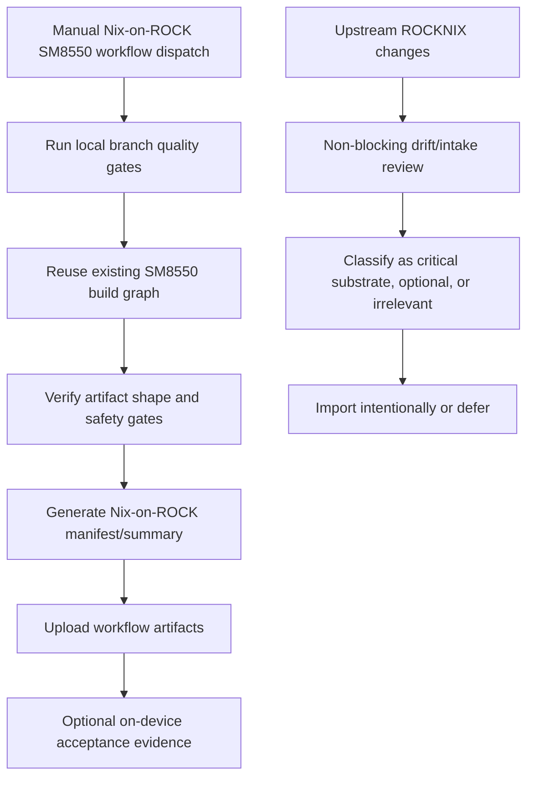

# feat: Add Nix-on-ROCK SM8550 product lane

## Summary

Add the first independent Nix-on-ROCK shipping loop as an SM8550-only product build lane with local quality gates, legible build evidence, an upstream-intake policy, and explicit on-device acceptance guidance. The plan keeps inherited ROCKNIX build internals where they are still useful, but stops treating upstream branch comparability as the product health signal.

---

## Problem Frame

Nix-on-ROCK is becoming a product boundary rather than a small ROCKNIX patch stack. The current build and release surfaces still encode upstream ROCKNIX identity and validation assumptions, so the first breakaway slice needs to prove independent SM8550 product health without destabilizing the already-working thin-host, seed, recovery, and storage-contract path.

---

## Requirements

- R1. Define Nix-on-ROCK-owned product behavior around SM8550 thin host, Nix guest lifecycle, storage contract, seed/update flow, recovery posture, and operator guidance. (Origin R1, AE1)
- R2. Treat ROCKNIX as an upstream substrate source rather than the product identity or validation authority. (Origin R2, R3, AE3)
- R3. Provide an SM8550-only build lane that validates Nix-on-ROCK on branch-local product gates. (Origin R4, R5, AE2)
- R4. Preserve useful inherited safety gates: guest-substrate static checks, SM8550 `SYSTEM` budget, update seed payload checks, image integrity, and recovery/install invariants. (Origin R5, R10, AE4)
- R5. Make build outputs maintainer-legible as Nix-on-ROCK without broad internal renaming. (Origin R6)
- R6. Document an upstream-intake policy that replaces rebase-by-default with deliberate supplier review. (Origin R7, AE3)
- R7. Keep the first slice narrow: no standalone repo extraction, public release channel, broad branding cleanup, or multi-device expansion. (Origin R8, R9)

**Origin actors:** A1 Product maintainer, A2 Build/release operator, A3 Device operator, A4 Future planning/implementation agent, A5 ROCKNIX upstream

**Origin flows:** F1 Boundary definition, F2 Independent SM8550 build proof, F3 Upstream intake after breakaway

**Origin acceptance examples:** AE1 Boundary classification, AE2 Branch-authoritative build proof, AE3 Intentional upstream intake, AE4 Safety before branding

---

## Scope Boundaries

### Deferred for later

- Full repository extraction into a new standalone repo.
- Complete renaming of every project variable, artifact, service, package, or historical reference.
- Multi-device expansion beyond the currently proven SM8550 direction.
- Public release branding, website, distribution channel, or end-user marketing.
- Automated upstream cherry-pick tooling beyond a documented intake policy.

### Outside this product's identity

- Becoming a general ROCKNIX replacement for all supported devices.
- Preserving upstream compatibility at the cost of Nix-on-ROCK product direction.
- Treating the guest as a temporary experiment inside ROCKNIX rather than the main product architecture.
- Building a generic Linux distro unrelated to the ROCKNIX-derived handheld substrate.

### Deferred to Follow-Up Work

- Public release publishing: create a Nix-on-ROCK release destination and release-body generator after the workflow artifact proof is stable.
- Broad identity cleanup: rename inherited variables, payload filenames, and service/env prefixes only after the product lane proves useful.
- Additional SM8550 variants: add explicit Thor or other compatible proof once a matching seed and device-validation loop exist.
- Upstream automation: add cherry-pick/import tooling only after the manual intake policy has been used enough to reveal the right workflow.

---

## Context & Research

### Relevant Code and Patterns

- `.github/workflows/build-nightly.yml` is the current manual/scheduled build entrypoint. It can build SM8550 on the fork, but still fetches upstream ROCKNIX and uses upstream comparison as part of its integrity step.
- `.github/workflows/build-device.yml` already has the reusable per-device graph and skips non-SM8550 host emulator/ARM jobs for SM8550.
- `.github/workflows/build-aarch64-image.yml` already contains important SM8550 artifact gates: `SYSTEM` budget, update tar presence, seed payload presence, and image gzip validation.
- `.github/workflows/build-image-only.yml` is valuable for fast iteration, but its base-run reuse means it should not become the first independent proof unless the base run comes from the same product lane.
- `projects/ROCKNIX/packages/tools/rocknix-guest-substrate/tests/guest-substrate-static-checks.sh` is the central local contract gate and already covers thin-host, storage-contract, seed, workflow, and safety assumptions through shell fixtures and grep assertions.
- `projects/ROCKNIX/packages/tools/rocknix-guest-substrate/tests/guest-substrate-runtime-smoke.sh` is the existing runtime/on-device smoke harness and supports live mode through `ROCKNIX_GUEST_LIVE_SMOKE=1`.
- `documentation/PER_DEVICE_DOCUMENTATION/SM8550/README.md` is the current operator-facing SM8550 seed/install/recovery note and should remain aligned with product-lane acceptance guidance.

### Institutional Learnings

- The Nix-on-ROCK storage contract is the clearest current product-owned seam; keep `/storage/nix-on-rock` visible and stable while preserving recovery flags and update tar wire compatibility.
- Split seed delivery is essential: the guest rootfs seed must remain outside `SYSTEM`, staged through the update tar payload and verified before extraction.
- Fast-iter lanes are useful but are not a substitute for a full branch-authoritative build proof when lower-level artifacts or validation assumptions changed.
- Fork update channels cannot rely on upstream `update.rocknix.org`; custom builds need their own artifact/release channel or manual update path until a product channel exists.
- Live generation and recovery evidence matter: marker files are corroborating, while selected/running guest state and service health are authoritative for release acceptance.

### External References

- No external research is needed for this slice. The work is repository-specific CI/release posture and should follow existing local workflow patterns.

---

## Key Technical Decisions

- Create a new product lane rather than rewriting the global `Build` workflow first: this isolates breakaway behavior, lowers regression risk, and keeps inherited ROCKNIX workflows available while the product lane proves itself.
- Keep internal `PROJECT=ROCKNIX` and `target/ROCKNIX-*` payload filenames in the first slice: these names are deep in the build system and do not block product independence if wrapper names, manifests, and docs make the output legible.
- Make upstream drift advisory, not blocking: local product quality gates should decide pass/fail; upstream changes should feed the intake policy.
- Treat workflow-dispatch artifacts as the first proof, not public release publishing: this satisfies the independence need without prematurely choosing release infrastructure.
- Preserve fast-iter as an iteration aid, not a release proof by default: reused artifacts can hide whether the independent lane actually validates the full product path.

---

## Open Questions

### Resolved During Planning

- What counts as the first independent build proof? A manually dispatchable SM8550 workflow artifact with manifest and documented on-device acceptance; scheduled/public release publishing is deferred.
- Should upstream comparison remain blocking? No. For the Nix-on-ROCK product lane it should be non-blocking advisory context at most.
- What minimal artifact identity is enough? Keep inherited payload filenames initially, but add Nix-on-ROCK workflow/artifact wrapper names plus a manifest/summary artifact.
- Which device scope is first? The first proof is SM8550-only and should label the specific compatible/device validated on-device rather than claiming all variants.

### Deferred to Implementation

- Exact workflow job decomposition: the implementing agent should choose the smallest safe composition of existing reusable workflows and follow their current permission/artifact conventions.
- Exact manifest fields: include the required evidence categories, but allow the implementation to derive field names from available workflow outputs and artifact contents.
- Exact upstream drift report format: use the simplest markdown or summary output that is non-blocking and reviewable.
- Exact live-smoke evidence bundle: refine based on the current device state and what can be collected safely without touching Android or bootloader partitions.

---

## High-Level Technical Design

> *This illustrates the intended approach and is directional guidance for review, not implementation specification. The implementing agent should treat it as context, not code to reproduce.*

The product lane should fail on local product-quality regressions and artifact safety failures. Upstream drift should be visible to maintainers but should not decide whether a Nix-on-ROCK branch is healthy.

---

## Implementation Units

### U1. Add an SM8550 Nix-on-ROCK product build lane

**Goal:** Create the first branch-authoritative build entrypoint for Nix-on-ROCK as an SM8550 product, separate from the inherited all-device ROCKNIX build surface.

**Requirements:** R1, R2, R3, R4, R7; F1, F2; AE1, AE2, AE4

**Dependencies:** None

**Files:**
- Create: `.github/workflows/build-nix-on-rock-sm8550.yml`
- Modify: `projects/ROCKNIX/packages/tools/rocknix-guest-substrate/tests/guest-substrate-static-checks.sh`
- Reference: `.github/workflows/build-device.yml`
- Reference: `.github/workflows/build-aarch64-image.yml`
- Reference: `.github/workflows/build-nightly.yml`

**Approach:**
- Add a workflow-dispatch lane whose visible purpose is Nix-on-ROCK SM8550 product validation.
- Reuse existing SM8550 build graph pieces where possible instead of duplicating build logic.
- Keep inherited build inputs such as `PROJECT=ROCKNIX` where required by the underlying build system.
- Ensure the lane is explicitly SM8550-only and does not expand the all-device matrix.
- Add static checks that make the product lane's existence and SM8550-only intent durable.

**Patterns to follow:**
- Existing reusable workflow composition in `.github/workflows/build-nightly.yml` and `.github/workflows/build-device.yml`.
- Existing static workflow assertions in `projects/ROCKNIX/packages/tools/rocknix-guest-substrate/tests/guest-substrate-static-checks.sh`.

**Test scenarios:**
- Happy path: workflow dispatch for the product lane targets only SM8550 and invokes the same SM8550 build graph used by the proven branch builds.
- Edge case: adding another device to the product lane causes static checks to fail until the requirements and plan are updated.
- Integration: the product lane preserves existing SM8550 artifact safety gates from the image build path.
- Covers AE2. Branch-local product lane can be reviewed without relying on upstream branch comparability as the proof.

**Verification:**
- The new workflow is visible in GitHub Actions as a Nix-on-ROCK SM8550 lane.
- Static checks pass and assert that the lane remains SM8550-only.
- A manually triggered run reaches the existing SM8550 build graph rather than the all-device matrix.

---

### U2. Replace upstream-comparability gates with local product gates

**Goal:** Stop upstream ROCKNIX branch comparison from being a blocking health signal in the product lane while preserving quality checks that catch real local regressions.

**Requirements:** R2, R3, R4, R6; F2, F3; AE2, AE3

**Dependencies:** U1

**Files:**
- Modify: `.github/workflows/build-nix-on-rock-sm8550.yml`
- Modify: `projects/ROCKNIX/packages/tools/rocknix-guest-substrate/tests/guest-substrate-static-checks.sh`
- Reference: `.github/workflows/build-nightly.yml`
- Reference: `.github/workflows/build-image-only.yml`

**Approach:**
- Keep blocking local gates: guest-substrate static checks, whitespace/syntax hygiene, artifact layout, `SYSTEM` budget, seed payload presence, and image integrity.
- Do not require fetching or diffing against upstream ROCKNIX for the product lane to pass.
- If upstream drift visibility is useful, expose it as advisory output or a separate manual/intake workflow rather than a product-lane failure.
- Keep inherited global ROCKNIX workflows unchanged unless they directly conflict with the product lane.

**Patterns to follow:**
- Existing workflow integrity check blocks in `.github/workflows/build-aarch64-image.yml`.
- Existing disabled/manual-only posture in `.github/workflows/trigger-fail-if-upstream-changed.yml`.

**Test scenarios:**
- Happy path: product lane local checks pass without network access to upstream ROCKNIX beyond dependencies required by the actual build.
- Error path: guest-substrate static check failure fails the product lane.
- Error path: artifact layout or `SYSTEM` budget failure fails the product lane.
- Integration: upstream drift report, if present, is visible in logs or summary but does not alter product-lane pass/fail.
- Covers AE2 and AE3. The branch can diverge while still producing a valid product build, and upstream changes are routed to intake rather than rebase pressure.

**Verification:**
- Product-lane pass/fail criteria are local and artifact-based.
- Static checks prevent reintroducing upstream branch comparability as a blocking product-lane gate.

---

### U3. Add Nix-on-ROCK build manifest and artifact legibility

**Goal:** Make successful artifacts understandable as Nix-on-ROCK outputs while preserving inherited payload names for compatibility.

**Requirements:** R1, R4, R5; F2; AE2, AE4

**Dependencies:** U1, U2

**Files:**
- Create: `.github/scripts/generate-nix-on-rock-build-manifest.sh`
- Modify: `.github/workflows/build-nix-on-rock-sm8550.yml`
- Modify: `projects/ROCKNIX/packages/tools/rocknix-guest-substrate/tests/guest-substrate-static-checks.sh`
- Reference: `.github/scripts/generate-release-body.sh`
- Reference: `documentation/PER_DEVICE_DOCUMENTATION/SM8550/README.md`

**Approach:**
- Generate a small manifest or summary artifact for each product-lane build.
- Include product identity, branch/SHA, SM8550 device scope, inherited payload naming note, guest/source revision evidence when available, seed archive evidence, storage-contract root, safety/recovery invariants, and explicit artifact status vocabulary.
- Distinguish `BuildProof`, `DeviceAccepted`, and `ReleaseCandidate` status in the manifest vocabulary: CI may produce `BuildProof`; on-device evidence may promote a build to `DeviceAccepted`; public `ReleaseCandidate` remains deferred unless a future release channel is defined.
- Prefer a small text/markdown artifact and GitHub job summary over large log retention for successful runs.
- Keep public release-body generation out of this unit; the manifest is product-lane evidence, not a release publication system.

**Patterns to follow:**
- Existing release-body script for deriving artifact names and device context, but avoid inheriting all-device ROCKNIX branding.
- Existing SM8550 documentation for seed, storage, and recovery vocabulary.

**Test scenarios:**
- Happy path: successful product-lane build uploads a Nix-on-ROCK manifest/summary alongside image/update artifacts.
- Edge case: manifest clearly states inherited `ROCKNIX-*` payload names are compatibility internals during transition.
- Error path: missing seed evidence or missing core artifact evidence prevents a manifest from claiming complete build-artifact readiness.
- Integration: manifest references the same storage and recovery contracts documented for SM8550 operators.

**Verification:**
- A maintainer can inspect the workflow summary or manifest and tell what was built, from which branch/SHA, for which SM8550 scope, and with what seed/storage/recovery assumptions.
- No broad `DISTRONAME`, `PROJECT`, or payload filename rename is required for artifact legibility.

---

### U4. Document upstream intake policy

**Goal:** Replace implicit rebase obligation with an explicit supplier-review policy for importing ROCKNIX upstream changes.

**Requirements:** R2, R6, R7; F1, F3; AE1, AE3

**Dependencies:** U2

**Files:**
- Create: `docs/nix-on-rock/upstream-intake.md`
- Create: `docs/nix-on-rock/product-boundary.md`
- Modify: `documentation/PER_DEVICE_DOCUMENTATION/SM8550/README.md`
- Reference: `docs/brainstorms/2026-05-17-001-break-away-nix-on-rock-requirements.md`
- Reference: `docs/plans/2026-05-16-001-refactor-nix-on-rock-storage-contract-plan.md`

**Approach:**
- Document Nix-on-ROCK-owned behavior, ROCKNIX-borrowed substrate, and out-of-scope upstream churn in one short product-boundary page.
- Define intake classifications: critical substrate fix, optional substrate improvement, conflicting product change, irrelevant upstream product churn.
- Define minimum intake trigger: before marking a build `DeviceAccepted`, and periodically or manually when the maintainer suspects relevant upstream substrate movement.
- Define minimum intake record fields: upstream range or commit, classification, touched subsystem, product invariant impact, import decision, validation evidence, and an explicit “no relevant changes” outcome when review finds nothing to import.
- Keep the policy manual-first and reviewable; do not automate cherry-picking in this slice.

**Patterns to follow:**
- Existing durable brainstorm/plan style in `docs/brainstorms/` and `docs/plans/`.
- Existing storage-contract plan's distinction between canonical product paths and compatibility exceptions.

**Test scenarios:**
- Happy path: a future agent can classify thin-host guest lifecycle work as Nix-on-ROCK product work from the docs alone.
- Happy path: a relevant upstream kernel/boot/security fix has a documented path to intentional import.
- Edge case: upstream UI/emulator churn can be rejected or deferred without being treated as product health failure.
- Covers AE1 and AE3. Boundary and intake records prevent future planning from silently returning to rebase-by-default.

**Verification:**
- Documentation states that upstream ROCKNIX is a supplier, not the product authority.
- The SM8550 operator docs or product-lane manifest point maintainers toward the boundary and intake policy without making policy prose a brittle substrate static-check invariant.

---

### U5. Define on-device acceptance evidence for the first proof

**Goal:** Make recovery/install safety an explicit acceptance layer for declaring the first independent product build useful.

**Requirements:** R1, R4, R5, R7; F2; AE2, AE4

**Dependencies:** U1, U3

**Files:**
- Create: `docs/nix-on-rock/sm8550-acceptance.md`
- Modify: `documentation/PER_DEVICE_DOCUMENTATION/SM8550/README.md`
- Modify: `projects/ROCKNIX/packages/tools/rocknix-guest-substrate/tests/guest-substrate-runtime-smoke.sh`
- Reference: `projects/ROCKNIX/packages/tools/rocknix-guest-substrate/scripts/rocknix-guest-activation-audit`
- Reference: `projects/ROCKNIX/packages/tools/rocknix-guest-substrate/tests/guest-substrate-static-checks.sh`

**Approach:**
- Define the acceptance evidence bundle for a product-lane artifact: host SSH, default target, guest service health, activation audit, seed/storage contract evidence, and recovery flag behavior.
- Separate CI build proof from device acceptance and release-candidate proof: CI can produce `BuildProof` artifacts; on-device smoke can mark a specific artifact `DeviceAccepted`; public `ReleaseCandidate` status remains out of scope for this slice.
- Make device-compatible scope explicit in acceptance notes so an Odin2Portal proof is not accidentally presented as all-SM8550 validation.
- Extend runtime smoke only where it improves evidence collection without making it dangerous or destructive.

**Patterns to follow:**
- Existing `ROCKNIX_GUEST_LIVE_SMOKE=1` live-mode structure.
- Existing SM8550 README recovery and reseed notes.
- Current activation audit behavior that treats selected/running guest state as authoritative and marker files as audit data.

**Test scenarios:**
- Happy path: live smoke reports host SSH active, guest active/running, zero failed guest units, and valid selected guest generation.
- Happy path: acceptance doc names the specific compatible/device used for proof.
- Error path: missing seed prevents guest start but leaves host recovery available.
- Error path: corrupt or wrong-compatible seed fails closed before extraction.
- Integration: legacy storage layout migration and clean-storage seed boot are included as acceptance scenarios, even if not run on every CI build.
- Covers AE4. Recovery and install safety remain acceptance criteria before branding or release expansion.

**Verification:**
- A device operator can follow the acceptance doc to collect evidence for a product-lane artifact.
- Runtime smoke remains safe by default and only performs live checks when explicitly enabled.

---

## System-Wide Impact

- **Interaction graph:** The new workflow connects GitHub Actions build orchestration, existing reusable build jobs, guest-substrate static checks, artifact upload, and optional on-device smoke evidence.
- **Error propagation:** Local quality/artifact failures should fail the product lane; upstream drift should surface as advisory context; on-device smoke failures should block acceptance but not necessarily invalidate the build artifact itself.
- **State lifecycle risks:** Fast-iter builds reuse prior artifacts and can misrepresent independence; manifests must distinguish full product-lane proof from derivative image-only artifacts.
- **API surface parity:** No public API changes. The external surfaces are GitHub Actions workflow names, artifact names, documentation, and operator-facing acceptance guidance.
- **Integration coverage:** CI proves artifact shape and local contracts; on-device smoke proves recovery/install/guest lifecycle behavior.
- **Unchanged invariants:** Keep `/flash/rocknix.no-nspawn`, `rocknix.safe=1`, `/flash/rocknix.reseed-guest`, update tar `target/seed/`, and current internal payload filenames stable in this slice.

---

## Risks & Dependencies

| Risk | Mitigation |
|------|------------|
| New workflow diverges from existing build graph and becomes another maintenance burden | Reuse existing reusable workflows and centralize only the product-lane orchestration/summary behavior in the new workflow. |
| Product lane silently drops a safety gate from current SM8550 builds | Extend static checks to assert retained gates and inspect workflow contents. |
| Artifact naming remains confusing because payloads still say ROCKNIX | Add Nix-on-ROCK wrapper names and manifest; explicitly document inherited payload names as transition internals. |
| Upstream drift becomes invisible after removing blocking diff checks | Add advisory drift/intake reporting and a manual intake policy. |
| Fast-iter artifacts are mistaken for release proof | Document fast-iter limitations and include base-run provenance in manifests where applicable. |
| On-device acceptance becomes too heavy to run frequently | Separate required CI artifact gates from device-acceptance smoke; keep destructive tests manual and explicit. |

---

## Documentation / Operational Notes

- Add `docs/nix-on-rock/` as the durable home for product-boundary, upstream-intake, and SM8550 acceptance guidance.
- Keep `documentation/PER_DEVICE_DOCUMENTATION/SM8550/README.md` focused on operator install/recovery steps and link to deeper product-lane docs rather than duplicating all policy content.
- Do not alter Android/bootloader partitions as part of acceptance guidance; maintain the existing safe-fastboot boundaries.
- The currently running GitHub Actions build for the storage-contract branch can inform confidence, but this plan should not depend on that run to define the product lane.

---

## Sources & References

- **Origin document:** [docs/brainstorms/2026-05-17-001-break-away-nix-on-rock-requirements.md](../brainstorms/2026-05-17-001-break-away-nix-on-rock-requirements.md)
- Related plan: [docs/plans/2026-05-16-001-refactor-nix-on-rock-storage-contract-plan.md](2026-05-16-001-refactor-nix-on-rock-storage-contract-plan.md)
- Related plan: [docs/plans/2026-05-15-001-fix-offline-guest-seed-staging-plan.md](2026-05-15-001-fix-offline-guest-seed-staging-plan.md)
- Relevant workflow: `.github/workflows/build-nightly.yml`
- Relevant workflow: `.github/workflows/build-device.yml`
- Relevant workflow: `.github/workflows/build-aarch64-image.yml`
- Relevant workflow: `.github/workflows/build-image-only.yml`
- Relevant tests: `projects/ROCKNIX/packages/tools/rocknix-guest-substrate/tests/guest-substrate-static-checks.sh`
- Relevant smoke: `projects/ROCKNIX/packages/tools/rocknix-guest-substrate/tests/guest-substrate-runtime-smoke.sh`
- Relevant operator docs: `documentation/PER_DEVICE_DOCUMENTATION/SM8550/README.md`
