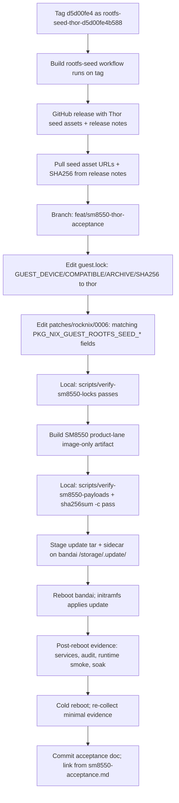

# feat: SM8550 Thor (bandai) device acceptance

## Summary

Validate the Nix-on-Rocks SM8550 product lane on a second physical device — `bandai` (AYN Thor, compatible `ayn,thor`) — by publishing a Thor rootfs seed at the same guest revision sobo accepted, building a Thor-pinned SM8550 image off the proven Phase 5 lane, installing it through the normal ROCKNIX update path, and recording acceptance evidence in the same shape as the 2026-05-18 / -19 / -20 sobo docs.

This is a deliberately narrow slice. It is **not** the per-device manifest refactor: the host package keeps a single-seed shape. Multi-device unified images are a follow-up plan that should land only after bandai has a clean baseline of its own.

---

## Problem Frame

Today's accepted product-lane image is single-device: `guest.lock` and the patched `package.mk` pin exactly one `GUEST_DEVICE` (`odin2portal`), one `GUEST_COMPATIBLE` (`ayn,odin2portal`), one seed archive, and one seed SHA256. `rocknix-guest-root-ensure` reads `/proc/device-tree/compatible` and **fails closed** on any seed whose `seed_compatible` does not match — by design.

Without a Thor seed and a Thor-pinned host image, installing the current update tar on bandai fails closed before guest extraction. We have no `DeviceAccepted` evidence for any SM8550 device other than sobo / Odin2Portal.

The fastest way to a real second-device proof, without disturbing the seam that has been stabilized across the SM8550 commits between 2026-05-14 and 2026-05-20, is to flip the single-device pin to Thor for one image build, install on bandai, and record evidence.

---

## Requirements

- R1. Publish a Thor guest rootfs seed at guest revision `d5d00fe4b58822da8ab0a0c21ea4306a92c65c2a` — the exact rev sobo is running — so the bandai image differs from the sobo image in only the seed-related fields. (origin Phase 5 acceptance, offline-seed-staging R8)
- R2. Build an SM8550 product-lane image with `guest.lock` and the patched `package.mk` pinned to Thor, using the same build lane that produced the 2026-05-20 sobo image. Local payload verification must pass before any device install. (origin product-lane plan AE2, AE4)
- R3. Install on `bandai` via the normal `/storage/.update/` update path. Do **not** touch Android, firmware, or bootloader partitions. Re-flashing and partition-level changes are out of scope. (origin acceptance shape from sm8550-acceptance.md)
- R4. Capture `DeviceAccepted` evidence in `docs/acceptance/sm8550-device-acceptance-<date>-thor.md` mirroring the 2026-05-19 / -20 sobo evidence layout: SHAs, seed archive, host services, activation audit, runtime smoke, soak. (origin sm8550-acceptance.md)
- R5. Record an explicit pre-/post-state for `guest.lock`: the lock is single-device, this plan flips it to Thor for one build and the working copy is restored after the build artifact is published so the main branch does not silently drift to a Thor pin. (origin product-boundary doc)
- R6. Do not modify `rocknix-guest-root-ensure`, the seed manifest format, or the patched host substrate code. This plan touches **only** `guest.lock`, `patches/rocknix/0006-rocknix-guest-substrate.patch` data fields, and the seed-publishing workflow. (origin offline-seed-staging plan boundary)

---

## Scope Boundaries

### Deferred for later

- Per-device seed manifest dispatch (one image, both seeds). Documented as the next plan after this one. Touches `package.mk`, `rocknix-guest-root-ensure`, `verify-sm8550-locks`, `verify-sm8550-payloads`, `guest.lock`, and static checks; deserves its own plan.
- Multi-SM8550-device unified release artifact.
- Bandai-specific guest-side hardening (e.g. multi-touchscreen routing from the 2026-05-08 brainstorm); evidence-gathering only in this slice.
- Bumping `GUEST_REV` past `d5d00fe4`. Picking up `1a3a22b` (`mkGuestRootfs`) or `889853e` (Korri input daemon) is a separate guest-source intake.

### Outside this product's identity

- Cross-compiling the Thor seed from a non-aarch64 runner.
- Building a Thor image off any guest source other than the publicly-pinned `nix-on-rocks` product tarball at `d5d00fe4`.

---

## Context & Research

### Current single-device pin

`guest.lock`:

```sh
GUEST_DEVICE="odin2portal"
GUEST_COMPATIBLE="ayn,odin2portal"
GUEST_REV="d5d00fe4b58822da8ab0a0c21ea4306a92c65c2a"
GUEST_SEED_ARCHIVE="rocknix-guest-rootfs-odin2portal-d5d00fe4b588.tar.zst"
GUEST_SEED_SHA256="650dafebc88abdc3581cb67dd05d825b54dc8807930898713b8086f5dda21a1f"
```

Patched `package.mk` (`patches/rocknix/0006-rocknix-guest-substrate.patch`) carries the corresponding `PKG_NIX_GUEST_ROOTFS_SEED_*` fields.

`verify-sm8550-locks` enforces equality between the lock and the patched package fields, including:

- `PKG_NIX_GUEST_ROOTFS_SEED_DEVICE` / `_COMPATIBLE` / `_ARCHIVE` / `_SHA256` / `_REV`
- `GUEST_SEED_ARCHIVE` shape: `rocknix-guest-rootfs-<GUEST_DEVICE>-*.tar.zst`
- Seed URLs route through `api.github.com/repos/simonwjackson/nix-on-rocks/releases/assets/`

### Build-rootfs-seed workflow

`.github/workflows/build-rootfs-seed.yml` already supports Thor:

- `workflow_dispatch` with `device: thor`, `publish_release: true`, plus optional `release_tag`.
- Tag trigger on `rootfs-seed-*`. A tag named `rootfs-seed-thor-<short12>` pushed at `d5d00fe4` will build `.#rootfs-thor` at that rev and publish a release whose body literally includes the `PKG_NIX_GUEST_ROOTFS_SEED_*` lines we need to paste.

### Thor profile is buildable at `d5d00fe4`

`guest/flake.nix` at `d5d00fe4` already exposes `packages.rootfs-thor = rootfsThor` and `mainSpaceThorConfiguration` via `./profiles/devices/thor.nix`. No guest-side changes are needed to publish a Thor seed at this rev.

### Fall-back behavior already covers wrong-device seeds

`docs/contracts/HOW-TO-FALL-BACK.md` documents that a wrong-compatible seed fails closed, leaving host recovery available. `rocknix-guest-root-ensure` enforces this via `compatible_matches_seed`. The bandai install is therefore guarded against an accidental Odin2Portal seed by existing code, not by this plan.

---

## Key Technical Decisions

- **Tag-driven seed publish over `workflow_dispatch` form.** Pushing the tag `rootfs-seed-thor-d5d00fe4b588` at `d5d00fe4` makes the seed an immutable, named release tied to a specific guest rev. The `workflow_dispatch` form works, but a tag commits us to the rev choice up-front and matches the existing odin2portal tag pattern.
- **One-shot lock flip, not a Thor branch.** `guest.lock` is edited in-place on a short-lived branch, the image is built, the bandai install is captured, then the branch is closed without merging back to main. Phase B (multi-seed) will reintroduce Thor permanently. Until then, main stays on the Odin pin so the next sobo update is the obvious thing.
- **No host substrate code edits.** The bandai validation runs against the same `rocknix-guest-root-ensure`, the same `package.mk` post_install structure, and the same update-tar payload layout that sobo accepted. The only variable is the seed.
- **Use the existing image-only lane.** Phase 5 proved that the image-only lane produces a real, installable update tar from a reusable base. Reusing it for the Thor pin matches the proven artifact path.

---

## Open Questions

### Resolved during planning

- **Should the Thor seed be built at the current main HEAD or at `d5d00fe4`?** At `d5d00fe4`. Holding `GUEST_REV` constant isolates the bandai-vs-sobo difference to the seed archive.
- **Should we land per-device manifest dispatch (Path B) as part of this slice?** No. It refactors the most-stabilized seam in the product and should run against two known-good single-device baselines.
- **Where does the bandai install evidence go?** A new file under `docs/acceptance/`, named to parallel the sobo files: `sm8550-device-acceptance-<YYYY-MM-DD>-thor.md`. The summary file `docs/acceptance/sm8550-acceptance.md` gets a new "Latest accepted evidence" bullet pointing to it.

### Deferred to implementation

- Exact release tag short SHA digits (`d5d00fe4b588` matches the odin tag pattern but the build workflow defaults to `${GITHUB_SHA::12}`, so the tag should also be 12 chars).
- Whether to also capture a cold-reboot pass on bandai before declaring `DeviceAccepted`. The sobo 2026-05-18 doc included it; the Phase 5 doc reused the same machine across reboots. Treat cold-reboot as required for the first Thor proof.

---

## High-Level Technical Design



---

## Implementation Units

### U1. Publish Thor rootfs seed at `d5d00fe4`

**Goal:** A signed, immutable GitHub release whose assets are the Thor rootfs seed parts at guest revision `d5d00fe4b58822da8ab0a0c21ea4306a92c65c2a`.

**Approach:**

1. Tag locally: `git tag rootfs-seed-thor-d5d00fe4b588 d5d00fe4b58822da8ab0a0c21ea4306a92c65c2a` in `nix-on-rocks`.
2. Push the tag: `git push origin rootfs-seed-thor-d5d00fe4b588`.
3. Watch `Build rootfs seed` workflow run on the `rootfs-seed-thor-*` tag; expect a green run that publishes a release tagged `rootfs-seed-thor-d5d00fe4b588` with assets matching `rocknix-guest-rootfs-thor-d5d00fe4b588.tar.zst.part-*`.

**Verification:** workflow green; release exists; release notes contain `PKG_NIX_GUEST_ROOTFS_SEED_URLS`, `_SHA256`, and asset name lines.

### U2. Flip `guest.lock` + patched `package.mk` to Thor on a short-lived branch

**Goal:** A branch — `feat/sm8550-thor-acceptance` — that pins the host build to the Thor seed and passes `scripts/verify-sm8550-locks` locally.

**Files:**

- `guest.lock` — five fields change: `GUEST_DEVICE`, `GUEST_COMPATIBLE`, `GUEST_SEED_ARCHIVE`, `GUEST_SEED_SHA256`. `GUEST_REV` stays at `d5d00fe4…`.
- `patches/rocknix/0006-rocknix-guest-substrate.patch` — same five fields on the package.mk additions: `PKG_NIX_GUEST_ROOTFS_SEED_DEVICE`, `_COMPATIBLE`, `_ARCHIVE`, `_SHA256`, `_URLS`. `_REV` and `PKG_NIX_GUEST_SHA256` stay unchanged.

**Verification:**

- `scripts/verify-sm8550-locks` passes (after applying patches to `work/rocknix/`).
- `scripts/apply-rocknix-patches` succeeds.
- `git diff main` shows changes only in the two files above.

### U3. Produce a Thor SM8550 image-only build

**Goal:** A green `Image only` workflow run from the Phase 5 reusable base, with Thor-pinned packaging, producing `ROCKNIX-SM8550.aarch64-<date>.tar` containing `target/seed/rocknix-guest-rootfs-thor-d5d00fe4b588.tar.zst`.

**Approach:** Reuse the Phase 5 base run (`26148449934`). Dispatch image-only with the Thor branch checked out. Confirm:

- Workflow run green.
- Uploaded artifact present.
- `scripts/verify-sm8550-payloads` against the downloaded artifacts passes locally.
- Update tar SHA256 sidecar present.

**Verification:** `sha256sum -c *.sha256` passes locally; update tar contains `target/SYSTEM`, `target/KERNEL`, and `target/seed/rocknix-guest-rootfs-thor-d5d00fe4b588.tar.zst`.

### U4. Install on bandai through the normal update path

**Goal:** Apply the Thor update on `bandai` (`ayn,thor`) without touching Android, firmware, or bootloader partitions.

**Approach:** As in sm8550-acceptance.md and the 2026-05-20 doc:

1. Copy update tar + sidecar `.sha256` to `/storage/.update/`.
2. Verify `sha256sum -c <tar>.sha256` on-device.
3. Reboot. Let initramfs apply.

If `rocknix-guest-root-ensure` fails closed because the existing guest root is incompatible or absent, follow the documented seed-staging path in `HOW-TO-FALL-BACK.md` (copy seed under `/storage/nix-on-rock/images/seeds/`, optional explicit reseed flag).

**Verification:** `BUILD_ID` matches the built host SHA; `systemctl get-default` is `rocknix-main-space.target`; `systemctl is-active rocknix-guest.service` is `active`.

### U5. Collect `DeviceAccepted` evidence for bandai

**Goal:** A new acceptance doc capturing the same evidence shape as the 2026-05-20 phase-5 sobo doc, scoped to `bandai` / `ayn,thor`.

**Files:**

- Create `docs/acceptance/sm8550-device-acceptance-<YYYY-MM-DD>-thor.md`.
- Update `docs/acceptance/sm8550-acceptance.md` to add the new bullet to "Latest accepted evidence".

**Evidence to capture:**

- Compatible string (`/proc/device-tree/compatible` first entry should be `ayn,thor`).
- Installed host `BUILD_ID`.
- `host system state`, `host failed units`, `rocknix-guest.service`, `rocknix-guest-promote.service`.
- `/storage/nix-on-rock/rootfs/current/etc/rocknix-guest-revision` matches `d5d00fe4`.
- `/storage/nix-on-rock/images/seeds/` contains the Thor seed.
- `rocknix-guest-activation-audit --quiet`: passed.
- `ROCKNIX_GUEST_LIVE_SMOKE=1 /usr/lib/rocknix-guest-substrate/tests/guest-substrate-runtime-smoke.sh`: passed.
- `ROCKNIX_REQUIRE_HOST_ESSWAY=no rocknix-guest-soak --hours 1 --interval-seconds 1`: passed with zero alarms.
- Cold-reboot pass with the same checks.

**Verification:** doc reviewed; summary doc updated; doc explicitly scopes claim to `ayn,thor` only.

### U6. Restore main to the Odin pin

**Goal:** Avoid silent drift of the main-branch pin.

**Approach:** After bandai evidence is published, close the Thor branch without merging. `main`'s `guest.lock` and patches stay on Odin2Portal until the Phase B (multi-seed) plan lands. The Thor lock values are recorded in the acceptance doc for reproducibility.

**Verification:** `git diff main feat/sm8550-thor-acceptance -- guest.lock patches/rocknix/0006-rocknix-guest-substrate.patch` shows the Thor pin; `main` head untouched.

---

## Risks & Dependencies

| Risk | Mitigation |
|------|------------|
| `.#rootfs-thor` build fails at `d5d00fe4` despite the flake exposing it | Workflow logs surface the failure cleanly; we fall back to dispatching at a chosen newer guest commit and accept the `GUEST_REV` bump as a documented intake. |
| Bandai already has a stale guest root from a prior development image; `rocknix-guest-root-ensure` refuses the new seed because the existing root is valid | Documented path: stop guest, `touch /flash/rocknix.reseed-guest`, reboot. Captured in `HOW-TO-FALL-BACK.md`. |
| Wrong-compatible seed lands on the wrong device by operator error | Fail-closed already enforced by `compatible_matches_seed`. Acceptance doc must record `/proc/device-tree/compatible` to make the claim auditable. |
| Phase 5 base artifact has aged out (14-day retention typical) | Re-run prepare-base before dispatching image-only. |
| Thor profile reveals device-specific defects (Korri input, touch routing) that block soak | Soak failure is bandai-acceptance-blocking but not seed-build-blocking. Track and triage in a follow-up; do not patch the host substrate in this plan. |

---

## Documentation / Operational Notes

- The `rootfs-seed-thor-d5d00fe4b588` release becomes a permanent product-repo artifact. Future Thor builds at the same rev can reuse it directly.
- The Phase B plan should explicitly reference this acceptance doc as the second baseline before refactoring the seed dispatch seam.
- Operator-facing SM8550 docs do not need to change for this slice. The fall-back doc already covers Thor + bandai.

---

## Sources & References

- Latest sobo acceptance: `docs/acceptance/sm8550-phase5-ci-and-device-acceptance-2026-05-20.md`
- Single-device pin contract: `scripts/verify-sm8550-locks`
- Wrong-device fail-closed contract: `projects/ROCKNIX/packages/tools/rocknix-guest-substrate/scripts/rocknix-guest-root-ensure` (`compatible_matches_seed`)
- Multi-seed direction (future Phase B): `docs/plans/2026-05-15-001-fix-offline-guest-seed-staging-plan.md`
- Operator fall-back: `docs/contracts/HOW-TO-FALL-BACK.md`
- Seed-publish workflow: `.github/workflows/build-rootfs-seed.yml`
