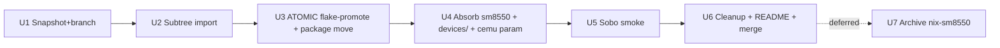

# refactor: Merge nix-sm8550 into nix-on-rocks (Medium-Plus scope)

## Summary

Consolidate the sibling `nix-sm8550` repo into `nix-on-rocks` as a single-flake monorepo with packages at the top level and a `devices/` slot carved out for the upcoming Retroid Pocket Mini (sm8250) work. Resolve the one real fork (cemu audio delta). Provide destination paths for the parallel moonlight-embedded worktree to land into. Skip layer abstractions that have no near-term consumer (boundary lint, `host-substrate/` rename, specialArgs injection mandate).

---

## Context: Why this revision

The original Big plan (12 units, layered architecture with mechanical lint enforcement) was authored against a 3-fork premise. Doc review (2026-05-22) found:

1. **Only cemu is a real fork.** `nix-sm8550` has no `packages/inputplumber/` at all; `packages/steam/package.nix` is byte-identical to nix-on-rocks's mod whitespace. The plan generalized from a sample size of one.
2. **moonlight-embedded was not greenfield.** `nix-sm8550/packages/moonlight-embedded/` already exists with PR #932 ffmpeg-drm-prime applied. The original U9 would have thrown that away.
3. **Sequencing failed pure-eval.** `guest/flake.nix` cannot `callPackage ../packages/...` under pure flake evaluation; U5–U9's verification gates were unachievable as sequenced.
4. **Cemu classification was contradictory.** Moving `settings.SM8550.xml` to `devices/` while keeping bake-in in `packages/cemu/$out` forces either a layer-rule violation or an undocumented runtime dependency. Original plan acknowledged neither.
5. **`devices/` layer had no consumer.** Subtraction test passed: deleting `devices/` and folding into `guest/data/sm8550/` lost nothing functional.

Post-review context shifted #5: **a second SoC (Retroid Pocket Mini, sm8250) is on the horizon**, "soon enough that I want the shape there, not soon enough that I'm building on it yet." That makes `devices/` load-bearing — but only the *slot*, not pre-population for sm8250.

Two parallel facts also constrain this plan:
- The moonlight-embedded worktree is **staging at refactor-target paths** (top-level `packages/moonlight-embedded/`, `guest/launchers/start_moonlight_embedded_gamescope.sh`, `guest/modules/moonlight.nix`) and **explicitly deferring activation until this refactor lands**. Coordination = whoever lands second rebases.
- The cemu classification gets resolved cleanly via callPackage parameterization (`socSettings` arg) rather than `packages → devices` import. Dependency direction stays one-way.

The original Big plan is preserved in git history (this file's previous content) for archaeological reference.

---

## Problem Frame

Two repos with overlapping content cause real friction:

- One real fork (cemu audio wiring) that must be reconciled before nix-sm8550 can be archived.
- Moonlight-embedded already exists in nix-sm8550 (with PR #932 patch) but the parallel worktree is staging its enhanced version at nix-on-rocks paths — the existing nix-sm8550 copy will be superseded.
- "Which repo does X go in?" recurs as a friction point (most recently the moonlight-embedded v4l2m2m work) because the split was an architectural aspiration that hasn't paid off — neither repo has a second external consumer.

A merge ends the friction. Carving out `devices/<soc>/` as a documented slot (without populating sm8250) gives the upcoming Retroid Pocket Mini work a clean landing zone. Skipping mechanical lint / `host-substrate/` rename / specialArgs mandates avoids shipping abstractions without consumers — the smell the original Big plan was supposed to eliminate, which it then reproduced.

---

## Requirements

- **R1.** Single repository (nix-on-rocks), single top-level flake at repo root.
- **R2.** Top-level `packages/` directory holds all reusable derivations. `guest/packages/` is removed.
- **R3.** Top-level `devices/<soc>/` directory exists with a populated `devices/sm8550/` slot. Only genuinely SoC-bound data lives here (UCM, cemu settings); per-product overrides stay in `guest/profiles/devices/<product>.nix`; per-MCU controller maps stay in `packages/inputplumber/maps/`.
- **R4.** The cemu audio fork is resolved by adopting the nix-on-rocks-enriched version as canonical. nix-sm8550's bare version is dropped.
- **R5.** `packages/cemu/` is parameterized via `socSettings` callPackage arg so SoC-specific defaults are injected by the flake, not imported by the package. Dependency direction is `flake → packages` and `flake → devices`, never `packages → devices`.
- **R6.** moonlight-embedded ends up at top-level `packages/moonlight-embedded/`. The parallel worktree's version is the canonical one (it includes PR #932 + the developing v4l2m2m work); nix-sm8550's copy is superseded.
- **R7.** All CI workflows, helper scripts, and guest static-checks pass at HEAD of `merge-monorepo` before merging to `main`.
- **R8.** Each unit commits in a state where `nix flake check` passes from repo root and Sobo can deploy from the resulting build. The big atomic move (U3) is one commit because half-state doesn't evaluate; everything else is per-unit.
- **R9.** `pre-merge-baseline-2026-05-22` tag exists on `main` of both repos before structural work begins.
- **R10.** Sobo integration smoke (U5) confirms no regression in cemu / steam / nixosConfiguration behavior versus pre-merge baseline. Moonlight-embedded integration is **out of scope here** — handled by the parallel worktree.

---

## Scope Boundaries

**In scope:**
- Repo consolidation: subtree import of nix-sm8550, package migration, flake collapse.
- `devices/sm8550/` slot creation with cemu settings + Ayn Odin 2 UCM moved in.
- cemu fork resolution (audio delta already in nix-on-rocks's copy; just drop nix-sm8550's copy and parameterize via callPackage).
- CI workflow + helper script path updates.
- README + migration notes.

**Out of scope:**
- Mechanical layer-boundary lint. Deferred until a real collision motivates it.
- `host-substrate/` rename of `patches/rocknix/`. Cosmetic; defer.
- specialArgs injection mandate. Direct `callPackage` works once flake is at root.
- Building anything for sm8250 / Retroid Pocket Mini. Slot exists; population is its own future plan.
- Moonlight-embedded patch development (plan 002 / refactor-002, separate worktree).
- Moonlight-embedded launcher/module wiring (handled by parallel integration plan that wraps 002).
- Archive of nix-sm8550 (deferred U7; not blocking).
- Cross-cutting documentation rewrite beyond README + one migration-notes file.

---

## High-Level Technical Design

### Final directory shape

```
nix-on-rocks/
├── flake.nix                       # MOVED from guest/flake.nix
├── flake.lock                      # MOVED from guest/flake.lock
├── README.md                       # MODIFIED
├── packages/                       # NEW top-level (absorbs guest/packages/ + nix-sm8550/packages/)
│   ├── cemu/                       # canonical, audio-enriched, parameterized via socSettings
│   │   ├── package.nix
│   │   ├── manifest.nix
│   │   ├── 000-build-fixes.patch
│   │   ├── 002-opt-seeprom-mlc01-keys-dir.patch
│   │   ├── 003-disable-cmake-interprocedural-optimization.patch
│   │   └── README.md
│   ├── steam/                      # whole package (S1 preserved)
│   ├── inputplumber/               # rust package + maps/ (per-MCU, NOT per-SoC)
│   │   ├── default.nix
│   │   └── maps/                   # RENAMED from sm8550/ (honestly per-product)
│   │       ├── capability_maps/
│   │       └── devices/
│   └── moonlight-embedded/         # from nix-sm8550 OR parallel worktree (whoever lands first)
├── devices/                        # NEW top-level: SoC-bound data only
│   ├── README.md                   # NEW: explains "add devices/<soc>/ for new SoCs"
│   └── sm8550/
│       ├── README.md               # NEW: lists what's here and why
│       ├── audio/
│       │   └── ayn-odin2-ucm/      # MOVED from guest/packages/audio/
│       │       ├── default.nix
│       │       └── ucm2/
│       └── cemu/
│           └── settings.xml        # MOVED from packages/cemu/settings.SM8550.xml
├── guest/
│   ├── modules/                    # unchanged location, paths updated
│   ├── profiles/                   # unchanged
│   ├── launchers/                  # unchanged location; new moonlight launcher from parallel branch
│   └── scripts/static-checks.sh    # MODIFIED: paths updated, no new layer-lint
├── patches/
│   └── rocknix/                    # UNCHANGED (no host-substrate rename in this plan)
├── scripts/                        # UNCHANGED location; some scripts updated for root-flake
└── docs/
    └── migration/
        └── 2026-05-22-monorepo-merge-notes.md  # NEW
```

### Top-level `flake.nix` shape (after U3)

```nix
{
  description = "nix-on-rocks: NixOS guest for ROCKNIX-hosted Snapdragon devices";

  inputs = {
    nixpkgs.url = "github:NixOS/nixpkgs/...";       # main pin
    nixpkgs-sdl2-classic.url = "github:...";        # SDL2 classic pin (cemu)
    # ... existing inputs unchanged
  };

  outputs = { self, nixpkgs, nixpkgs-sdl2-classic, ... }@inputs:
    let
      systems = [ "aarch64-linux" "x86_64-linux" ];
      forAllSystems = nixpkgs.lib.genAttrs systems;

      packageSetFor = system:
        let
          pkgs = import nixpkgs { inherit system; };
          pkgsSdl2Classic = import nixpkgs-sdl2-classic { inherit system; };
        in {
          cemu = pkgs.callPackage ./packages/cemu/package.nix {
            SDL2_classic = pkgsSdl2Classic.SDL2;
            socSettings = ./devices/sm8550/cemu/settings.xml;   # NEW: parameterized
            socName = "SM8550";                                  # NEW: parameterized
          };
          steam = pkgs.callPackage ./packages/steam/package.nix { };
          inputplumber = pkgs.callPackage ./packages/inputplumber/default.nix { };
          moonlight-embedded = pkgs.callPackage ./packages/moonlight-embedded/package.nix { };
          sm8550-ayn-odin2-ucm = pkgs.callPackage ./devices/sm8550/audio/ayn-odin2-ucm { };
        };
    in {
      packages = forAllSystems (system: packageSetFor system);

      nixosConfigurations = {
        thor = nixpkgs.lib.nixosSystem { ... };
        odin2portal = nixpkgs.lib.nixosSystem { ... };
      };

      nixosModules = { ... };
    };
}
```

### Cemu parameterization (resolves Adversarial P1-1 contradiction)

Current `packages/cemu/package.nix` bakes `settings.SM8550.xml` into `$out`:

```nix
postInstall = ''
  mkdir -p "$out/share/Cemu/config/SM8550"
  cp ${./settings.SM8550.xml} "$out/share/Cemu/config/SM8550/settings.xml"
'';
```

Becomes:

```nix
{ ..., socSettings ? null, socName ? null }:

mkDerivation {
  # ...
  postInstall = ''
    # existing wrapper installation ...
  '' + lib.optionalString (socSettings != null && socName != null) ''
    mkdir -p "$out/share/Cemu/config/${socName}"
    cp ${socSettings} "$out/share/Cemu/config/${socName}/settings.xml"
    # default-settings= line in wrapper points to this path
  '';
}
```

Future Retroid Mini support: same package, same callPackage shape, different args:
```nix
cemu = pkgs.callPackage ./packages/cemu/package.nix {
  SDL2_classic = pkgsSdl2Classic.SDL2;
  socSettings = ./devices/sm8250/cemu/settings.xml;
  socName = "SM8250";
};
```

No `packages/ → devices/` import. Dependency direction stays clean.

### `devices/README.md` (content sketch)

```markdown
# devices/

SoC-bound data files and small derivations that wrap them.

## When to add a directory here

Add `devices/<soc>/` when introducing a new SoC. Example: `devices/sm8550/`
for Snapdragon 8 Gen 2 devices (Ayn Odin 2 family). The directory name is
the upstream SoC codename (`sm8550`, `sm8250`, etc.).

## What belongs here

- Audio UCM configurations (codec/DSP routing — SoC-specific)
- Engine-specific tuning files (e.g., cemu settings tuned for the SoC's GPU)
- Boot-time device tree fragments that aren't already part of ROCKNIX

## What does NOT belong here

- Per-product overrides (hostname, sway display topology) — those live in
  `guest/profiles/devices/<product>.nix`.
- Per-controller / per-MCU input maps — those live with the consuming
  package (`packages/inputplumber/maps/`), because inputplumber selects
  them at runtime based on hardware detection, not SoC.
- Anything imported by a `packages/` derivation. Packages receive
  device-specific data via callPackage arguments from the flake, never
  via `import ../devices/...`.
```

---

## Implementation Units

### U1 — Snapshot & branch
- **Goal:** Reversibility floor.
- **Files:**
  - Create `docs/migration/2026-05-22-monorepo-merge-notes.md` (~1 page).
- **Steps:**
  1. `git tag pre-merge-baseline-2026-05-22` on `main` of `nix-on-rocks` (record SHA).
  2. `git tag pre-merge-baseline-2026-05-22` on `main` of `nix-sm8550` (record SHA).
  3. `git checkout -b merge-monorepo` on nix-on-rocks.
  4. Write migration-notes scaffold: source SHAs, branch name, rollback procedure.
  5. Commit.
- **Verification:**
  - Both tags exist (`git rev-parse pre-merge-baseline-2026-05-22` succeeds in both repos).
  - `merge-monorepo` branch checked out in nix-on-rocks.
  - `docs/migration/2026-05-22-monorepo-merge-notes.md` committed.

### U2 — Subtree import nix-sm8550 into quarantine
- **Goal:** nix-sm8550 history grafted at `incoming-nix-sm8550/`, invisible to the current flake.
- **Files:** Adds `incoming-nix-sm8550/` (entire nix-sm8550 tree).
- **Steps:**
  1. `git subtree add --prefix=incoming-nix-sm8550 <path-to-nix-sm8550> main --squash`.
  2. Commit message records the nix-sm8550 source SHA being imported (addresses Feasibility P1-2 from doc review).
- **Verification:**
  - `ls incoming-nix-sm8550/packages/` → `cemu  moonlight-embedded  steam`.
  - `nix flake check` (in `guest/`, since flake hasn't moved yet) still passes — quarantine isn't imported.
  - `guest/scripts/static-checks.sh` still passes — no current assertions inspect `incoming-nix-sm8550/`.
- **Notes:** Quarantine doubles flake source size temporarily (Adversarial P1-4). Deleted in U6.

### U3 — Atomic flake-promotion + package move to top level (THE BIG ONE)
- **Goal:** `flake.nix` lives at repo root; `packages/` is top-level; everything that worked from `guest/` works from root. **Single atomic commit** because half-state doesn't evaluate (Feasibility P0-1).
- **Files (substantial):**
  - `git mv guest/flake.nix flake.nix`
  - `git mv guest/flake.lock flake.lock`
  - `git mv guest/packages packages`
  - Modify `flake.nix`: path references stay relative (`./packages/...`) since both moved together.
  - Modify `guest/modules/device.nix`: `pkgs.callPackage ../packages/audio/ayn-odin2-ucm` → `pkgs.callPackage ../../packages/audio/ayn-odin2-ucm` (or refactor to receive via callPackage arg from flake; see notes).
  - Modify `guest/scripts/static-checks.sh`: search/replace path assertions; remove assertions that reference `guest/flake.nix` (now `flake.nix`); update file-existence checks.
  - Modify `.github/workflows/*.yml`: drop any `cd guest &&` prefixes; update `guest/...` paths.
  - Modify `scripts/build-sm8550`, `scripts/apply-rocknix-patches`, `scripts/generate-manifest`, `scripts/refresh-patches`: update guest/-relative paths.
  - Delete empty `guest/packages/` parent dir (post-move).
- **Steps:**
  1. Plan all path changes on paper first (a worksheet `/tmp/u3-paths.md`).
  2. Execute `git mv` operations.
  3. Update flake.nix internals.
  4. Update guest/modules/device.nix UCM reference.
  5. Update guest/scripts/static-checks.sh content-coupled assertions (Feasibility P0-2 — this is where most of the work is).
  6. Update CI workflows + helper scripts.
  7. Run verification gate before committing.
- **Verification:**
  - `nix flake check` passes from repo root.
  - `nix build .#cemu` succeeds.
  - `nix build .#steam` succeeds.
  - `nix build .#inputplumber` succeeds.
  - `nix build .#sm8550-ayn-odin2-ucm` succeeds (UCM derivation still at `guest/packages/audio/...` in U3; moves in U4).
  - `nixosConfigurations.thor.config.system.build.toplevel` evaluates without errors.
  - `nixosConfigurations.odin2portal.config.system.build.toplevel` evaluates.
  - Updated `guest/scripts/static-checks.sh` passes against new layout.
  - `nix flake show` lists the same packages + nixosConfigs as pre-U3 baseline.
- **Notes:**
  - This is the largest unit; budget 2-4 hours of focused work.
  - The audio UCM derivation stays at `packages/audio/ayn-odin2-ucm/` for now; U4 moves it to `devices/sm8550/audio/`.
  - Consider checkpointing partial work to a scratch branch before the final commit.

### U4 — Absorb nix-sm8550 packages + carve devices/ slot + parameterize cemu
- **Goal:** Canonical packages land at top-level `packages/`. `devices/sm8550/` slot exists with cemu settings + UCM moved in. cemu parameterized via callPackage.
- **Files:**
  - Delete `incoming-nix-sm8550/packages/cemu/` (superseded by audio-enriched canonical version in `packages/cemu/`).
  - Delete `incoming-nix-sm8550/packages/steam/` (byte-identical, no migration needed).
  - **Coordinate with parallel moonlight worktree** for moonlight-embedded — see "Meshing" section below. Either:
    - `git mv incoming-nix-sm8550/packages/moonlight-embedded packages/moonlight-embedded` (if parallel branch hasn't landed)
    - Skip if `packages/moonlight-embedded/` already exists from parallel branch (verify it's a superset of nix-sm8550's version).
  - Add `moonlight-embedded` to flake's `packageSetFor`.
  - Create `devices/README.md` (content sketch above).
  - Create `devices/sm8550/README.md` (lists `audio/ayn-odin2-ucm/`, `cemu/settings.xml`; notes future `devices/sm8250/` for Retroid Mini).
  - `git mv packages/cemu/settings.SM8550.xml devices/sm8550/cemu/settings.xml`.
  - `git mv packages/audio/ayn-odin2-ucm devices/sm8550/audio/ayn-odin2-ucm`.
  - Delete empty `packages/audio/` parent dir.
  - Modify `packages/cemu/package.nix`: accept `socSettings ? null, socName ? null` callPackage args; conditionally bundle.
  - Modify `flake.nix`: cemu callsite passes `socSettings = ./devices/sm8550/cemu/settings.xml; socName = "SM8550";`; UCM callsite updated to `./devices/sm8550/audio/ayn-odin2-ucm`.
  - Modify `guest/modules/device.nix`: UCM reference updated to `../../devices/sm8550/audio/ayn-odin2-ucm` (or remove the direct import and let flake pass it via specialArgs — your call).
  - **Rename:** `git mv packages/inputplumber/sm8550 packages/inputplumber/maps` (honestly per-product, not per-SoC).
  - Update `packages/inputplumber/default.nix` to reference `./maps/` instead of `./sm8550/`.
  - Modify `guest/scripts/static-checks.sh`: update assertions for new paths.
- **Steps:**
  1. Drop `incoming-nix-sm8550/packages/{cemu,steam}/`.
  2. Move moonlight-embedded (or skip if parallel branch is ahead).
  3. Create `devices/` + READMEs.
  4. Move settings.xml and UCM into devices/.
  5. Parameterize cemu.
  6. Update flake.nix callsites.
  7. Update guest/modules/device.nix.
  8. Rename inputplumber maps directory.
  9. Update guest/scripts/static-checks.sh.
  10. Run verification gate.
- **Verification:**
  - `nix build .#cemu` succeeds; resulting `$out/share/Cemu/config/SM8550/settings.xml` matches `devices/sm8550/cemu/settings.xml`.
  - `nix build .#sm8550-ayn-odin2-ucm` succeeds.
  - `nix build .#moonlight-embedded` succeeds (with PR #932 ffmpeg-drm-prime evidence: `strings $out/bin/moonlight | grep -i 'drm_prime\|ffmpeg_drm'` or similar smoke).
  - `nix build .#inputplumber` succeeds; resulting `$out` still contains the controller maps.
  - `nix flake show` lists `moonlight-embedded` (new).
  - All cemu evidence assertions in the package's postInstall still pass (audio backend, Cubeb).
  - Updated `guest/scripts/static-checks.sh` passes.
  - Both nixosConfigurations evaluate.

### U5 — Sobo integration smoke
- **Goal:** Prove restructured branch deploys cleanly to Sobo with no regression.
- **Files:** None modified; this is a deployment/verification unit.
- **Steps:**
  1. On Fuji, build `nixosConfigurations.thor.config.system.build.toplevel`.
  2. Stage rootfs onto Sobo's `/.update/` (or whatever the current generation-switch mechanism is — stage10 proof from previous work applies).
  3. Switch generation; reboot guest.
  4. SSH `root@sobo`, smoke-test:
     - `cemu --version` runs.
     - Cemu reads `/storage/.config/Cemu/settings.xml` (or whatever the activation path is) and the SM8550 defaults are present.
     - `steam --version` runs (just init, no actual game launch).
     - Sway session launches.
     - Audio backend evidence files present under the cemu derivation's `nix-support/`.
  5. Tag `monorepo-merge-sobo-accepted-2026-05-22`.
- **Verification:**
  - No regression in cemu / steam behavior vs `pre-merge-baseline-2026-05-22`.
  - Sobo boots, sway runs, audio works.
  - Tag exists.

### U6 — Cleanup + README + merge to main
- **Goal:** Quarantine empty; README explains new layout; merge_monorepo branch ready to land on main.
- **Files:**
  - Delete `incoming-nix-sm8550/` entirely (`git rm -rf`).
  - Modify `README.md`: note absorption of nix-sm8550, link to `docs/migration/2026-05-22-monorepo-merge-notes.md`, describe new top-level layout (packages/, devices/, guest/, patches/).
  - Finalize `docs/migration/2026-05-22-monorepo-merge-notes.md`: rollback procedure, source SHAs, what changed.
- **Steps:**
  1. Verify `incoming-nix-sm8550/` contains nothing not migrated or intentionally dropped.
  2. `git rm -rf incoming-nix-sm8550/`.
  3. Rewrite README to reflect new structure.
  4. Finalize migration notes.
  5. Merge `merge-monorepo` → `main` (squash or merge commit; user choice).
  6. Tag `monorepo-merge-complete-2026-05-22` on main.
- **Verification:**
  - `find . -type d -name 'incoming-*' | wc -l` → 0.
  - `nix flake check` passes on main.
  - All CI workflows green on first push to main after merge.
  - Tag exists.

### U7 — Archive nix-sm8550 (deferred, NOT blocking)
- **Goal:** nix-sm8550 sibling repo officially retired.
- **Files (in nix-sm8550 repo, not nix-on-rocks):**
  - Replace `nix-sm8550/README.md` with tombstone pointing at nix-on-rocks.
  - Optionally archive the GitHub repository (read-only mode).
- **Steps:**
  1. Wait 1-2 weeks of nix-on-rocks main use with no surprises.
  2. Push tombstone commit to nix-sm8550 main.
  3. Optional: GitHub Settings → Archive repository.
- **Verification:**
  - nix-sm8550 README points at nix-on-rocks.
  - Repo archived (if chosen).
- **Notes:** Not in dependency chain. Pure cleanup.

---

## Phase Sequence



Strictly sequential. No parallel opportunity within this plan.

---

## Meshing with parallel moonlight-embedded worktree

The parallel worktree is staging files at refactor-target paths in nix-on-rocks:
- `packages/moonlight-embedded/` (top-level, matches U3 destination)
- `guest/modules/moonlight.nix`
- `guest/launchers/start_moonlight_embedded_gamescope.sh`
- `guest/launchers/pair-moonlight.sh`

The parallel plan explicitly defers kiosk activation until "the refactor's U9 absorbs them" — in this revised plan, that absorption happens in U4 (which adds `moonlight-embedded` to `packageSetFor`) plus whatever profile-import the parallel worktree drives.

**Coordination posture: whoever lands second rebases.**

- **If this refactor lands first** (likely, given it's smaller now): parallel branch rebases onto post-U6 main. Its `packages/moonlight-embedded/` lands at the right path. It needs to wire `moonlight-embedded` into a profile import (since U4 already added the flake output). Mechanical change.
- **If parallel branch lands first**: U4 sees `packages/moonlight-embedded/` already exists at destination. Skip the move-from-quarantine step for moonlight; verify the existing package is the parallel branch's enhanced version (which is a superset of nix-sm8550's). Delete `incoming-nix-sm8550/packages/moonlight-embedded/` outright.

Either order works. No structural conflict — both plans target the same paths.

---

## Key Technical Decisions

### Single-flake at repo root, not per-layer sub-flakes
**Rationale:** Solo project, one repo, one flake gives best DX and avoids the pure-eval cross-flake import dance. Sub-flakes per layer would have higher ceremony and zero current benefit.

### Cemu parameterized via `socSettings` callPackage arg
**Rationale:** Resolves Adversarial P1-1 contradiction. Package no longer imports `devices/`; flake injects. Generalizes to Retroid Mini without restructuring. Dependency direction stays one-way without needing a boundary lint to enforce it (callPackage IS the enforcement).

### Inputplumber maps stay under `packages/inputplumber/maps/`, not `devices/<soc>/`
**Rationale:** Maps are per-MCU/product (Ayn MCU, Ayaneo MCU, future Retroid MCU). inputplumber daemon selects at runtime via hardware detection. Putting them under `devices/sm8550/` would encode a false SoC binding. Rename from `sm8550/` to `maps/` makes the truth explicit.

### `devices/` slot carved out but only sm8550/ populated
**Rationale:** Retroid Pocket Mini work is coming but not started. Carving the slot now means when sm8250 work begins, the pattern is clear: `devices/sm8250/audio/...`, `devices/sm8250/cemu/...`. No "where does this go" debate.

### No boundary lint in this plan
**Rationale:** Solo project, no current collisions, three layers (`packages/`, `devices/`, `guest/`) with callPackage as the actual enforcement mechanism. Add lint when a real human collision or repeated placement mistake motivates it. Adding it now would be the same "abstraction without consumer" smell this plan tries to avoid.

### No `host-substrate/` rename of `patches/rocknix/`
**Rationale:** Cosmetic rename. The current name is fine. Defer until there's a structural reason (e.g., adding non-ROCKNIX patches).

### No specialArgs injection mandate
**Rationale:** Direct `callPackage` from `guest/modules/` to `../packages/` works under pure eval once the flake is at repo root. specialArgs injection is a real pattern for some cases, but mandating it across all units (as the original plan did) adds indirection without a current consumer.

### Audio UCM moves to `devices/sm8550/audio/` as a whole derivation
**Rationale:** UCM is the canonical example of "SoC-bound data wrapped in a tiny derivation." Moving the whole derivation (default.nix + ucm2/) is cleaner than splitting derivation logic from data. Retroid will have `devices/sm8250/audio/<codec>-ucm/` mirroring this shape.

### Cemu fork resolved by adopting nix-on-rocks's version as canonical
**Rationale:** The audio-enriched version IS the canonical version. nix-sm8550's copy is strictly older. No "merge two divergent forks" exercise needed — just drop the older copy.

---

## Risks & Mitigations

| Risk | Likelihood | Impact | Mitigation |
|---|---|---|---|
| Pure flake-eval failure mid-U3 because some import was missed | Med | High | Worksheet all path changes before executing. Run `nix flake check` aggressively. Keep a scratch branch with partial state for diffing. |
| `guest/scripts/static-checks.sh` content-coupled assertions miss a path | Med | Med | Step 5 of U3 explicitly addresses; allow several iterations to land the assertion updates. |
| CI workflow path miss → red branch | Med | Low | Bundle workflow updates into U3 atomic commit. Test by pushing to a throwaway branch and watching CI before landing U3. |
| Parallel moonlight branch and this branch collide on `packages/moonlight-embedded/` | Low | Low | Coordination is "whoever lands second rebases." Both plans target same paths so rebase is mechanical. |
| Cemu callPackage parameterization changes runtime behavior subtly | Low | Med | U5 Sobo smoke validates settings activation. Compare `$out/share/Cemu/config/SM8550/settings.xml` byte-for-byte against pre-merge baseline. |
| External consumer of nix-on-rocks flake breaks at U6 merge | Low | Low | None currently identified (this was a guess in original plan; user is sole consumer). Document in migration notes if any surface. |
| Devices/ subtree size penalty during U2-U6 | Low | Low | Acceptable for ~3-5 day branch. U6 deletes quarantine. |
| nix-sm8550 main moves during this work | Low | Low | U1 tags pin the baseline. Source SHA recorded in U2 commit msg. |
| Retroid sm8250 work starts before this lands | Med | Med | Coordination: that work should rebase on this plan's `merge-monorepo` branch. The devices/ slot is documented before sm8250 work begins. |

---

## Test Strategy

**Per-unit gates** (each unit's Verification section):
- `nix flake check` passes (mandatory after U3).
- Targeted `nix build .#<pkg>` for any package touched.
- `nixosConfigurations.*.config.system.build.toplevel` evaluates (after U3).
- `guest/scripts/static-checks.sh` passes (mandatory after U3).

**Integration gate** (U5):
- Sobo deploys; cemu launches; settings activate; sway runs; audio works.
- Tagged `monorepo-merge-sobo-accepted-2026-05-22`.

**Merge gate** (U6):
- CI workflows green on first push to main.
- Tagged `monorepo-merge-complete-2026-05-22`.

**Not tested here:**
- Moonlight-embedded end-to-end streaming (handled by parallel worktree's plan).
- Sm8250 / Retroid Mini anything (future work).

---

## Effort Estimate

- **U1:** 15 min
- **U2:** 20 min
- **U3:** 2-4 hours (the big atomic commit)
- **U4:** 1-2 hours
- **U5:** 1 hour (deployment, no code)
- **U6:** 30 min

**Total: ~1-2 days focused, 3-5 days calendar.** Substantially smaller than original Big plan's ~2 weeks.

---

## Alternatives Considered

### Original Big plan (12 units, layered architecture with mechanical lint)
**Rejected because:**
- Premise (3 forks) was overstated; only 1 real fork.
- Greenfield moonlight assumption discarded existing nix-sm8550 work.
- Sequencing failed pure eval.
- `devices/` layer reproduced the abstraction-without-consumer smell it claimed to fix.
- 2-week branch for things that don't need to be done.

The doc-review findings that triggered this rejection are preserved in the prior conversation. The original plan content is preserved in git history at the prior commit of this file.

### Tiny: just ship moonlight (do nothing structural)
**Rejected because:** Moonlight ship is happening in a parallel worktree already. This plan's purpose is structural; "do nothing" leaves the cemu fork unresolved and the parallel worktree without a stable destination.

### Small: consolidate without `devices/`
**Rejected because:** Retroid Pocket Mini work is coming. Doing the consolidation now without carving the `devices/` slot means a second restructure when sm8250 starts. Cheap to carve now.

### Multi-flake within repo (sub-flake per layer)
**Rejected because:** Adds pure-eval ceremony for zero current benefit. Single flake is the right call for a solo project at this scale.

### Move nix-on-rocks's cemu into nix-sm8550 and consume via flake input
**Rejected because:** Still leaves two repos to maintain. The parallel moonlight worktree's staging at nix-on-rocks paths argues for nix-on-rocks as the destination.

---

## Open Questions

- **Does the audio UCM move from `packages/audio/ayn-odin2-ucm/` to `devices/sm8550/audio/ayn-odin2-ucm/` need a corresponding update to the inner derivation's relative paths?** Likely yes for `default.nix`'s `ucm2/` reference (should still be `./ucm2/` since it's relative to the derivation's directory). Verify in U4.

- **Should `guest/modules/device.nix`'s UCM callPackage become a callPackage arg from the flake (via specialArgs) instead of a direct relative-path import?** Either works. Direct import is simpler; flake-injected is more uniform with cemu's `socSettings`. Decide during U4. Recommend direct import for now — uniformity isn't a goal in this plan.

- **What's the exact set of paths in CI workflows that need updating?** Worksheet during U3 prep. Likely: every `cd guest && nix ...` becomes `nix ...`; every `guest/packages/...` becomes `packages/...`; every `./guest/flake.nix` becomes `./flake.nix`.

- **Does `scripts/refresh-patches` need fixing or just relocating?** Earlier finding noted it's broken (hardcodes patch list dropping 0008, references sibling checkout). Fix it during U3 if cheap; otherwise file a follow-up issue.

---

## Sources

- Original Big plan (this file's prior content; preserved in git history).
- Doc review (2026-05-22) by feasibility, coherence, scope-guardian, and adversarial reviewers — findings preserved in conversation context.
- `../nix-sm8550/` working tree (verified empirically for fork claims).
- `guest/packages/{cemu,steam,inputplumber,audio/ayn-odin2-ucm}/` (current canonical sources).
- Parallel moonlight-embedded worktree integration plan (per user-shared description on 2026-05-22).
- Related (not origin): `docs/brainstorms/2026-05-17-001-break-away-nix-on-rock-requirements.md` (product extraction, distinct from this repo consolidation).
