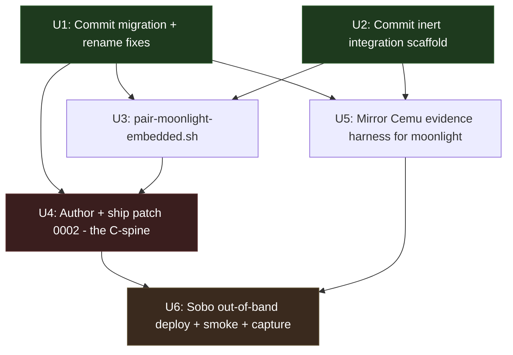
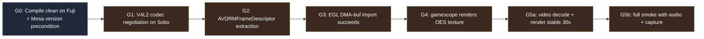
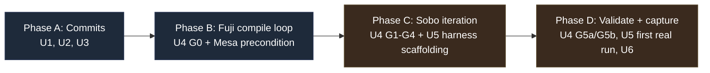

# feat: Ship moonlight-embedded SM8550 zero-copy v4l2m2m to Sobo end-to-end

## Summary

Wrap the C-spine defined in plan 002 (the `hevc_v4l2m2m` + EGL DMA-buf platform patch) with everything else needed to validate Korri Stream end-to-end on Sobo: commit the staged migration, ship a CLI-pair companion script, mirror the Cemu evidence harness for moonlight, and deploy the patched binary out-of-band via `nix copy`. Sequenced so the work commits as a series of independently-reviewable milestones that mesh with the worktree refactor (plan 001) when it lands its moonlight-embedded unit (U9), without pre-empting that wiring.

Terminology note: this plan uses **"the C-spine"** consistently for the C-language patch work (patch `0002-add-v4l2m2m-egl-platform.patch`). Earlier drafts drifted between "C-work", "the C work", and "the novel C work" — those are the same artifact.

---

## Problem Frame

The moonlight-embedded SM8550 package surface, dev-loop tooling, and integration scaffold were migrated into this repo in the current session and have built green on Fuji against the destination repo's nixpkgs pin (25.11). Nothing is committed. The C-spine — the actual zero-copy decode path — has not been written yet; plan 002's U5 names the work but does not execute it. No `moonlight-embedded` CLI pair flow exists anywhere in the repo (the existing `pair-moonlight.sh` targets the Qt client with a different keystore). The refactor in plan 001 is in flight in a separate worktree and explicitly owns the eventual rootfs wiring at its U9, so any wiring done here today would collide with it.

The goal is to take that work from "staged on disk, builds, untested on the target device" to "validated on Sobo with zero-copy hardware decode, with reproducible evidence, sequenced as committable steps that the refactor merge absorbs cleanly."

---

## Requirements

- R1. Every uncommitted file from the current session lands in git history as one or more reviewable commits, with at least byte-equality-to-source preserved for content that was mechanically migrated and a separable rationale for any session-time edits.
- R2. The two nixpkgs attribute renames discovered during Fuji build (`opus`→`libopus`, `libpthreadstubs`→`libpthread-stubs`) ride into history with a clear rationale that survives plan 001's later flake collapse (U10) without re-discovery.
- R3. A CLI-pair companion script (`pair-moonlight-embedded.sh`) exists, mirrors the existing Qt pair script's argv shape, and targets the embedded keystore.
- R4. Patch `0002-add-v4l2m2m-egl-platform.patch` lands under `packages/moonlight-embedded/patches/` and is referenced from `manifest.nix`. The package builds clean on Fuji with all three patches applied. `expectedPlatforms` includes `v4l2m2m`.
- R5. Patch 0002 produces a moonlight binary that, on Sobo, negotiates an iris V4L2 codec, extracts an `AVDRMFrameDescriptor`, imports it via `EGL_LINUX_DMA_BUF_EXT`, and renders an `GL_TEXTURE_EXTERNAL_OES` sample under SDL2 in a gamescope nested compositor.
- R6. An evidence harness mirroring the existing `remote-cemu-*.sh` shape produces a per-run evidence directory under `/storage/.guest/runs/` capturing build fingerprint, command line, environment, decode statistics, and a short capture (log + screenshot or video) for any moonlight smoke run.
- R7. Sobo deployment happens out-of-band (built on Fuji, `nix copy` to Sobo, ad-hoc invocation), not via rootfs profile inclusion. The rootfs profile composition stays unchanged so the refactor's U9 can wire it without conflict.
- R8. A 30-second-or-longer Korri Stream smoke succeeds on Sobo with `MOONLIGHT_PLATFORM=v4l2m2m`. Audio routes through PipeWire to the AYN UCM, not `auto_null`. Visible frames render in the gamescope window.
- R9. The successful smoke is captured as a dated acceptance doc and a new learning under `docs/solutions/` (per repo convention), so the next refactor consumer or future Mesa bump can reproduce the validation.
- R10. No file written by this plan conflicts with plan 001's listed file changes for its U9 *at path level*. **At content level, plan 003's `packages/moonlight-embedded/package.nix` supersedes the thin `overrideAttrs` sketch in plan 001 U9's Approach (and adds a `manifest.nix` sibling not in plan 001's file list); plan 003's `guest/modules/moonlight.nix` uses the `rocknix.sm8550.<feature>.*` options shape rather than plan 001 U9's `programs.nix-ld`/`systemd.tmpfiles`-only sketch.** When the refactor merges, plan 001 U9's residual scope is the *wiring* (profile import, kiosk chord, `MOONLIGHT_PLATFORM=v4l2m2m` env override, package output exposure via the top-level flake collapse) — the files exist; the merge does not Create them. Additive files added by this plan (`pair-moonlight-embedded.sh`, `remote-moonlight-*.sh`) live in `guest/launchers/` and have no path collision. See Documentation / Operational Notes for the explicit handoff text.

---

## Scope Boundaries

- The monorepo merge restructure itself (plan 001).
- Refactor U9 wiring of the staged module into `profiles/main-space.nix` — this plan deliberately leaves the module inert.
- Refactor U10 top-level flake collapse and the resulting `self.packages.moonlight-embedded` exposure.
- Moonlight-Qt CLI behavior, Qt pair flow, or any change to existing `guest/launchers/pair-moonlight.sh`.
- Sunshine host configuration, app catalog, or pair-state management on the host side.
- Korri portal / kiosk session changes.
- Mesa version bump for the guest (the plan depends on guest Mesa being usable for EGL DMA-buf import; if the guest profile ships 26.0.2 with the known freedreno regression, that's an upstream guest issue out of scope here — verification gate G3 in U4 will surface it).
- A Sway chord or `games-launcher.sh` entry for moonlight (those are profile-composition changes owned by plan 001 U9).
- Plan 002's U4 ("factor-out `src/video/ffmpeg.c`") — stays deferred. Patch 0002 mirrors PR #932's direct `avcodec_*` style and does not factor out shared FFmpeg helpers.

### Deferred to Follow-Up Work

- Per-app moonlight quality profiles (`stream-1080p60-h265`, `stream-4k30-h264`, etc.) wired into the launcher beyond the env-knob defaults. A `MOONLIGHT_PROFILE` knob may surface, but persisted-profile catalog management is later work.
- Power-tuning profile capture (`stream-1080p60-h265` named profile in the SM8550 power-profiling best-practice doc). Use `RUNNER_POWER=max` for this plan's smoke; named profile capture follows once the smoke is green.
- `nix copy` automation script. This plan validates the manual flow; automation can come once the path is proven.
- Refactor-time consumer of the new launchers in the kiosk session — handled by refactor 001 U9.
- Archive/tombstone of `nix-sm8550` (refactor's deferred U12).

---

## Context & Research

### Relevant Code and Patterns

- `guest/launchers/start_cemu_guest_gamescope.sh` — canonical launcher template (PATH, XDG, gamescope wrap, knob discovery, `/storage/.guest/runs/` logs). Already followed correctly in staged `start_moonlight_embedded_gamescope.sh`.
- `guest/launchers/pair-moonlight.sh` — Qt pair script. Shape to mirror for the embedded variant (argv parsing, PIN generation, banner), with the `QT_QPA_PLATFORM=offscreen` line dropped (irrelevant to the embedded CLI) and `-keydir /storage/.cache/moonlight` substituted for Qt's `~/.config/...` path.
- `guest/launchers/remote-cemu-runner.sh` + `remote-cemu-build-fingerprint.sh` + `remote-cemu-runtime-ab.sh` — evidence harness pattern. Mirror file-for-file for moonlight; reuse `RUNNER_POWER=max` semantics and the `/storage/.guest/runs/<ts>-<variant>-<profile>/` evidence layout.
- `guest/modules/device.nix` — `options.rocknix.sm8550.<feature>.{enable,package,…}` pattern. Already followed correctly in staged `guest/modules/moonlight.nix`.
- `guest/flake.nix:15-30` (`packageSetFor`) and `:31-71` (`mainSpaceConfigurationFor`) — composition seams the refactor's U9 will use to activate the staged module. Read-only reference for this plan.
- `guest/profiles/main-space.nix:148-160` — module imports list. Read-only reference; this plan does not add to it.
- `packages/moonlight-embedded/{manifest.nix,package.nix,patches/}` — package surface staged this session. U4 of this plan adds patch 0002, updates the manifest patch list, and updates `expectedPlatforms`.
- `scripts/moonlight-embedded-dev-checkout.sh` — dev-loop helper. Authoring `0002` happens in the scratch tree this helper materializes.
- `patches/rocknix/0006-rocknix-guest-substrate.patch` — already shipped on `main` (commit `537b92f`). Provides `/dev/video[0-9]*` enumeration + `DeviceAllow=char-video4linux rwm` (static + runtime re-emit). Prerequisite for U5 of plan 002.
- `docs/plans/2026-05-22-002-feat-moonlight-embedded-v4l2m2m-zero-copy-plan.md` — the C-work spine plan. U4 of this plan executes its U5.
- `docs/plans/2026-05-22-001-refactor-monorepo-merge-layered-restructure-plan.md` — the worktree refactor. U9 of that plan owns module activation and launcher wiring; this plan must not pre-empt it.
- `docs/thinking/2026-05-22-moonlight-embedded-{rk-structure,ffmpeg-drm-prime,forks-prior-art}.md` — tech context for U4 (FFmpeg DRM_PRIME API, EGL attrib lists, rk.c structural template, PR #932 prior-art survey).

### Institutional Learnings

- `docs/solutions/runtime-errors/guest-moonlight-no-v4l2m2m-decoder-missing-video-passthrough-rocknix-2026-05-22.md` — substrate prerequisite already paying its debt. Sobo `v4l2-ctl --list-formats` confirms HEVC/H264/VP90/AV01 inputs → NV12 / **Q08C** (QCOM compressed) outputs. Q08C is the zero-copy target format for U4. Iris ordinals are not stable across kernel revs — enumerate at runtime, never hardcode `video0`/`video1`.
- `docs/solutions/runtime-errors/guest-pipewire-dummy-sink-missing-udev-sound-records-rocknix-2026-05-13.md` — audio gate must precede streaming smoke. `wpctl status` / `pactl list short sinks` must show a real sink, not `auto_null`. Refuse to declare green if only `auto_null` is present; fix is `rocknix-guest-udev-stage` re-run + guest restart.
- `docs/solutions/best-practices/rocknix-layer14-main-space-cold-boot-autostart-2026-05-08.md` — `swaymsg exec` is silently broken in this nspawn config (`execlp("/bin/sh", ...)` returns success but nothing runs). Out-of-band launch via direct invocation in a guest shell sidesteps this; once the refactor wires the launcher into the kiosk it must do so via a systemd unit that inherits `WAYLAND_DISPLAY` + `XDG_RUNTIME_DIR`, not via `swaymsg exec`.
- `docs/solutions/performance-issues/rocknix-layer14-cemu-performance-audit-2026-05-09.md` — guest display path is within 5-16% of host for `glmark2-es2-wayland` and `vkcube`, so any moonlight FPS shortfall is in the decoder/import seam, not the display. **Mesa 25.2.6 is the known-stable guest Mesa**; Mesa 26.0.2 has a known `vkQueueSubmit Error -4` regression on freedreno that would tank the EGL import path. Verify guest Mesa version before declaring G3 (EGL import gate) green. CPU/GPU power profile dominates p1; `RUNNER_POWER=max` is mandatory for representative benchmarks.
- `docs/solutions/best-practices/rocknix-sm8550-power-profiling-2026-05-04.md` — `RUNNER_POWER=max` semantics + safe restore script shape. The harness in U5 reuses this.
- `docs/solutions/developer-experience/rocknix-stage10-generation-switch-proof-sm8550-2026-05-13.md` — fast inner-iteration loop for guest-only changes (import generation B, switch, audit, roll back). Not used by this plan because we deploy out-of-band (R7), but referenced for any future kiosk-driven test once the refactor lands.
- `docs/solutions/runtime-errors/rocknix-nix-remote-copy-profile-store-mismatch-2026-05-05.md` — `nix copy` post-conditions must be verified from a non-portable shell (`ls -ld /nix/store/<hash>-moonlight-embedded-*`). Korri-desktop hit a portable-vs-real `/nix` namespace split; the same trap applies to U6.
- `docs/ops/storage-audit-2026-05-14.md` — Sobo at 6.9 GB free on `/storage`. The moonlight closure is small (~50 MB) but generation switches can accumulate. U6 should clean up after itself rather than letting closures pile.

### External References

None. PR #932 and the three migrated briefs cover the FFmpeg DRM_PRIME / EGL DMA-buf / V4L2 stateful M2M territory; the unknowns are hardware-specific and resolve via Sobo iteration, not docs.

---

## Key Technical Decisions

- **Wrap plan 002 rather than rewrite it.** Plan 002 is the canonical C-spine artifact (vendored from `nix-sm8550`, complete with its U1-U6 structure and risk table). U4 of this plan *executes* plan 002's U5; the rest of this plan is the integration shell. Avoids duplicating risk-tracking and lets plan 002 stay as the C-spine reference.
- **Stay inert; do not wire into the guest profile today.** Plan 001 U9 explicitly owns `profiles/main-space.nix` activation of the moonlight module. Wiring it today would conflict-merge at refactor merge time and force re-resolution. Trade-off: Sobo testing cannot use the kiosk launch path; it uses out-of-band invocation instead (R7).
- **Out-of-band deployment via `nix copy`, not rootfs inclusion.** Builds on Fuji, transfers closure to Sobo, runs the launcher with `MOONLIGHT_BIN` env override pointing at the copied store path. This validates the patched binary on hardware without requiring the rootfs profile to import the staged module. When the refactor lands U9, the same launcher consumes `pkgs.moonlight-embedded` from the profile instead of an ad-hoc store path; no launcher change needed.
- **Two migration commits, not one.** U1 commits the migrated package surface (renames absorbed because they're required-for-build and therefore inseparable from the migration commit) and the docs. U2 commits the new staged integration scaffolding (module + launcher). Rationale: separates *concerns* — "package + tooling moved from another repo" (U1) vs "new inert integration scaffolding at refactor-target paths" (U2). The split is justified by the concern boundary, not bisectability of the rename fix (which the build itself requires).
- **Single C-spine unit (U4) with gates internal, not gates-as-units.** The patch (`0002-add-v4l2m2m-egl-platform.patch`) lands as one artifact; the gates G0-G5 are iteration checkpoints, not separate ships. Splitting into per-gate units would imply per-gate commits, which doesn't match how C patches actually develop (you usually rewrite earlier code as you discover later constraints).
- **Mirror Cemu evidence harness rather than invent a new one.** The `remote-cemu-runner.sh` family already shapes evidence directories, builds fingerprints, captures runtime A/B's. Reuse the shape so reviewers can apply the same eye to moonlight runs. Mirroring also future-proofs against the refactor renaming guest-launcher locations — both sets move together.
- **U4's first compile-clean is on Fuji (G0), not Sobo.** Compiles compile anywhere; the iteration loop is fast on Fuji. Sobo only enters at G1 (iris negotiation), which is where the hardware-specific unknowns start.

---

## Open Questions

### Resolved During Planning

- **Branch target — `main` or `merge-monorepo`?** `main`. Working on `merge-monorepo` would mean working inside the refactor; the whole "don't fight the refactor" framing presumes we work alongside it. Inert staging is what makes that work.
- **Pair script — separate file or extend existing?** Separate file (`pair-moonlight-embedded.sh`). Different binary, different keystore, parallel shape. Mashing them would force conditionals on which client variant the operator is pairing.
- **Combine migration + rename-fix commits?** No — two commits (see Key Technical Decisions). Cleanest narrative.
- **U4 internal sub-structure — units or gates?** Gates inside one unit. C work doesn't decompose cleanly into per-gate commits.
- **U6 deploy lane — Stage 10 generation switch or out-of-band `nix copy`?** Out-of-band `nix copy`. Stage 10 would require importing the moonlight module into the rootfs profile, which conflicts with R7. `nix copy` keeps the rootfs untouched.

### Deferred to Implementation

- **Exact iris codec/output format negotiation order in U4.** Brief at `docs/thinking/2026-05-22-moonlight-embedded-rk-structure.md` documents the rk.c sequence; whether it transfers verbatim or needs SM8550-specific ordering tweaks (e.g., `V4L2_PIX_FMT_NV12` vs `V4L2_PIX_FMT_QC08C`) is a G1 discovery.
- **EGL attribute list exact contents for Q08C modifier import.** Brief at `docs/thinking/2026-05-22-moonlight-embedded-ffmpeg-drm-prime.md` covers the EGL attrib structure; whether freedreno on Adreno 740 accepts the same modifier list as Mesa documents requires the actual `eglCreateImage` call (G3 discovery).
- **Whether 10-bit (HEVC Main 10) needs separate plumbing.** Brief calls out gotchas. G5 smoke can start with 8-bit; 10-bit follow-up if not free.
- **U5 harness naming for moonlight-specific knobs.** The Cemu harness uses `CEMU_*` env knobs; moonlight's will use `MOONLIGHT_*`. Specific knob names emerge from mirroring the file structure, not plan-time invention.
- **Acceptance doc filename and learning category for U6.** Convention is dated; exact date and category (`developer-experience` vs `runtime-errors` vs `performance-issues`) depends on what the smoke surfaces.

---

## High-Level Technical Design

> *This illustrates the intended sequence and dependency shape and is directional guidance for review, not implementation specification. The implementing agent should treat it as context, not code to reproduce.*

### Unit dependency graph



U1 and U2 commit independently; U3 (small) can land in parallel with the start of U4. U4 is the load-bearing C-spine work and has internal gates G0-G5. U5 has no dependency on the patch being complete (harness scaffolding can land alongside U4 iteration) — hence depending on U1+U2 only. U6 is the integration gate that closes the plan.

### U4 internal gates



Each gate produces a debuggable artifact (stderr log, V4L2 ioctl trace, EGL error code, screenshot). Iteration between gates may rewrite earlier code; the gates are checkpoints, not freezes. G0 includes the guest Mesa version precondition because Mesa 26.0.2 has a known freedreno regression that would make G3 fail deterministically on iteration — detecting before any Sobo work starts avoids wasted cycles.

### Phased delivery



Sobo is only required from Phase C onward. Phases A-B happen entirely on Fuji. U5 scaffolding lands in Phase C (in parallel with Sobo iteration); U5's first actual evidence-capturing run happens in Phase D once a working binary exists to wrap.

---

## Implementation Units

### U1. Commit migration with nixpkgs 25.11 rename fixes

**Goal:** Get the staged package surface, dev-loop tooling, and docs into git history as one mechanical-migration commit. The two nixpkgs attribute renames (`opus`→`libopus`, `libpthreadstubs`→`libpthread-stubs`) ride along because they're required for the package to build at all on the destination repo's nixpkgs pin.

**Requirements:** R1, R2

**Dependencies:** None

**Files:**
- Commit (already on disk, untracked or modified):
  - `packages/moonlight-embedded/manifest.nix`
  - `packages/moonlight-embedded/package.nix` (includes the rename fixes)
  - `packages/moonlight-embedded/README.md`
  - `packages/moonlight-embedded/patches/0001-vendored-ffmpeg-drm-prime-pr932.patch`
  - `packages/moonlight-embedded/patches/0001a-fix-libdrm-cmake-find-and-main-help.patch`
  - `packages/moonlight-embedded/patches/README.md`
  - `scripts/moonlight-embedded-dev-checkout.sh`
  - `docs/plans/2026-05-22-002-feat-moonlight-embedded-v4l2m2m-zero-copy-plan.md`
  - `docs/thinking/2026-05-22-moonlight-embedded-rk-structure.md`
  - `docs/thinking/2026-05-22-moonlight-embedded-ffmpeg-drm-prime.md`
  - `docs/thinking/2026-05-22-moonlight-embedded-forks-prior-art.md`
- Do not commit yet (U2): `guest/modules/moonlight.nix`, `guest/launchers/start_moonlight_embedded_gamescope.sh`
- Do not commit at all (pre-existing untracked): `guest/launchers/pair-moonlight.sh` (existed before this session — separate concern, do not absorb)

**Approach:**
- Single commit. Title shape: `feat(moonlight-embedded): migrate SM8550 package surface from nix-sm8550`.
- Body explains the source (`nix-sm8550@2fe90b1`), what's mechanical (patches, manifest, briefs, plan doc) vs adapted (README path references, plan frontmatter `verify_command`, dev-checkout helper's flake.nix anchor swap), and the two nixpkgs renames with the Fuji build evidence ("verified clean against nixos-25.11; without these renames the package fails to evaluate with `Function called without required argument \"opus\"`").
- Use `git add -p` to stage only the U1-scope paths; explicitly leave `guest/modules/moonlight.nix` and `guest/launchers/start_moonlight_embedded_gamescope.sh` for U2.

**Patterns to follow:**
- Commit message convention from recent `main` history (`feat(<scope>): ...` body with rationale paragraphs and provenance pointers — see commits `537b92f`, `7175227`, `8bcd1f0`).

**Test scenarios:**
- Happy path: after commit, `bash scripts/moonlight-embedded-dev-checkout.sh` runs to completion (clones, branches, applies both patches in `LC_ALL=C` order, prints "applied 2 patch(es)").
- Happy path: `nix eval --impure --expr '(import packages/moonlight-embedded/manifest.nix).version'` returns `"2.7.1-sm8550-v4l2m2m"`.
- Integration: the build proven on Fuji this session still reproduces from the committed tree (`nix-build -I nixpkgs=channel:nixos-25.11 -E 'with import <nixpkgs> {}; callPackage ./packages/moonlight-embedded/package.nix {}' --no-out-link` succeeds).
- Edge case: `git status` after commit shows the U2 files (`guest/modules/moonlight.nix`, `guest/launchers/start_moonlight_embedded_gamescope.sh`) still untracked, the pre-existing `guest/launchers/pair-moonlight.sh` still untracked, and no other surprises.

**Verification:**
- One new commit on `main` containing exactly the U1-scope files
- `bash scripts/moonlight-embedded-dev-checkout.sh` exits 0
- The Fuji build reproduces from this commit's tree

---

### U2. Commit staged guest integration scaffolding (inert)

**Goal:** Get the inert NixOS module and the launcher script into git so plan 001's U9 can find them at the refactor's target paths. Explicitly do not import the module from any profile.

**Requirements:** R1, R10

**Dependencies:** U1 (so the module's `defaultText` pointer at `packages/moonlight-embedded/` references something already in history)

**Files:**
- Commit:
  - `guest/modules/moonlight.nix`
  - `guest/launchers/start_moonlight_embedded_gamescope.sh`
- Do not touch: `guest/profiles/main-space.nix` (no import added)
- Do not touch: `guest/flake.nix` (no `packagesFor` entry added)

**Approach:**
- Single commit. Title shape: `feat(moonlight-embedded): stage inert guest integration scaffold at refactor target paths`.
- Body explains the refactor-staging posture: the module is `enable = false` by default, the launcher is not yet copied to `/storage/.guest/`, and the refactor's U9 is where these become active. Includes a one-line acknowledgement that plan 001 U9 is the canonical wiring step — this commit makes its job mechanical.
- Verify after staging that grep for `import ./modules/moonlight.nix` and `start_moonlight_embedded_gamescope.sh` in `guest/profiles/` returns nothing — proves the inert posture is preserved.

**Patterns to follow:**
- Existing `guest/modules/audio.nix` and `guest/modules/steam.nix` shape (option-defined, `lib.mkIf cfg.enable`, `environment.systemPackages`, `systemd.tmpfiles.rules`).
- Existing `guest/launchers/start_cemu_guest_gamescope.sh` shape (PATH+XDG export, `${VAR:-default}` knob discovery, `command -v` gates, `/storage/.guest/runs/` log redirect, `exec gamescope ... -- payload`).

**Test scenarios:**
- Happy path: `nix-instantiate --parse guest/modules/moonlight.nix` exits 0.
- Happy path: `bash -n guest/launchers/start_moonlight_embedded_gamescope.sh` exits 0.
- Edge case: `grep -r 'moonlight.nix' guest/profiles/ guest/flake.nix` returns no matches (confirms the module is not yet imported).
- Edge case: `grep -r 'start_moonlight_embedded' guest/profiles/ guest/flake.nix` returns no matches (confirms launcher is not yet referenced in profile composition).
- Integration: existing guest static checks (`bash guest/scripts/static-checks.sh`) still pass — no existing invariant should fail because of additive inert files. If any does, the static check or this commit is mis-shaped.

**Verification:**
- One new commit on `main` containing exactly the two U2-scope files
- Both files parse / syntax-check clean
- No profile or flake imports added
- `bash guest/scripts/static-checks.sh` still passes

---

### U3. Add `pair-moonlight-embedded.sh` companion launcher

**Goal:** Provide a CLI-pair script that mirrors the Qt `pair-moonlight.sh` shape but targets the embedded binary and the `/storage/.cache/moonlight` keystore, so U4 verification has a deterministic pair flow rather than ad-hoc shell invocations.

**Requirements:** R3

**Dependencies:** U1 (manifest exists), U2 (the stream launcher already honors the same `MOONLIGHT_BIN` knob this script uses; U2's launcher edit is the contract this script parallels).

**Files:**
- Create: `guest/launchers/pair-moonlight-embedded.sh`

**Approach:**
- Mirror `pair-moonlight.sh` shape: argv parsing (host required, pin optional), 4-digit PIN generation with non-zero leading digit, banner with PIN + Sunshine web UI URL, `exec` the binary with the pair subcommand.
- Differences from the Qt script:
  - Shebang: `#!/usr/bin/env nix-shell` with `#! nix-shell -i bash --pure -p coreutils gawk gnugrep` (drop `moonlight-qt`; the embedded binary is consumed via an env override, not a nix-shell input, so it works whether the binary is staged via U6's `nix copy` or via the future refactor-installed package).
  - Resolve binary: `MOONLIGHT_BIN=${MOONLIGHT_BIN:-$(command -v moonlight 2>/dev/null || true)}` mirroring the stream launcher's resolution exactly. Fail with the same instructive error pointing at U6's `nix copy` flow if neither is set.
  - Drop `QT_QPA_PLATFORM=offscreen` (no Qt event loop).
  - Use `-keydir /storage/.cache/moonlight` (the embedded keystore) and `pair <host>` subcommand.
  - Banner reminds operator about `/storage/.cache/moonlight` ownership and that this is separate from the Qt keystore.
- Mark executable.

**Patterns to follow:**
- `guest/launchers/pair-moonlight.sh` for argv parsing, PIN generation, exit codes, banner shape.
- `MOONLIGHT_BIN` knob convention from `guest/launchers/start_moonlight_embedded_gamescope.sh` (added by U2). Both scripts resolve the binary identically so out-of-band deploys can set the env once.

**Test scenarios:**
- Happy path: `bash -n guest/launchers/pair-moonlight-embedded.sh` exits 0.
- Happy path (with mock binary): `MOONLIGHT_BIN=/bin/true pair-moonlight-embedded.sh testhost 1234` prints the banner and exits 0 (the mock satisfies the exec without actually pairing). Validates argv handling and banner rendering without requiring a real Sunshine host.
- Edge case: missing host argument → exit 64, usage to stderr.
- Edge case: bad PIN format ("0123") → exit 64, error to stderr (mirrors Qt script's validation).
- Edge case: missing `MOONLIGHT_BIN` and no `moonlight` on PATH → exit 127 with informative error pointing at U6's `nix copy` flow.

**Verification:**
- File exists, executable
- Script parses (`bash -n`)
- Argv validation works with a mock binary
- Help/usage on `-h` or no args

---

### U4. Author and ship patch `0002-add-v4l2m2m-egl-platform.patch` — the C-spine

**Goal:** Execute plan 002's U5. Write the patch that adds a `v4l2m2m` platform to moonlight-embedded: selects `hevc_v4l2m2m` / `h264_v4l2m2m` decoders explicitly by name, extracts the `AVDRMFrameDescriptor` from each decoded frame, imports it into a GL texture via `EGL_LINUX_DMA_BUF_EXT`, and samples `GL_TEXTURE_EXTERNAL_OES` in an SDL2 GL context so it composes under gamescope. Land the patch, update the manifest, and prove it builds on Fuji + runs the gates on Sobo.

**Precondition (blocking, before any G0 work):** Guest Mesa version is **not** 26.0.2. Mesa 26.0.2 has a known freedreno `vkQueueSubmit Error -4` regression (per `docs/solutions/performance-issues/rocknix-layer14-cemu-performance-audit-2026-05-09.md`) that would cause G3 (EGL DMA-buf import) to fail deterministically on every iteration. Verify by building the current `rocknix-guest-main-space-odin2portal` rootfs and inspecting its Mesa package (`nix-store --query --references` over the closure, grep for `mesa-*`) **before** starting C-patch authoring. If the rootfs ships 26.0.2, the plan pauses here: either Mesa downgrade is in scope (escalate to user) or the plan blocks pending an upstream Mesa fix. Do not start G0 until this gate clears.

**Requirements:** R4, R5, R8

**Dependencies:** U1 (manifest exists), U3 (pair flow available for any hardware iteration)

**Files:**
- Create: `packages/moonlight-embedded/patches/0002-add-v4l2m2m-egl-platform.patch`
- Modify: `packages/moonlight-embedded/manifest.nix` (add patch 0002 to `patches`, add `"v4l2m2m"` to `expectedPlatforms`, comment-uncomment `"-DENABLE_V4L2M2M=ON"` in `cmakeFlags`)
- Modify: `packages/moonlight-embedded/README.md` (status table: `v4l2m2m` row → "shipped" instead of "not yet implemented")
- Modify: `packages/moonlight-embedded/patches/README.md` (row 0002 status update)

**Approach:**
- Author in the scratch tree produced by `scripts/moonlight-embedded-dev-checkout.sh` (one Fuji-side iteration loop; export to repo via `git format-patch` once stable).
- Structural template: `src/video/rk.c` (existing EGL/GLES rkmpp platform — same shape of decoder-thread + GL-render-thread, but rkmpp swaps for FFmpeg's `hevc_v4l2m2m` wrapper). Brief at `docs/thinking/2026-05-22-moonlight-embedded-rk-structure.md` documents the file-by-file mapping.
- FFmpeg API: select decoder by name (`avcodec_find_decoder_by_name("hevc_v4l2m2m")` / `"h264_v4l2m2m"`), set `AVCodecContext.pix_fmt = AV_PIX_FMT_DRM_PRIME`, drain each `AVFrame` for its `AVDRMFrameDescriptor` (`(AVDRMFrameDescriptor *)frame->data[0]`). Brief at `docs/thinking/2026-05-22-moonlight-embedded-ffmpeg-drm-prime.md` is the API reference.
- EGL import: `eglCreateImage(display, EGL_NO_CONTEXT, EGL_LINUX_DMA_BUF_EXT, NULL, attribs)` with one attrib block per plane carrying `EGL_DMA_BUF_PLANE<i>_FD_EXT` / `EGL_DMA_BUF_PLANE<i>_OFFSET_EXT` / `EGL_DMA_BUF_PLANE<i>_PITCH_EXT` / `EGL_DMA_BUF_PLANE<i>_MODIFIER_LO_EXT` / `EGL_DMA_BUF_PLANE<i>_MODIFIER_HI_EXT`. Then `glEGLImageTargetTexture2DOES(GL_TEXTURE_EXTERNAL_OES, eglImage)`. Sample with `samplerExternalOES` in the fragment shader (the brief documents the GLSL prelude `#extension GL_OES_EGL_image_external_essl3 : require`).
- Register via the platform plumbing PR #932 added (`src/platform.h` enum, `src/platform.c` dispatch table, `src/main.c` `-platform` help — patch 0001a already added `ffmpeg_drm` to help text; this patch adds `v4l2m2m`).
- CMake: gate the new files behind `-DENABLE_V4L2M2M=ON` (default ON) with a `pkg_check_modules(EGL egl glesv2)` probe (same shape as 0001a's `DRM` probe). Add the new translation unit to the `moonlight` target sources when enabled.
- After scratch-tree iteration, export with `git format-patch --start-number 2 -1 nix-on-rocks-dev -o packages/moonlight-embedded/patches/` (the `--start-number 2` is required — default `format-patch` numbers from 0001 and would clobber the existing `0001-vendored-ffmpeg-drm-prime-pr932.patch`). Verify `LC_ALL=C` filename ordering with `LC_ALL=C ls packages/moonlight-embedded/patches/*.patch` keeps `0001-*`, `0001a-*`, `0002-*` in order. Plan 002's U6 drift-detector script (intended to catch ordering regressions automatically) does not yet exist in this repo — it's tracked under plan 001 U3 (top-level `scripts/static-checks.sh` creation) and plan 002 U6 (the moonlight-specific invariants block). Manual `ls | sort` is the verification today; the auto-detector lands when those plans land.
- After patch lands, on Fuji: rebuild with `nix-build`. On Sobo: out-of-band invocation (U6 covers the deploy; U4's hardware-touching gates G1-G4 happen during iteration, before U6's full smoke).

**Execution note:** Iterative compile-test-validate loop tied to gates G0-G5, not a tight sequence of code edits. Expect the new file (`src/video/v4l2m2m.c` or similar — final name is implementation discovery) to be rewritten between gates as discoveries propagate backward. Treat each gate's pass as a checkpoint worth tag/branch save-point but not a separate plan unit.

**Technical design:** *(directional guidance, not implementation specification — final shape emerges through Sobo iteration)*

Structural pseudo-code for the new platform's hot loop:

```text
PLATFORM_INIT:
  - locate iris V4L2 node (enumerate /dev/video[0-9]* at runtime — never hardcode)
  - avcodec_find_decoder_by_name("hevc_v4l2m2m") || h264 fallback
  - configure AVCodecContext: pix_fmt = AV_PIX_FMT_DRM_PRIME, threading off
  - create SDL2 window + GL context, query EGL display + extensions
    (require EGL_EXT_image_dma_buf_import + EGL_EXT_image_dma_buf_import_modifiers)
  - compile shader pipeline with samplerExternalOES + GL_OES_EGL_image_external_essl3

PLATFORM_SUBMIT_FRAME(units):
  - avcodec_send_packet / avcodec_receive_frame
  - on AV_PIX_FMT_DRM_PRIME frame: cast frame->data[0] → AVDRMFrameDescriptor
  - for each layer/plane:
      build EGL attrib list with FD/OFFSET/PITCH/MODIFIER
      eglCreateImage(EGL_LINUX_DMA_BUF_EXT)
      glBindTexture(GL_TEXTURE_EXTERNAL_OES, t)
      glEGLImageTargetTexture2DOES(GL_TEXTURE_EXTERNAL_OES, image)
  - render texture to fullscreen quad via the OES fragment shader
  - SDL_GL_SwapWindow
  - eglDestroyImage (frame ownership ends with av_frame_unref)
```

This is the same shape PR #932's `ffmpeg_drm.c` uses, with the KMS atomic display thread swapped for the SDL2 GL render path (so gamescope can own DRM master).

**Patterns to follow:**
- `src/video/rk.c` (upstream) — overall EGL/GLES platform shape: decoder thread feeds a frame queue, render thread imports and draws.
- PR #932's `src/video/ffmpeg_drm.c` (vendored as patch 0001) — `AVDRMFrameDescriptor` extraction is verbatim-reusable; only the display sink differs.
- `0001a` patch — pattern for adding a `pkg_check_modules` probe + extending `main.c` help text.
- `LC_ALL=C` filename ordering rule documented in plan 002 U6 and enforced by `scripts/moonlight-embedded-dev-checkout.sh`.

**Test scenarios:**
- **G0 — compile clean on Fuji (Mesa precondition passed):** `nix-build` against the patched manifest succeeds; `bin/moonlight --help` shows `v4l2m2m` in the `-platform` list; `nix-support/moonlight-embedded-build/manifest.txt` shows all three patches and `expectedPlatforms=sdl ffmpeg_drm v4l2m2m`.
- **G1 — V4L2 negotiation on Sobo:** `MOONLIGHT_PLATFORM=v4l2m2m moonlight stream <host> Desktop` produces stderr indicating successful `VIDIOC_S_FMT` against the iris device (NV12 or Q08C output negotiated). Specific log lines depend on FFmpeg's `hevc_v4l2m2m` verbosity; verify against `dmesg` for any iris errors.
- **G2 — `AVDRMFrameDescriptor` extraction:** stderr shows the first frame's `AVDRMFrameDescriptor.nb_layers` / `nb_planes` / per-plane `fd` + `offset` + `pitch` + `modifier`. Validates that FFmpeg's iris wrapper returns DRM_PRIME-shaped frames; non-DRM_PRIME pix_fmt at this point means the decoder configuration is wrong, fix and re-iterate.
- **G3 — EGL DMA-buf import:** `eglCreateImage` returns non-`EGL_NO_IMAGE_KHR`; `eglGetError()` after returns `EGL_SUCCESS`. Mesa version precondition (verified before G0) protects against the known 26.0.2 freedreno regression; if Mesa is correct and G3 still fails, the modifier list is the suspect — iterate against `eglQueryDmaBufModifiersEXT` results.
- **G4 — gamescope renders OES texture:** Visible frame in the gamescope window (even if wrong color or static — proves the OES sampler is wired and texture is bound). Use a known stream source (Sunshine "Desktop" app) so misrender is recognizable.
- **G5a — video decode + render stable 30 s:** `MOONLIGHT_PLATFORM=v4l2m2m` stream renders visible frames for ≥ 30 seconds with ≤ 2 frame drops total, no `EGL_BAD_*` errors from the import path in stderr, no iris errors in `dmesg`. This isolates the patch's deliverable (decoder + EGL + GL + gamescope) from audio infra. Audio is not asserted at G5a.
- **G5b — end-to-end smoke including audio + capture:** G5a plus audio routes through PipeWire (not `auto_null`) to the AYN UCM, and a short capture (via U5's harness) lands under `/storage/.guest/runs/`. G5b is the U6 acceptance gate — it relies on PipeWire health which is independent of the patch.
- Integration: with `MOONLIGHT_PLATFORM=sdl` (software decode fallback) the patched binary still works — verifies patch 0002 doesn't regress the existing SDL platform.
- Edge case: with `-platform ffmpeg_drm` (PR #932's path), the binary exits with the documented "needs DRM master" error under gamescope — verifies 0002 doesn't accidentally activate 0001's KMS path.
- Edge case: filename ordering: `LC_ALL=C find packages/moonlight-embedded/patches -name '*.patch' | LC_ALL=C sort` lists `0001-*`, `0001a-*`, `0002-*` in that order. Plan 002 U6's drift detector script (currently in `scripts/static-checks.sh` from `nix-sm8550`, not yet ported) would fail otherwise; if/when that detector lands here it will catch the regression.

**Verification:**
- All three patches present in `packages/moonlight-embedded/patches/`
- Manifest lists all three; `expectedPlatforms` includes `v4l2m2m`; `cmakeFlags` has `-DENABLE_V4L2M2M=ON`
- Mesa precondition documented as passed (or paused with explicit escalation note)
- Fuji `nix-build` succeeds; `bin/moonlight --help` shows `v4l2m2m`
- G5a (video stability) succeeds on Sobo. G5b (full smoke with audio + capture) is U6's acceptance gate.

---

### U5. Mirror Cemu evidence harness for moonlight runs

**Goal:** Stand up `remote-moonlight-runner.sh`, `remote-moonlight-build-fingerprint.sh`, and `remote-moonlight-runtime-ab.sh` paralleling the existing Cemu harness, so U6's Sobo smoke produces reviewable evidence under `/storage/.guest/runs/<ts>-<variant>-<profile>/` matching the existing convention.

**Requirements:** R6

**Dependencies:** U1 (manifest exists for build fingerprint), U2 (launcher exists to wrap), U3 (pair flow exists for first-run setup). Can land in parallel with U4 once those are in.

**Files:**
- Create: `guest/launchers/remote-moonlight-runner.sh`
- Create: `guest/launchers/remote-moonlight-build-fingerprint.sh`
- Create: `guest/launchers/remote-moonlight-runtime-ab.sh`

**Approach:**
- Mirror file-for-file from `guest/launchers/remote-cemu-{runner,build-fingerprint,runtime-ab}.sh`. Replace `CEMU_*` env knobs with `MOONLIGHT_*`. Reuse `RUNNER_POWER=max` semantics and `/storage/.guest/runs/<ts>-<variant>-<profile>/` evidence layout — both are project conventions.
- The Cemu runner invokes a sibling `remote-cemu-cleanup.sh` (see `remote-cemu-runner.sh:~381`) and may reference other helpers in the Cemu set. The minimum-viable mirror is the three named files; during implementation, mirror any cleanup/import/promote helpers the runner actually calls. The file list above is the minimum, not the complete set.
- Build fingerprint captures: `nix-store --query --references` over the moonlight closure, `manifest.txt` contents from `$out/nix-support/moonlight-embedded-build/`, patch list with hashes, `moonlight --version` output.
- Runner captures: launcher env, gamescope/moonlight stderr split, decoder statistics (parse from moonlight verbose output), short MP4 capture of the gamescope output if `RUNNER_CAPTURE=1` (use existing `gamescope --capture` flag).
- **Audio precondition enforced by the runner**: before invoking the stream launcher, run `wpctl status` inside the guest and refuse to start if only `auto_null` is present. Prints the udev re-stage instruction from the dummy-sink learning doc. This makes G5b's audio gate enforceable rather than operator-checklist.
- Runtime-A/B captures: two consecutive runs (e.g., `-platform sdl` vs `-platform v4l2m2m`) for direct comparison, writes a side-by-side `evidence.md` matching the Cemu A/B's shape. **Justification for keeping in scope:** U6's learning doc benefits from a quantified sdl→v4l2m2m delta to justify the patch's existence in repo history; runtime-A/B is the lightweight tool that captures it. If the smoke (G5a/G5b) is unequivocally green and the learning doc can be written without quantified comparison, U5's runtime-A/B script becomes Deferred to Follow-Up Work.

**Patterns to follow:**
- Existing Cemu harness file-by-file. Do not invent a new evidence layout.
- Power-profile best-practice doc for `RUNNER_POWER=max` apply/restore.

**Test scenarios:**
- Happy path: `bash -n` clean on all three scripts.
- Happy path (dry-run on Fuji): `remote-moonlight-build-fingerprint.sh` against a Fuji-built closure produces a fingerprint file with manifest, patch list, and binary version. Validates the script works against any moonlight closure, not just Sobo.
- Edge case (no `/storage`): runner detects missing `/storage/.guest/runs/` parent and exits with a clear error pointing at the guest mount.
- Integration: from Sobo, `remote-moonlight-runner.sh testhost Desktop` produces a populated evidence directory after a short run (used directly by U6).

**Verification:**
- All three scripts present, executable, syntax-clean
- Fingerprint script works against a Fuji-built closure
- Evidence-directory layout matches the Cemu harness convention

---

### U6. Sobo out-of-band deploy + end-to-end smoke + capture

**Goal:** Validate U4's patch on real hardware. Build on Fuji, `nix copy` the closure to Sobo, pair via U3's script, run via the staged launcher with `MOONLIGHT_PLATFORM=v4l2m2m`, capture evidence via U5's harness, document acceptance + the learning.

**Requirements:** R7, R8, R9

**Dependencies:** U4 (patch must ship), U5 (harness must exist for evidence)

**Files:**
- Create: `docs/acceptance/sm8550-device-acceptance-YYYY-MM-DD-sobo-moonlight-embedded-v4l2m2m.md` (exact date TBD)
- Create: `docs/solutions/<category>/moonlight-embedded-v4l2m2m-zero-copy-sobo-YYYY-MM-DD.md` (category TBD: `developer-experience` if the deploy path was the lesson, `performance-issues` if the gain/regression was the lesson, `runtime-errors` if a debug saga was the lesson — pick at write time based on what surfaced)

**Approach:**
- **Sobo nix substrate precondition** (verified once before U6 starts): `ssh root@sobo 'command -v nix && nix store ping 2>&1'` must show a real Nix daemon, not a nix-portable wrapper. If nix-portable is the only Nix on Sobo (the Korri-desktop trap per the `nix-remote-copy-profile-store-mismatch` learning), the `nix copy` lane is unworkable and the plan needs to escalate (either: install real Nix on Sobo, or revisit the stay-inert decision and use Stage 10 generation switch instead). Do not start the build-and-copy steps until this passes.
- **Build on Fuji**: `nix-build -I nixpkgs=channel:nixos-25.11 -E 'with import <nixpkgs> {}; callPackage ./packages/moonlight-embedded/package.nix {}'`. Verify all three patches applied, `v4l2m2m` in `--help`.
- **Transfer to Sobo**: `nix copy --to ssh-ng://root@sobo /nix/store/...-moonlight-embedded-2.7.1-sm8550-v4l2m2m`. Verify post-conditions: `ssh root@sobo 'ls -ld /nix/store/<hash>-moonlight-embedded-*'` from a non-portable shell.
- **Mesa precondition**: already verified before U4 started (see U4 precondition). If the Sobo deploy substrate's Mesa drifted from the build target after U4 finished, re-verify here.
- **Audio precondition**: handled by U5's runner before the smoke fires (`wpctl status`, refuse-on-`auto_null`). If the runner is not yet in place, operator runs `wpctl status` manually before invoking the stream launcher. Remediation per the dummy-sink learning is documented in `docs/solutions/runtime-errors/guest-pipewire-dummy-sink-missing-udev-sound-records-rocknix-2026-05-13.md` — quote the exact udev re-stage command from that doc inline if the runner needs to print it.
- **Pair**: `MOONLIGHT_BIN=/nix/store/<hash>-moonlight-embedded-*/bin/moonlight bash guest/launchers/pair-moonlight-embedded.sh aka` (or whatever the Sunshine host is). Follow the banner's web UI flow.
- **Smoke**: `MOONLIGHT_BIN=/nix/store/<hash>.../bin/moonlight MOONLIGHT_PLATFORM=v4l2m2m bash guest/launchers/start_moonlight_embedded_gamescope.sh aka "Desktop"`. Run for 30+ seconds.
- **Capture**: `bash guest/launchers/remote-moonlight-runner.sh aka "Desktop"` (under `RUNNER_POWER=max`) captures evidence. Verify the evidence directory under `/storage/.guest/runs/` contains the expected files (matches Cemu harness layout).
- **Cleanup**: `nix-store --delete /nix/store/<hash>-moonlight-embedded-...` if disk pressure on Sobo (6.9 GB free per the storage audit).
- **Document**:
  - Acceptance doc captures: build SHA (commits from U1-U5), patch SHAs (0001/0001a/0002), Fuji nixpkgs rev, Sobo kernel rev, Mesa version, FFmpeg version, iris driver version, evidence directory path, smoke duration, any anomalies.
  - Learning doc captures: what specifically broke during gates and how it was resolved, anything to know for the next Mesa bump or kernel update, anything to feed back into plan 001 U9 (e.g., "kiosk activation must set `MOONLIGHT_PLATFORM=v4l2m2m` explicitly because the default `sdl` is too slow").

**Patterns to follow:**
- `docs/solutions/developer-experience/rocknix-stage10-generation-switch-proof-sm8550-2026-05-13.md` — not used as the deploy lane here (we're out-of-band), but its evidence-capture and audit pattern is the model for the acceptance doc.
- Existing `docs/acceptance/sm8550-device-acceptance-*-sobo.md` files for filename and content shape.
- Existing `docs/solutions/<category>/...sm8550-YYYY-MM-DD.md` files for the learning capture shape.

**Test scenarios:**
- **Happy path**: 30+ second stream completes; visible frames; audio routes to a real sink; `dmesg` shows no iris errors; evidence directory captured.
- **Edge case: closure copy lands in nix-portable namespace** — script detects via `ls -ld` from non-portable shell and aborts with a clear error pointing at the learning doc. Validates the script enforces the trap we know about.
- **Edge case: audio gate fails (`auto_null` only)** — U5's runner refuses to start the stream, prints the udev re-stage instruction. Surface this rather than producing a silent stream nobody believes.
- **Edge case: Mesa 26.0.2 detected** — should never reach here (U4 precondition gates it). If somehow Mesa drifted between U4 G0 and U6, U6's substrate re-verify catches it.
- **Edge case: pair state lost after `/storage` cleanup** — script detects no pair cert at `/storage/.cache/moonlight/<host>` and points at U3's `pair-moonlight-embedded.sh`.
- **Failure path: gamescope blackframe** — captured screenshot shows blank/wrong color → G4 regression hit, debug via FFmpeg stats and EGL error log. Acceptance doc captures the failure mode if reproducible.
- **Failure path: decoder underrun** — moonlight stderr shows frame drops > N per second → check power profile, check `dmesg` for iris throttling, check Mesa version, retry with `RUNNER_POWER=max` if not already.

**Verification:**
- Smoke produces 30+ second stable stream with `MOONLIGHT_PLATFORM=v4l2m2m`
- Audio routes through PipeWire to a real sink
- Evidence directory captured under `/storage/.guest/runs/` matching the Cemu harness layout
- Acceptance doc landed at `docs/acceptance/`
- Learning doc landed at `docs/solutions/<category>/`
- Sobo `/storage` not noticeably more full than before (closure cleaned up if needed)

---

## System-Wide Impact

- **Interaction graph at refactor merge time**: when plan 001's `merge-monorepo` branch merges, its U9 imports `guest/modules/moonlight.nix` from `profiles/main-space.nix` and references `guest/launchers/start_moonlight_embedded_gamescope.sh` from the kiosk session. Both files exist at the target paths from U2 of this plan; the merge is mechanical. U3's `pair-moonlight-embedded.sh` becomes available via the same mechanism. U5's harness files are additive — no merge conflict. U4's patch ships through `packages/moonlight-embedded/patches/` and `manifest.nix`; the refactor's U10 flake collapse picks up the package via `self.packages.<system>.moonlight-embedded` automatically.
- **Error propagation**: U6 failures surface as Sobo runtime errors and stay isolated to the test invocation (no rootfs change). U4 patch defects surface at compile (G0, Fuji) before hardware iteration starts.
- **State lifecycle**: pair state at `/storage/.cache/moonlight/<host>` survives generation switches and the `/storage/.update/*.tar` host-substrate update lane. No special preservation needed beyond keeping the keydir under `/storage`.
- **API surface parity**: the new `pair-moonlight-embedded.sh` does not change `pair-moonlight.sh`. They coexist; they pair with the same Sunshine host but use different client keystores. Operators picking the wrong script will pair the wrong client — banner text in U3 should make this obvious.
- **Integration coverage**: U6's smoke is the cross-layer scenario that U4's per-gate iteration alone cannot prove (decoder + EGL + GL + SDL2 + gamescope + sway + nspawn + PipeWire + Sunshine all interacting). No unit-level coverage substitutes.
- **Unchanged invariants**: `patches/rocknix/0006-rocknix-guest-substrate.patch` and its static/runtime checks for `/dev/video[0-9]*` enumeration + `DeviceAllow=char-video4linux rwm` are unchanged and unaffected. `guest/scripts/static-checks.sh` invariants for cemu/steam/input/audio/UCM are unchanged. `guest/flake.nix` package set is unchanged (no moonlight entry added here; the refactor's U9 owns that). The existing `guest/launchers/pair-moonlight.sh` (Qt) is untouched.

---

## Risks & Dependencies

| Risk | Likelihood | Impact | Mitigation |
|------|-----------|--------|------------|
| Guest Mesa is 26.0.2 (freedreno `vkQueueSubmit Error -4` regression) | Med | High | U4 entry precondition (before G0) blocks on Mesa version. If 26.0.2, plan pauses pending downgrade-in-scope escalation or upstream fix. Failure becomes a plan-time signal, not iteration burn. |
| Iris `hevc_v4l2m2m` codec configuration doesn't match what FFmpeg expects | Med | Med | G1 is the first Sobo gate; failures here mean a configuration mismatch (pix_fmt order, capability flags). `dmesg` + `v4l2-ctl --list-formats-out` on Sobo are the diagnostic tools. Brief at `docs/thinking/2026-05-22-moonlight-embedded-rk-structure.md` documents the rk.c sequence as a reference. |
| Q08C modifier not in the EGL attrib list freedreno accepts | Med | Med | G3 surfaces this; iterate attrib list against `eglQueryDmaBufModifiersEXT` results. Brief documents the modifier negotiation pattern. Fallback: configure FFmpeg to output linear NV12 instead of Q08C (lower-perf but works). |
| Sunshine app stickiness causes wrong app to launch on Sobo | Low | Low | Plan 002 already documents this as server-side, out-of-scope. Use "Desktop" app for development per plan 002's risk table. |
| Sobo `/storage` fills during deploy | Low | Med | U6 step includes `nix-store --delete` cleanup. Storage audit doc as reference if pressure spikes. |
| Plan 001 (refactor) stalls beyond ~4 weeks; inert U2 code accumulates without an integration consumer | Med | Med | U6 validates a development substrate (out-of-band `nix copy`), not the shipping substrate (rootfs profile). If plan 001 stalls, U6's acceptance ages without re-validation on the path that will eventually ship. Mitigation: at the 4-week mark post-U6, either revisit stay-inert (temporary profile import, manual re-validate) or trigger plan 001 momentum. Documented as a calendar checkpoint, not a hard deadline. |
| Sobo lacks a real Nix daemon (only nix-portable); `nix copy` lane is unworkable | Low | High | U6 substrate precondition (`nix store ping` from a non-portable shell) catches this before any closure transfer. If it fails, the whole deploy lane choice has to be revisited; surface to user. |
| U4 iteration takes calendar weeks longer than estimated | Med | Low | Plan does not bake in calendar estimates. Each gate is a checkpoint, not a deadline. U4 dependents (U6) gate on G5a/G5b pass, not date. |
| `nix copy` to Sobo lands in nix-portable namespace, invisible to plain shell | Low | High | Substrate precondition (above) is the primary mitigation. U6 also has the post-copy verification step (`ls -ld` from non-portable shell) and the learning doc reference. Detect-and-fail rather than detect-and-debug-mysterious-launcher-failure. |
| 10-bit HEVC (Main 10) needs separate plumbing not in 8-bit path | Med | Low | Out of scope for first smoke; capture in learning doc if discovered. Plan 002's U5 deferred 10-bit gotchas explicitly. |
| Plan 001 U9's `package.nix` overrideAttrs sketch is incompatible with this plan's from-source build | Med | Low | Documented under R10 + Documentation/Operational Notes. Plan 001 U9's residual scope at merge time is wiring-only (profile import + kiosk chord + flake collapse), not file Create. Coordination requires plan 001 author awareness; left to refactor-merge time to reconcile if not done upstream. |

---

## Documentation / Operational Notes

- **Plan 002 status update**: after U4 G5a passes, plan 002's U5 is effectively complete; update its status table accordingly. Plan 002's frontmatter `status: active` stays until U4 of this plan + 002's own U5 acceptance both land.
- **Plan 001 U9 handoff** (load-bearing — update plan 001 when this plan completes, or note inline if not feasible):
  - `packages/moonlight-embedded/package.nix` already exists with a from-source `stdenv.mkDerivation` + `manifest.nix` indirection (not the `overrideAttrs` sketch plan 001 U9 currently lists). Plan 001 U9's residual scope on this file is **none** — verify and keep.
  - `packages/moonlight-embedded/manifest.nix` exists; not in plan 001 U9's file list. Keep, no Create.
  - `packages/moonlight-embedded/patches/{0001,0001a,0002}-*.patch` exist; plan 001 U9 inherits them.
  - `packages/moonlight-embedded/{README.md,patches/README.md}` exist; plan 001 U9's residual is **none** unless wording must change for the new context.
  - `guest/modules/moonlight.nix` exists with the `rocknix.sm8550.moonlight.*` options shape. Plan 001 U9 needs to: (a) **import** it from `profiles/main-space.nix`, (b) **override** `rocknix.sm8550.moonlight.package` to the top-level flake's `packages.<system>.moonlight-embedded` (created by plan 001 U10), (c) **set** `rocknix.sm8550.moonlight.enable = true`.
  - `guest/launchers/start_moonlight_embedded_gamescope.sh` exists. Plan 001 U9 needs to: (a) reference it from the kiosk session (per profile-composition convention; the launcher is operator-copied to `/storage/.guest/` not Nix-installed), (b) ensure the kiosk invocation passes `MOONLIGHT_PLATFORM=v4l2m2m` (the launcher's default `sdl` is software-decode and would silently use the wrong path), (c) add a Sway chord if desired.
  - Additive files this plan adds (`pair-moonlight-embedded.sh`, `remote-moonlight-*.sh`) require no plan 001 U9 action — they're available wherever operators need them.
- **Plan 001 cross-reference**: when this plan completes, plan 001 U9 should reference this plan and shrink its Approach to wiring-only.
- **Why U6 validates a dev substrate, not the shipping substrate**: out-of-band `nix copy` exercises the patched binary on real hardware (decoder + EGL + GL + gamescope + PipeWire + Sunshine integration), but does not exercise the rootfs-installed binary path that ships post-refactor (Stage 10 generation switch, systemd-unit invocation inheriting `WAYLAND_DISPLAY`, package-from-profile resolution). U6 acceptance is therefore conditional: when plan 001 U9 lands, re-running the smoke on the shipping path is a follow-up acceptance gate. Documented as the "plan 001 stalls" risk row above. Not a defect, but a known gap reviewers should weight.
- **Acceptance doc convention**: per `docs/acceptance/sm8550-device-acceptance-*-sobo.md` naming. Date is the day of successful smoke.
- **Learning capture**: category selection deferred to write time. `developer-experience` if `nix copy` flow was the lesson; `performance-issues` if perf/regressions were; `runtime-errors` if a debug saga was. Doc shape per existing `docs/solutions/<category>/...sm8550-YYYY-MM-DD.md` files.
- **Sobo storage hygiene**: U6 cleans up after itself; future test runs may want a recurring janitor — out of scope for this plan but worth a follow-up note if cycles accumulate.
- **No CI changes**: no `.github/workflows/build-moonlight-embedded.yml` is added by this plan. Manual `nix-build` on Fuji is the CI surrogate. The refactor's U10 will add moonlight-embedded to `rootfs-*` builds automatically once flake-collapse happens.

---

## Phased Delivery

### Phase A — Commits (no Sobo)
- U1 (commit migration + rename fixes)
- U2 (commit inert integration scaffold)
- U3 (pair-moonlight-embedded.sh)

Outcome: history reflects this session's work plus the pair script. All work reviewable and reversible. No code activated on the device.

### Phase B — Fuji compile loop (no Sobo)
- U4 Mesa precondition check (Mesa version of current `rocknix-guest-main-space-odin2portal` rootfs)
- U4 G0 (compile clean with patch 0002)

Outcome: patch 0002 lives in scratch tree, builds clean, exports as canonical patch via `format-patch --start-number 2`. Mesa precondition passes (or escalates). No hardware required.

### Phase C — Sobo iteration loop
- U4 G1 (V4L2 negotiation)
- U4 G2 (DRM_PRIME frame extraction)
- U4 G3 (EGL DMA-buf import) — Mesa precondition from Phase B protects against the known 26.0.2 regression
- U4 G4 (gamescope renders OES texture)
- U5 scaffolding (harness scripts authored; first real run waits for Phase D)

Outcome: each gate produces a debuggable artifact (stderr log, dmesg, screenshot). Iteration between gates may rewrite earlier code; final patch export waits until G4 is stable.

### Phase D — Validate + capture
- U4 G5a (video stability) + G5b (full smoke with audio)
- U5 first real evidence-capturing run (scaffolding was Phase C)
- U6 (deploy + acceptance + learning capture)

Outcome: plan-completing milestone with capture artifacts under `docs/acceptance/` and `docs/solutions/`.

---

## Alternative Approaches Considered

- **Wire moonlight into `guest/flake.nix` and `profiles/main-space.nix` today** — rejected. Plan 001 U9 explicitly owns this wiring; doing it twice would force conflict resolution at merge time. Out-of-band deploy via `nix copy` preserves U6 validation without the conflict. Trade-off honestly: U6 validates a development substrate, not the shipping substrate (see Documentation / Operational Notes). The shipping-substrate re-validation is a known follow-up.
- **Single combined migration + new scaffold commit** — rejected. The U1/U2 split is a *concern* split (package surface vs integration scaffold), not a bisect-signal split. The rename fixes are absorbed into U1 because they're required-for-build (the package fails to evaluate without them on nixos-25.11); they cannot be separated from the migration commit while keeping the migration commit buildable. Keeping U1 (surface) and U2 (scaffold) as separate commits is justified by reviewer cognitive load and revert atomicity (you can revert the scaffold without losing the migration, or vice versa). The bisect argument applies to migration vs scaffold, not migration vs renames.
- **Temporary profile import in U2, removed by plan 001 U9's merge** — considered, rejected on conflict-cost grounds. Trade-off the rejection accepts: U6 validates a non-shipping substrate. Accepted because the alternative requires hand-coordination at refactor merge time (someone must remember to remove the temporary import or it gets duplicated with the refactor's planned import). The known-gap-with-followup is preferable to a coordination obligation.
- **Stage 10 generation-switch as U6 deploy lane** — rejected, with caveats. Requires importing the moonlight module into the rootfs profile, which conflicts with R7. Stage 10 is the right lane for guest-only changes that *are* in the profile; for staged-but-inert work, `nix copy` is cleaner. The cost of this choice is that U6 validates a development substrate, not the shipping substrate — documented as a known gap with a re-validation follow-up gated on plan 001 U9.
- **Author 0002 directly in `packages/moonlight-embedded/patches/` without scratch tree** — rejected. Patch authoring without an applied-patches working tree is much slower (no incremental compile, no test in place, no `git am` validation that the patch stack still applies cleanly). The dev-checkout helper exists specifically to make this loop fast.
- **Skip U5 harness; capture U6 evidence ad-hoc** — considered. Trade-off: U5 has real cost (three scripts patterned on Cemu's), but the Cemu harness exists because ad-hoc evidence capture became unreviewable over time. Same forces will apply here. Keep U5.
- **Split U4 into per-gate units (G0 = unit, G1 = unit, ...)** — rejected. C work doesn't decompose cleanly into per-gate commits; you usually rewrite earlier code as you discover later constraints. Gates as iteration checkpoints, units as ship boundaries — keeps the right level of structure.
- **Combine U4 and U6 into one unit** — rejected. U4 is patch authoring + Fuji compile + Sobo iteration; U6 is formal capture + documentation. Different output artifacts (patch file vs acceptance/learning docs), different reviewer concerns. Keeping them separate makes the plan's completion criteria crisp.

---

## Sources & References

- **Plan 002 (the C-spine plan, vendored from `nix-sm8550`)**: [docs/plans/2026-05-22-002-feat-moonlight-embedded-v4l2m2m-zero-copy-plan.md](2026-05-22-002-feat-moonlight-embedded-v4l2m2m-zero-copy-plan.md)
- **Plan 001 (the worktree refactor)**: [docs/plans/2026-05-22-001-refactor-monorepo-merge-layered-restructure-plan.md](2026-05-22-001-refactor-monorepo-merge-layered-restructure-plan.md)
- **Tech briefs**:
  - [docs/thinking/2026-05-22-moonlight-embedded-rk-structure.md](../thinking/2026-05-22-moonlight-embedded-rk-structure.md)
  - [docs/thinking/2026-05-22-moonlight-embedded-ffmpeg-drm-prime.md](../thinking/2026-05-22-moonlight-embedded-ffmpeg-drm-prime.md)
  - [docs/thinking/2026-05-22-moonlight-embedded-forks-prior-art.md](../thinking/2026-05-22-moonlight-embedded-forks-prior-art.md)
- **Substrate prerequisite (already on `main`)**: [docs/solutions/runtime-errors/guest-moonlight-no-v4l2m2m-decoder-missing-video-passthrough-rocknix-2026-05-22.md](../solutions/runtime-errors/guest-moonlight-no-v4l2m2m-decoder-missing-video-passthrough-rocknix-2026-05-22.md) (currently shows `D` in working tree as a stash artifact; HEAD version is canonical)
- **Audio gate learning**: [docs/solutions/runtime-errors/guest-pipewire-dummy-sink-missing-udev-sound-records-rocknix-2026-05-13.md](../solutions/runtime-errors/guest-pipewire-dummy-sink-missing-udev-sound-records-rocknix-2026-05-13.md)
- **Mesa version constraint + harness pattern**: [docs/solutions/performance-issues/rocknix-layer14-cemu-performance-audit-2026-05-09.md](../solutions/performance-issues/rocknix-layer14-cemu-performance-audit-2026-05-09.md)
- **Sway/nspawn lessons**: [docs/solutions/best-practices/rocknix-layer14-main-space-cold-boot-autostart-2026-05-08.md](../solutions/best-practices/rocknix-layer14-main-space-cold-boot-autostart-2026-05-08.md)
- **Power profiling**: [docs/solutions/best-practices/rocknix-sm8550-power-profiling-2026-05-04.md](../solutions/best-practices/rocknix-sm8550-power-profiling-2026-05-04.md)
- **`nix copy` trap**: [docs/solutions/runtime-errors/rocknix-nix-remote-copy-profile-store-mismatch-2026-05-05.md](../solutions/runtime-errors/rocknix-nix-remote-copy-profile-store-mismatch-2026-05-05.md)
- **Sobo storage**: [docs/ops/storage-audit-2026-05-14.md](../ops/storage-audit-2026-05-14.md)
- **Upstream PR #932 (vendored as patch 0001)**: <https://github.com/moonlight-stream/moonlight-embedded/pull/932>
