# refactor: Add generic product payload contract

## Summary

Add a product-neutral payload lock and verifier beside the current Korri-specific SM8550 path. Phase 1 does not change the Docker/ROCKNIX image builder or remove Korri defaults; it proves a generic contract can describe today’s exact `PKG_NIX_GUEST_*` package variables before any expensive image build is attempted.

---

## Problem Frame

`nix-on-rocks` is intended to remain the generic SM8550 ROCKNIX substrate, while Korri owns product appliance composition. The current Docker image path still hardcodes Korri source and seed facts in `patches/rocknix/0006-rocknix-guest-substrate.patch`, and current checks intentionally enforce that cutover. Phase 1 needs a low-risk characterization seam: product-neutral metadata that maps to the existing build variables exactly, without changing what gets baked into images.

---

## Requirements

- R1. Add a generic, sourceable product payload contract that can describe the current Korri product source and rootfs seed without adding a Nix image-build path.
- R2. Preserve today’s Docker/ROCKNIX build behavior: `package.mk` in the patched ROCKNIX tree still uses the existing Korri `PKG_NIX_GUEST_*` assignments during Phase 1.
- R3. Verify all current top-level `PKG_NIX_GUEST_*` and `PKG_NIX_GUEST_ROOTFS_SEED_*` values from patched `package.mk`, including derived authority/name URL values, blank single seed URL, and ordered split seed URL list.
- R4. Keep `guest.lock`, `scripts/verify-sm8550-locks`, `scripts/verify-korri-promotion-proof`, and Korri-specific static assertions intact; this phase is additive only.
- R5. Wire the new verifier into every existing cheap/pre-build guard that currently runs `scripts/verify-sm8550-locks`, without requiring a Phase 1 SM8550 image build.
- R6. Document the contract honestly: the generic lock characterizes the current Korri payload in Phase 1; it does not yet make the image path product-generic.

---

## Scope Boundaries

- Do not replace Docker/ROCKNIX image builds with Nix image builds.
- Do not generate or rewrite `patches/rocknix/0006-rocknix-guest-substrate.patch` from the new lock in Phase 1.
- Do not remove current Korri package variables, Korri promotion proof, or Korri cutover static checks.
- Do not change rootfs seed assets, Korri revisions, accepted device, or accepted compatible string as part of this phase.
- Do not dispatch `build-sm8550.yml`, `build-image-only.yml`, or any other SM8550 image-producing workflow as Phase 1 acceptance.
- Do not change `scripts/generate-manifest` or artifact manifest vocabulary yet; that belongs after the generic path is used by an image build.

### Deferred to Follow-Up Work

- Phase 2: make Korri emit the generic payload contract and rootfs seed artifact from the Korri repo.
- Phase 3: run `build-image-only.yml` against known-good base artifacts using the generic payload seam.
- Later cleanup: replace Korri-specific defaults and proof names after a generic image path has been manually validated.
- Later customization: add boot logo, product metadata, Moonlight defaults, and other payload assets once the generic seam is active.

---

## Context & Research

### Relevant Code and Patterns

- `guest.lock` and `upstream.lock` are sourceable shell lock files. The new product lock should follow that assignment-only style rather than introducing JSON/YAML/Nix parsing.
- `patches/rocknix/0006-rocknix-guest-substrate.patch` is the source of truth for generated `work/rocknix/projects/ROCKNIX/packages/tools/rocknix-guest-substrate/package.mk`; never edit `work/rocknix` directly.
- `scripts/apply-rocknix-patches` regenerates the patched ROCKNIX tree and stages contract docs into the substrate package.
- `scripts/verify-sm8550-locks` sources `guest.lock` and patched `package.mk`, then asserts current Korri and seed alignment.
- `scripts/verify-sm8550-payloads` reads expected seed archive/SHA from patched `package.mk` and verifies update tar contents.
- `.github/workflows/preflight.yml`, `.github/workflows/build-sm8550.yml`, `.github/workflows/prepare-sm8550-base.yml`, `.github/workflows/continue-sm8550-from-toolchain.yml`, `.github/workflows/build-image-only.yml`, and `scripts/build-sm8550` all run the patch/contract/lock guard before doing more expensive work.
- `guest/scripts/static-checks.sh` encodes durable invariants with grep assertions and clear failure messages; use that additive style for new contract guardrails.

### Institutional Learnings

- `docs/migration/2026-05-22-korri-dependency-direction-violation.md` establishes the architectural rule: `korri --inputs--> nix-on-rocks`, never the reverse. The new lock may describe a product payload but must not add a Korri flake input or compose Korri modules in `nix-on-rocks`.
- `docs/contracts/layer14-main-space-contract.md` defines the host/guest split: the host owns boot, update, rollback, recovery, seed staging, and promotion mechanics; downstream products own appliance composition and selected product services.
- `docs/ci/fast-builds.md` and the fast-iter learning emphasize avoiding full SM8550 builds until static and packaging contracts are proven. Phase 1 should stop at cheap checks.
- `docs/contracts/HOW-TO-FALL-BACK.md` reinforces that seed metadata must stay fail-closed: device-compatible, checksum-verified, and recoverable when wrong.

### External References

- No external research is needed. This is a repo-specific shell/CI contract refactor that should follow existing local patterns.

---

## Key Technical Decisions

- **Use a sourceable shell lock:** A repo-root `product-payload.lock` matches `guest.lock`/`upstream.lock`, avoids a new parser, and works in existing Bash verifiers.
- **Characterize before generating:** Phase 1 renders expected values and compares them to patched `package.mk`; it does not make the build consume the generic lock yet.
- **Compare expanded values and enumerate fields:** The verifier should source rendered output and patched `package.mk` to compare values, while also failing if patched `package.mk` contains any unmodeled top-level `PKG_NIX_GUEST_*` assignment.
- **Keep seed duplication guarded:** If `product-payload.lock` duplicates seed fields from `guest.lock`, the verifier must assert lock-to-lock seed equality so future bumps cannot update only two of the three sources.
- **Preserve ordered seed URLs:** Treat `PRODUCT_ROOTFS_SEED_URLS` / rendered `PKG_NIX_GUEST_ROOTFS_SEED_URLS` as an ordered space-delimited string because split GitHub release assets are concatenated in that order before checksum verification.
- **Wire the verifier wherever pre-build locks are checked:** Drift should fail before Docker work in every lane that already applies patches and verifies `guest.lock`.

---

## Open Questions

### Resolved During Planning

- Should Phase 1 model all current package variables? Yes. The contract should cover every current top-level `PKG_NIX_GUEST_*` assignment in patched `package.mk`.
- Should the generic lock generate the real package patch now? No. Phase 1 is characterization-only; generation or replacement belongs to a later image-build-gated phase.
- Should comparison be byte-for-byte assignment text? No. Use expanded shell values for compatibility with existing verifier style, plus static greps for current critical literals.

### Deferred to Implementation

- Exact variable names in `product-payload.lock`: implementation may refine names, but must keep them product-neutral and sourceable with simple quoted shell assignments.
- Exact renderer output mode: implementation may use stdout and/or a temporary rendered env file, as long as the verifier reuses the renderer rather than duplicating mapping logic.
- Whether to add a cheap static relationship to `scripts/verify-korri-promotion-proof`: implementation may add a lightweight assertion or doc note, but should not make the new verifier run the Nix-heavy proof by default.

---

## High-Level Technical Design

> *This illustrates the intended approach and is directional guidance for review, not implementation specification. The implementing agent should treat it as context, not code to reproduce.*

```mermaid
flowchart TD
  A[product-payload.lock\nproduct-neutral sourceable shell] --> B[scripts/render-product-payload\nrenders PKG_NIX_GUEST_* values]
  B --> C[scripts/verify-product-payload]
  D[guest.lock\naccepted seed facts] --> C
  E[patched package.mk\nfrom scripts/apply-rocknix-patches] --> C
  C --> F{all rendered fields match?}
  F -->|yes| G[cheap gates pass\nno image build]
  F -->|no| H[fail before Docker/ROCKNIX build]

  E -. remains build source in Phase 1 .-> I[Docker/ROCKNIX image path unchanged]
```

---

## Implementation Units

### U1. Define the generic product payload lock

**Goal:** Add the product-neutral metadata file that describes today’s Korri product source and rootfs seed without changing the build path.

**Requirements:** R1, R2, R3, R4

**Dependencies:** None

**Files:**
- Create: `product-payload.lock`
- Create: `scripts/tests/product-payload-contract.sh`
- Reference: `guest.lock`
- Reference: `upstream.lock`
- Reference: `patches/rocknix/0006-rocknix-guest-substrate.patch`

**Approach:**
- Use a sourceable shell assignment file at the repo root, with simple quoted `PRODUCT_*` fields and comments stating that it currently characterizes the Korri payload.
- Include enough fields to render all current top-level `PKG_NIX_GUEST_*` values from patched `package.mk`: product authority repo/name, product rev, source SHA256, source URL or URL ingredients, source subdir, build target, seed rev, seed device, seed compatible, seed archive, seed SHA256, blank single seed URL, and ordered seed URL list.
- Keep current Korri values unchanged in the new lock. This is a mirror/characterization artifact, not a pin bump.
- Avoid computed shell logic in the lock. If a value is derived in `package.mk`, either encode the source value plus have the renderer derive it, or encode the rendered value; do not make the lock itself execute logic.

**Patterns to follow:**
- `guest.lock` for sourceable lock style.
- `upstream.lock` for comments that identify authority and pin purpose.

**Test scenarios:**
- Happy path: sourcing `product-payload.lock` exposes all required `PRODUCT_*` fields with non-empty values, except intentionally blank single seed URL.
- Edge case: the ordered split seed URL field preserves the current asset order exactly.
- Error path: missing required fields are reported by `scripts/tests/product-payload-contract.sh` with the field name.
- Integration: seed device, compatible, archive, and SHA values match `guest.lock`.

**Verification:**
- The lock is readable as shell syntax and contains no product build behavior.
- The lock can express the current accepted Korri/Odin2Portal payload without changing `guest.lock` or patch `0006`.

---

### U2. Add renderer and verifier for product payload equivalence

**Goal:** Prove the generic lock renders to the exact effective `PKG_NIX_GUEST_*` values currently present in patched ROCKNIX `package.mk`.

**Requirements:** R1, R2, R3, R4

**Dependencies:** U1

**Files:**
- Create: `scripts/render-product-payload`
- Create: `scripts/verify-product-payload`
- Modify: `scripts/tests/product-payload-contract.sh`
- Reference: `scripts/verify-sm8550-locks`
- Reference: `work/rocknix/projects/ROCKNIX/packages/tools/rocknix-guest-substrate/package.mk`

**Approach:**
- Follow the existing Bash style: `set -euo pipefail`, derive `repo_root`, support `NIX_ON_ROCKS_WORKDIR`, and use small `fail` / `require_nonempty` / `require_equal` helpers.
- `scripts/render-product-payload` reads `product-payload.lock` and emits shell assignments for the current `PKG_NIX_GUEST_*` variable set. The renderer owns mapping logic so the verifier does not duplicate it.
- `scripts/verify-product-payload` requires that `scripts/apply-rocknix-patches` has produced patched `package.mk`, sources rendered output and `package.mk`, and compares expanded values field-by-field.
- The verifier must discover top-level `PKG_NIX_GUEST_*` assignments in patched `package.mk` and fail if any are not modeled by the renderer.
- The verifier must assert seed fields in `product-payload.lock` match `guest.lock`, avoiding silent three-way drift between the generic lock, accepted seed lock, and `package.mk`.
- The verifier must preserve the ordered split seed URL string exactly.

**Patterns to follow:**
- `scripts/verify-sm8550-locks` for sourcing locks and patched `package.mk`.
- `scripts/verify-sm8550-payloads` for parsing expected package fields and failing early with explicit messages.
- `packages/steam/tests/steam-package-contract.sh` for package-contract style tests.

**Test scenarios:**
- Happy path: after `scripts/apply-rocknix-patches`, `scripts/verify-product-payload` passes with today’s lock and patched `package.mk`.
- Edge case: a new top-level `PKG_NIX_GUEST_*` assignment added to `package.mk` without renderer support causes a verifier failure naming the unmodeled variable.
- Edge case: `PKG_NIX_GUEST_AUTHORITY_NAME` and `PKG_NIX_GUEST_URL` compare equal after shell expansion even though they are derived in `package.mk`.
- Edge case: blank `PKG_NIX_GUEST_ROOTFS_SEED_URL` is accepted only when the ordered multi-URL field is present.
- Error path: changing seed SHA in `product-payload.lock` but not `guest.lock` fails before comparing to `package.mk`.
- Error path: running the verifier before patch application fails with an actionable message about missing patched `package.mk`.

**Verification:**
- The generic contract can characterize the current Korri payload field-for-field.
- A partial or stale lock fails before any Docker build begins.

---

### U3. Wire the verifier into cheap and pre-build gates

**Goal:** Make generic payload drift fail wherever existing SM8550 lock drift already fails, while still avoiding Phase 1 image builds.

**Requirements:** R3, R4, R5

**Dependencies:** U2

**Files:**
- Modify: `.github/workflows/preflight.yml`
- Modify: `.github/workflows/build-sm8550.yml`
- Modify: `.github/workflows/prepare-sm8550-base.yml`
- Modify: `.github/workflows/continue-sm8550-from-toolchain.yml`
- Modify: `.github/workflows/build-image-only.yml`
- Modify: `scripts/build-sm8550`
- Reference: `scripts/ci-build-stage`

**Approach:**
- Add `scripts/verify-product-payload` immediately after `scripts/verify-sm8550-locks` in every workflow/local script block that already runs `scripts/apply-rocknix-patches`, `scripts/verify-sm8550-contract`, and `scripts/verify-sm8550-locks`.
- Do not add new workflow jobs or new image-producing acceptance requirements.
- Keep `scripts/ci-build-stage` unchanged unless implementation discovers it has its own pre-build guard that should mirror the same check. The package/image internals should continue to read patched `package.mk` as they do today.
- Preserve current Docker context and `PROJECT=ROCKNIX DEVICE=SM8550 ARCH=aarch64` behavior.

**Patterns to follow:**
- Existing repeated pre-build guard blocks in `.github/workflows/build-sm8550.yml` and `.github/workflows/build-image-only.yml`.
- Local `scripts/build-sm8550` guard ordering.

**Test scenarios:**
- Happy path: preflight runs patch application, contract check, existing lock check, new product-payload verifier, Bash syntax checks, and guest static checks without starting a Docker image build.
- Integration: each SM8550 build workflow still runs the same Docker build steps after the added verifier, with no changed artifact names or build inputs.
- Error path: product payload mismatch fails before Docker login/build steps in CI.
- Edge case: image-only workflow still accepts `base_run_id` and downloads the same artifacts; the new verifier only gates metadata drift.

**Verification:**
- Cheap checks catch generic payload drift in PR/preflight.
- Full/image-only build workflows are not required for Phase 1 acceptance, but will fail early if the generic payload mirror drifts later.

---

### U4. Preserve Korri cutover checks and add additive static guardrails

**Goal:** Prevent Phase 1 from weakening the current accepted Korri path while adding the new generic contract seam.

**Requirements:** R2, R4, R5

**Dependencies:** U1, U2

**Files:**
- Modify: `guest/scripts/static-checks.sh`
- Reference: `patches/rocknix/0006-rocknix-guest-substrate.patch`
- Reference: `scripts/verify-korri-promotion-proof`
- Reference: `scripts/verify-sm8550-locks`

**Approach:**
- Keep the current static assertions that patch `0006` packages Korri as the product authority during cutover and targets Korri’s by-compatible appliance output.
- Add assertions that the new lock, renderer, verifier, and contract test exist and are executable where appropriate.
- Add a guard that Phase 1 has not removed the current Korri build target from `patches/rocknix/0006-rocknix-guest-substrate.patch`.
- Do not make `guest/scripts/static-checks.sh` run a network/Nix-heavy proof. Keep `scripts/verify-korri-promotion-proof` available but separate.

**Patterns to follow:**
- Existing `guest/scripts/static-checks.sh` grep assertions with explicit failure messages.
- Existing separation between cheap static checks and slower proof scripts.

**Test scenarios:**
- Happy path: static checks pass when both the legacy Korri path and new generic payload verifier exist.
- Error path: removing the Korri by-compatible target from patch `0006` fails static checks in Phase 1.
- Error path: deleting or de-executabilizing the new renderer/verifier fails static checks.
- Integration: static checks do not require network access or a Docker build.

**Verification:**
- Existing accepted cutover protections remain in place.
- The generic seam is enforced as additive infrastructure, not a replacement path.

---

### U5. Document Phase 1 contract and build-cost boundary

**Goal:** Make the new contract understandable without implying generic product image builds are active yet.

**Requirements:** R6

**Dependencies:** U1, U2, U3, U4

**Files:**
- Modify: `README.md`
- Modify: `docs/ci/fast-builds.md`
- Modify: `docs/contracts/layer14-main-space-contract.md`
- Reference: `docs/migration/2026-05-22-korri-dependency-direction-violation.md`

**Approach:**
- Update docs additively to say `product-payload.lock` characterizes the current locked product payload and is verified against patched `package.mk` before Docker builds.
- State clearly that Korri remains the current locked payload and current image builds still consume `package.mk` from patch `0006` in Phase 1.
- Explain that Phase 1 validation is cheap: patch application, contract checks, lock checks, product-payload verification, syntax checks, and guest static checks. Image-only/full SM8550 builds are intentionally deferred to later phases.
- Preserve the dependency-direction rule: downstream products may consume `nix-on-rocks`, but `nix-on-rocks` must not import downstream product flakes.

**Patterns to follow:**
- `README.md` current proof-target and CI-shape sections.
- `docs/ci/fast-builds.md` lane descriptions and guardrail language.
- `docs/contracts/layer14-main-space-contract.md` host/product ownership language.

**Test scenarios:**
- Happy path: docs describe the new verifier as a pre-build characterization gate, not as a new image builder.
- Edge case: docs explicitly warn that `work/rocknix` is generated and direct edits there are not durable.
- Error path: documentation review confirms docs do not describe the generic lock as an active image-build input before later phases wire it into the build path.

**Verification:**
- A future maintainer can tell which metadata file to update, which verifier to run, and why no Phase 1 image build is expected.

---

## System-Wide Impact

- **Interaction graph:** `product-payload.lock` feeds `scripts/render-product-payload`; the renderer feeds `scripts/verify-product-payload`; the verifier compares against `guest.lock` and patched `package.mk`; CI/local pre-build guards call the verifier after existing lock checks.
- **Error propagation:** mismatches should fail as early shell-script errors with field-specific messages before Docker login, build, artifact upload, or device deployment.
- **State lifecycle risks:** the main risk is intentional duplication across `product-payload.lock`, `guest.lock`, and patch `0006`. The verifier must make partial updates impossible to miss.
- **API surface parity:** every workflow/local path that currently runs `scripts/verify-sm8550-locks` should run the new verifier too, so CI lanes do not disagree about valid metadata.
- **Integration coverage:** Phase 1 proves static equivalence only. It does not prove image artifacts, update tar seed staging, or device boot; those are explicitly later phases.
- **Unchanged invariants:** Docker remains the image builder; patched `package.mk` remains the build source; Korri remains the current locked payload; `guest.lock` remains the accepted seed lock; current recovery/update contracts remain unchanged.

---

## Risks & Dependencies

| Risk | Mitigation |
|------|------------|
| Generic lock models only part of the build contract | Verifier enumerates every top-level `PKG_NIX_GUEST_*` assignment in patched `package.mk` and fails on unmodeled variables. |
| Three-way drift between `product-payload.lock`, `guest.lock`, and patch `0006` | Verifier compares product lock seed fields to `guest.lock` and rendered package fields to patched `package.mk`. |
| Phase 1 accidentally becomes a build-path rewrite | Keep patch `0006` assignments as the build source and explicitly defer generation/replacement to later image-build-gated phases. |
| CI lanes diverge | Add the verifier wherever `scripts/verify-sm8550-locks` already runs. |
| Docs overpromise generic product support | Phrase docs as characterization/pre-build verification only; state Korri remains the current locked payload. |
| Slow proof sneaks into cheap checks | Keep `scripts/verify-korri-promotion-proof` separate from the new verifier; use only static assertions or documentation for its relationship to product revs. |

---

## Documentation / Operational Notes

- Phase 1 acceptance should run only cheap local checks. Do not dispatch a five-hour full build or an image-only Docker build for this phase.
- If implementation changes a substrate script embedded in `patches/rocknix/0006-rocknix-guest-substrate.patch` beyond static assertions, reassess whether Phase 1 still qualifies as no-image-build acceptance.
- Preserve existing manual validation anchors from accepted SM8550 builds; this phase should not update accepted seed/image evidence.

---

## Sources & References

- Related migration note: `docs/migration/2026-05-22-korri-dependency-direction-violation.md`
- Contract docs: `docs/contracts/layer14-main-space-contract.md`
- Recovery docs: `docs/contracts/HOW-TO-FALL-BACK.md`
- CI docs: `docs/ci/fast-builds.md`
- Current substrate patch: `patches/rocknix/0006-rocknix-guest-substrate.patch`
- Current lock verifier: `scripts/verify-sm8550-locks`
- Current promotion proof: `scripts/verify-korri-promotion-proof`
- Current payload verifier: `scripts/verify-sm8550-payloads`
- Current preflight workflow: `.github/workflows/preflight.yml`
