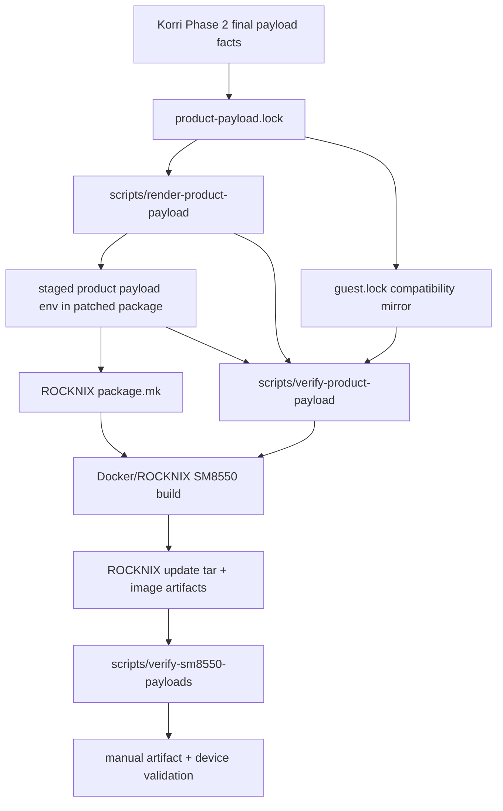
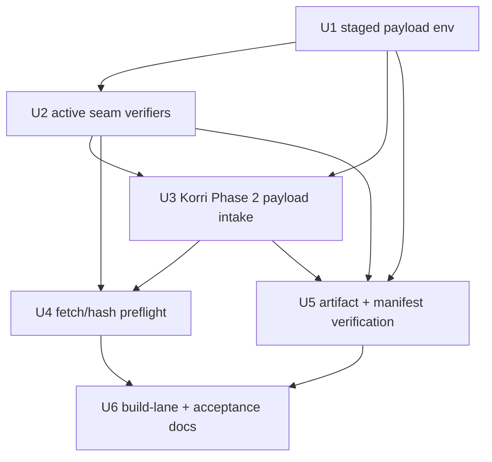

# refactor: Consume product payloads in SM8550 image builds

## Summary

Make the Phase 1 generic product payload seam the active source for SM8550 Docker/ROCKNIX image builds, then consume a Korri Phase 2 Sobo payload for Odin2Portal through that seam. In this plan, Sobo names the Korri product/runtime payload, while Odin2Portal names the shipped SM8550 seed device/compatible target (`odin2portal` / `ayn,odin2portal`). The implementation keeps Docker as the image backend, uses cheap lock/fetch/artifact checks before expensive builds, and validates the first candidate with refreshed substrate/base artifacts rather than blindly reusing stale image-only inputs.

## Closeout

Phase 3 is closed at `artifact-verified + remote device smoke accepted` for Sobo/Odin2Portal. The accepted input surface is the active Korri payload in `product-payload.lock` / `guest.lock`: Korri revision `a3fabfd8a35190cd23d027f4f8569bc11344a3d5`, source SHA256 `0dea10b50a12d2a96944d44d401d4786f95768d4e79df7a13a237d4fcef0f80d`, seed device `odin2portal`, compatible `ayn,odin2portal`, archive `rocknix-guest-rootfs-odin2portal-a3fabfd8a351.tar.zst`, and seed SHA256 `bdfe9a73acc327c77b3c813d7c284bfc4c182b930b436b24cdcfa878d73ccd0a`.

Evidence carried into Phase 4:

- Preflight run: `26505279214`
- Fresh base run: `26505366012`
- Image-only proof run: `26509482057`
- Product payload release: `rocknix-product-payload-a3fabfd8a351`
- Remote Sobo smoke: portal recovered with host/guest failed units at zero.

This closeout does not claim full-chain release-path proof, hands-on runtime acceptance, Thor acceptance, or release publication. `/storage/.boot.hint=UPDATE` remaining after successful boot is tracked as update-lifecycle hardening follow-up and is not a Phase 3 blocker unless it causes an update/runtime regression.

---

## Problem Frame

Phase 1 added `product-payload.lock`, `scripts/render-product-payload`, and `scripts/verify-product-payload`, but those files only characterize the current hardcoded `PKG_NIX_GUEST_*` block. The patched ROCKNIX substrate still gets its active product source and rootfs seed from literals in `patches/rocknix/0006-rocknix-guest-substrate.patch`, so Korri cannot yet supply a new product payload without another manual patch edit and a risky multi-hour build loop.

---

## Requirements

- R1. The SM8550 Docker/ROCKNIX image path must consume product source and rootfs seed facts rendered from the generic `PRODUCT_*` payload contract, not from duplicated hardcoded literals in the substrate package patch.
- R2. The image backend must remain Docker/ROCKNIX; this phase must not introduce or depend on a Nix-built SM8550 image pipeline.
- R3. The first active payload cutover must target the Korri Phase 2 Sobo payload for Odin2Portal, with `guest.lock`, `product-payload.lock`, staged package environment, update tar seed payload, and manifest all agreeing on device, compatible string, archive name, and SHA256.
- R4. In network-capable image-build lanes, cheap validation must fail before Docker work when source tarball bytes, seed asset bytes, lock fields, rendered package variables, or staged package environment drift. Offline/local structural checks may skip byte fetches, but a skipped byte check must not be treated as a valid pre-Docker image-build gate.
- R5. Post-build artifact verification must continue to prove update tar shape, `SYSTEM` budget, `KERNEL` presence, seed archive presence, seed SHA256, checksum files, gzip integrity, and manifest payload evidence.
- R6. The first image-producing validation for this active seam must not reuse stale base artifacts for product/source/seed/substrate changes; it must refresh the substrate/base path before image-only packaging is treated as meaningful.
- R7. The implementation must preserve the Korri/nix-on-rocks dependency direction: nix-on-rocks may consume copied payload facts and release asset URLs, but must not import or evaluate the Korri flake during normal image builds.
- R8. Recovery and device acceptance remain manual gates: a green build artifact is not accepted until artifact geometry/checksum verification and targeted device recovery/boot/runtime validation pass.

---

## Scope Boundaries

- Do not replace the Docker/ROCKNIX build backend with a Nix image builder.
- Do not add a Korri flake input, compose Korri NixOS modules, or evaluate Korri as part of normal nix-on-rocks image builds.
- Do not introduce multi-seed or multi-device update artifacts in this phase. The active SM8550 image still carries one bootable rootfs seed/compatible pair at a time.
- Do not claim Thor and Odin2Portal are both accepted from a single validation. Validate the device whose seed is shipped.
- Do not delete the existing Korri-specific promotion proof or legacy documentation names solely for cleanup; generic naming cleanup belongs after the active seam has produced and validated an image.
- Do not flash or update a device as part of implementation. Device install/soak is an explicit manual validation step after artifacts exist.

### Deferred to Follow-Up Work

- Later cleanup: rename or remove Korri-specific compatibility scripts/docs once the generic active path is validated on device.
- Later device expansion: add a separate Thor payload/intake path, or plan explicit multi-seed support if a single image must cover multiple SM8550 compatible strings.
- Later customization: add boot logo, splash/branding assets, and additional product metadata once the product payload is the proven active image input.
- Later build optimization: revisit whether image-only can be used directly for subsequent payload-only bumps after a fresh compatible base checkpoint has proved the active seam.
- Later fallback intake: define an operator-supplied payload finalization path if Korri cannot emit final release asset URLs directly.

---

## Context & Research

### Relevant Code and Patterns

- `product-payload.lock` is a sourceable shell lock that currently mirrors the payload facts still hardcoded in the substrate patch.
- `scripts/render-product-payload` maps `PRODUCT_*` values to the `PKG_NIX_GUEST_*` values expected by ROCKNIX `package.mk`.
- `scripts/verify-product-payload` currently compares the rendered values with top-level assignments in patched `work/rocknix/projects/ROCKNIX/packages/tools/rocknix-guest-substrate/package.mk`.
- `scripts/apply-rocknix-patches` is the durable hook that creates `work/rocknix` and stages contract docs into the patched package directory; direct edits under `work/rocknix` are scratch only.
- `patches/rocknix/0006-rocknix-guest-substrate.patch` owns the durable substrate `package.mk` contents and guest root/promotion helpers.
- `scripts/verify-sm8550-locks` checks `guest.lock` against patched `package.mk`; it currently includes Korri-specific expectations.
- `scripts/verify-sm8550-payloads` verifies real update/image artifacts and parses expected seed fields from patched `package.mk`.
- `scripts/ci-build-stage` contains a duplicated payload verification path that must not diverge from `scripts/verify-sm8550-payloads`.
- `scripts/generate-manifest` currently sources `guest.lock`; after the active seam it must record product-payload authority and seed facts.
- `.github/workflows/build-sm8550.yml`, `.github/workflows/continue-sm8550-from-toolchain.yml`, `.github/workflows/prepare-sm8550-base.yml`, and `.github/workflows/build-image-only.yml` all run patch/lock checks before expensive Docker work.
- `docs/ci/fast-builds.md` explicitly warns not to use stale image-only base artifacts for product source, seed pin, or host substrate changes.

### Institutional Learnings

- `docs/plans/2026-05-26-001-refactor-product-payload-contract-plan.md` defines Phase 1 as characterization-only and defers active image-build consumption to this phase.
- `docs/ci/fast-builds.md` captures the build-lane risk model: image-only is fastest, but package/source/seed/substrate changes require refreshing base artifacts first.
- `docs/contracts/layer14-main-space-contract.md` defines the host/guest split: host owns boot, update, recovery, seed staging, and promotion mechanics; downstream products own appliance composition.
- `docs/migration/2026-05-22-korri-dependency-direction-violation.md` establishes the hard direction rule: Korri consumes nix-on-rocks, never the reverse.
- `docs/contracts/HOW-TO-FALL-BACK.md` and recovery docs reinforce fail-closed seed staging and explicit operator recovery paths.
- `docs/solutions/runtime-errors/sm8550-mkimage-vfat-logical-sector-size-too-small-2026-05-25.md` requires real artifact geometry checks for fastboot/full-image paths; build success alone is not enough.

### External References

- External research was skipped. This is a repo-specific build-substrate refactor with strong local scripts, workflows, and recovery docs.

---

## Key Technical Decisions

- **Make the generic lock the active source of truth:** `product-payload.lock` remains sourceable shell, and `scripts/render-product-payload` remains the only mapper from product facts to `PKG_NIX_GUEST_*` facts. Human edits after this phase should update the product payload lock first.
- **Stage a rendered package environment into the patched ROCKNIX package:** `scripts/apply-rocknix-patches` should render the payload environment into the patched `rocknix-guest-substrate` package directory, and patched `package.mk` should source that staged file. This keeps Docker/ROCKNIX builds static and self-contained inside `work/rocknix` without reaching back to the repository root during the build.
- **Keep `guest.lock` as a compatibility mirror for now:** until cleanup removes the older lock, Phase 3 keeps `guest.lock` synchronized with the active product seed so existing seed checks and docs remain fail-closed.
- **Allow product-owned release asset URLs without weakening SHA checks:** URL policy should accept authenticated GitHub release asset API URLs from the product payload authority while still rejecting retired `rocknix-nix-guest` references and still verifying archive SHA256.
- **Add required network/hash preflight for image-producing lanes:** because GitHub tarball bytes can vary by fetch mode and release asset inputs can be wrong, source/seed URL hash checks should run before multi-hour Docker build stages in network-capable workflows. Local/offline checks may report that byte validation was skipped, but that mode is not sufficient for image-build approval.
- **Refresh base before first image-only proof:** the first active-seam candidate changes package/substrate inputs and rootfs seed pins, so validation should refresh base artifacts from a known-good toolchain before using image-only packaging. Direct image-only against an old base is explicitly out of scope for the first proof.
- **Preserve single-seed semantics:** Phase 3 should produce one SM8550 artifact for the active compatible string. Multi-seed support would require a separate root-ensure/update-tar design.
- **Do not cleanup too early:** scripts and docs may still mention Korri as the current product payload. Phase 3 removes hardcoded build-source literals, not every historical or compatibility reference.

---

## Open Questions

### Resolved During Planning

- Should `product-payload.lock` become the build source of truth or only a verifier input? It becomes the source of truth; the build consumes a rendered, staged package environment.
- Should the SM8550 image backend switch to Nix? No. Docker/ROCKNIX remains the image backend.
- Can the first Phase 3 proof use old image-only base artifacts? No. Refresh base/substrate first, then use image-only only against that fresh compatible base.
- Should Phase 3 introduce multi-device rootfs seeds? No. Keep one seed/compatible pair per image.
- Should nix-on-rocks derive payload facts by evaluating Korri? No. Consume copied final facts from Korri Phase 2; do not import or evaluate Korri in normal builds.

### Deferred to Implementation

- Exact staged env filename inside `rocknix-guest-substrate`: choose a clear package-local name and keep `scripts/verify-product-payload` authoritative.
- Exact placement of source/seed URL network preflight in CI: use the earliest image-producing lane where credentials and network access are intentionally available, but keep offline local checks usable and visibly marked as structural-only.
- Exact Korri Phase 2 source/seed values: implementation must use the final immutable Korri revision, source tarball SHA, seed archive, seed SHA, and release asset URL facts produced by Phase 2.
- Exact device validation evidence file: operator may capture acceptance in the current docs shape after artifacts are produced.

---

## High-Level Technical Design

> *This illustrates the intended approach and is directional guidance for review, not implementation specification. The implementing agent should treat it as context, not code to reproduce.*

---

## Implementation Units

### U1. Make rendered product payload facts package-local

**Goal:** Stage rendered `PKG_NIX_GUEST_*` facts into the patched ROCKNIX substrate package so Docker builds can consume generic product payload data without reading the nix-on-rocks repo root.

**Requirements:** R1, R2, R4, R7

**Dependencies:** None

**Files:**
- Modify: `scripts/apply-rocknix-patches`
- Modify: `scripts/render-product-payload`
- Modify: `scripts/tests/product-payload-contract.sh`
- Modify: `patches/rocknix/0006-rocknix-guest-substrate.patch`
- Reference: `product-payload.lock`
- Reference: patched `projects/ROCKNIX/packages/tools/rocknix-guest-substrate/tests/guest-substrate-static-checks.sh`
- Reference: patched `projects/ROCKNIX/packages/tools/rocknix-guest-substrate/scripts/rocknix-guest-promote`

**Approach:**
- Extend patch application to render the product payload environment after applying the patch queue and copy it into the patched `rocknix-guest-substrate` package directory.
- Change the durable `package.mk` patch so the top-level product/source/seed variables are sourced from the staged package-local environment instead of being hardcoded as independent literals.
- Keep the staged file assignment-only shell syntax, matching the renderer output and avoiding dynamic repo-root access during Docker builds.
- Install or otherwise expose the rendered build-target fact to the runtime promotion helper, so on-device promotion defaults come from the same payload facts as the image build while retaining `ROCKNIX_GUEST_BUILD_TARGET` as an explicit override.
- Preserve package-local failure messages when payload values are absent, so an incorrectly staged package fails before fetching, installing, or promoting.
- Keep the current product payload values intact until U3 updates them to the Korri Phase 2 final facts.

**Patterns to follow:**
- `scripts/apply-rocknix-patches` for staging docs into the generated package tree.
- `scripts/render-product-payload` for sourceable assignment output.
- `patches/rocknix/0006-rocknix-guest-substrate.patch` as the only durable source for patched `package.mk` behavior.

**Test scenarios:**
- Happy path: after patch application, the patched substrate package contains a product payload env file whose contents match `scripts/render-product-payload` output.
- Happy path: patched `package.mk` resolves the same expanded `PKG_NIX_GUEST_*` values as before when current lock values are unchanged.
- Error path: deleting the staged package env causes `package.mk`/verification to fail with a message naming the missing staged payload file.
- Error path: runtime promotion fails closed or requires an explicit override when no payload build target is installed.
- Edge case: derived values such as authority name and source URL remain renderer-owned and do not drift in `package.mk`.
- Integration: Docker context remains self-contained under `work/rocknix`; no build-time dependency on a repo-root file path is introduced.

**Verification:**
- The active package path can consume rendered generic payload facts while producing the same effective package values for the current lock.

---

### U2. Rebalance lock and product payload verifiers around the active seam

**Goal:** Update cheap checks so they validate the staged active product payload path, not just the old characterization mirror.

**Requirements:** R1, R3, R4, R7

**Dependencies:** U1

**Files:**
- Modify: `scripts/verify-product-payload`
- Modify: `scripts/verify-sm8550-locks`
- Modify: `scripts/tests/product-payload-contract.sh`
- Modify: `patches/rocknix/0006-rocknix-guest-substrate.patch`
- Reference: `guest.lock`
- Reference: `product-payload.lock`
- Reference: patched `projects/ROCKNIX/packages/tools/rocknix-guest-substrate/tests/guest-substrate-static-checks.sh`

**Approach:**
- Make `scripts/verify-product-payload` compare three surfaces: renderer output, staged package env, and the values visible to patched `package.mk`.
- Reverse the old field-coverage assertion: fail if patched `package.mk` reintroduces hardcoded top-level `PKG_NIX_GUEST_*` assignments outside the staged env source path.
- Update patched guest-substrate static checks so `scripts/verify-sm8550-contract` validates the staged-env contract instead of grepping for removed literal package assignments.
- Keep `guest.lock` seed fields synchronized with `product-payload.lock` for this phase, but treat `product-payload.lock` as the primary edited source.
- Move product-authority/build-target assertions toward the generic payload verifier; keep `scripts/verify-sm8550-locks` focused on SM8550 seed/guest compatibility and retired-repo rejection.
- Preserve fail-closed URL policy while allowing product-authority release asset URLs needed by Korri Phase 2.

**Patterns to follow:**
- Current `scripts/verify-product-payload` field modeling and unmodeled-field detection.
- Current `scripts/verify-sm8550-locks` fail/require helper style.
- `scripts/tests/product-payload-contract.sh` for local shell smoke coverage.

**Test scenarios:**
- Happy path: renderer output, staged env, package-visible values, `guest.lock`, and `product-payload.lock` all agree.
- Edge case: `package.mk` contains no independent hardcoded `PKG_NIX_GUEST_*` assignments after sourcing the staged env.
- Error path: patched guest-substrate static checks fail when `package.mk` stops sourcing the staged env or skips source/seed SHA verification.
- Error path: a staged env generated from stale lock data fails against current `product-payload.lock`.
- Error path: `guest.lock` seed SHA differs from `product-payload.lock` seed SHA and the verifier fails before Docker work.
- Error path: a release asset URL from the retired `rocknix-nix-guest` repo remains rejected.
- Integration: Korri-owned release asset API URLs are accepted only when their SHA fields match the lock and payload checks.

**Verification:**
- All cheap gates can prove the active generic seam before any SM8550 build lane starts.

---

### U3. Intake the Korri Phase 2 Sobo-on-Odin2Portal payload facts

**Goal:** Replace the current lock facts with the final Korri Phase 2 Sobo product source and Odin2Portal rootfs seed facts, while keeping the compatibility mirror fail-closed.

**Requirements:** R3, R4, R7

**Dependencies:** U1, U2, external Korri Phase 2 final payload facts

**Files:**
- Modify: `product-payload.lock`
- Modify: `guest.lock`
- Modify: `README.md`
- Modify: `docs/ci/fast-builds.md`
- Reference: `docs/contracts/layer14-main-space-contract.md`

**Approach:**
- Copy only immutable Phase 2 facts from Korri: clean product revision, source tarball SHA, source subdir, promotion build target, seed device, compatible string, archive name, seed SHA, and release asset URL(s).
- Switch the active seed target deliberately to Odin2Portal (`odin2portal` / `ayn,odin2portal`), and ensure `guest.lock` mirrors that device/compatible/archive/SHA until later cleanup removes the compatibility lock.
- Keep the build target as a payload fact rather than a substrate assumption. It may still name Korri in this phase because Korri is the current product payload, but the substrate package should not hardcode it independently.
- Update docs so operators see that current active payload facts come from Korri Phase 2 and that the artifact is device-specific.
- Do not generate payload facts by running or importing Korri during nix-on-rocks builds.
- Do not change first-proof build-lane dispatch or base artifact selection in this unit; U6 owns refreshed-base validation policy.

**Patterns to follow:**
- Existing sourceable lock style in `guest.lock`, `product-payload.lock`, and `upstream.lock`.
- `docs/ci/fast-builds.md` payload-contract section for lane safety notes.
- `README.md` accepted proof/status fields.

**Test scenarios:**
- Happy path: both locks identify `odin2portal` / `ayn,odin2portal` and the same seed archive/SHA.
- Happy path: product source tarball SHA and seed URL fields are non-placeholder values supplied by Korri Phase 2.
- Edge case: no `by-compatible` rootfs seed archive is introduced as an off-device seed identity.
- Error path: a Thor seed archive with Odin2Portal compatible string fails lock verification.
- Error path: missing or placeholder source SHA/seed URL fails before Docker work.
- Integration: docs no longer imply the active lock is Thor when the active payload is Sobo/Odin2Portal.

**Verification:**
- The active product lock, guest lock, and rendered package env describe the same Korri Phase 2 Sobo payload for Odin2Portal.

---

### U4. Add cheap fetch/hash preflight for external product bytes

**Goal:** Catch wrong Korri source tarball bytes or rootfs seed asset bytes before expensive Docker/ROCKNIX build stages.

**Requirements:** R4, R7

**Dependencies:** U2, U3

**Files:**
- Create: `scripts/verify-product-payload-fetches`
- Modify: `scripts/tests/product-payload-contract.sh`
- Modify: `.github/workflows/build-sm8550.yml`
- Modify: `.github/workflows/continue-sm8550-from-toolchain.yml`
- Modify: `.github/workflows/prepare-sm8550-base.yml`
- Modify: `.github/workflows/build-image-only.yml`
- Reference: `.github/workflows/preflight.yml`

**Approach:**
- Add an explicit network-capable verifier that uses the same source URL and seed URL fields as the active rendered payload.
- Verify the product source tarball hash against the lock before Docker package fetches do it late.
- Verify the rootfs seed archive hash against the lock before base/image build lanes spend hours.
- Support the existing ordered split-URL style and the single-URL style emitted by Korri Phase 2.
- Do not run network payload-byte verification in PR/push preflight by default. Keep `preflight.yml` limited to offline structural checks unless assets are public and the verifier can prove that mode explicitly.
- Invoke network byte verification only in manual/image-producing workflows before the base/image Docker stages that would otherwise fetch those bytes late. Missing credentials are a structural-only skip in offline checks but a failure in network-enabled image-build gates.
- Do not change first-proof build-lane dispatch or base artifact selection in this unit; U6 owns refreshed-base validation policy.

**Patterns to follow:**
- `scripts/verify-sm8550-payloads` for checksum-oriented failure style.
- `scripts/verify-sm8550-locks` for explicit lock-derived assertions.
- GitHub Actions pre-build guard placement already used for `scripts/verify-product-payload`.

**Test scenarios:**
- Happy path: source tarball bytes hash to `PRODUCT_SOURCE_SHA256`, and seed archive bytes hash to `PRODUCT_ROOTFS_SEED_SHA256`.
- Edge case: multiple seed URLs are fetched/combined in lock order before hash verification.
- Error path: a URL that returns the wrong bytes fails with source/seed context before Docker work.
- Error path: a missing GitHub token or inaccessible private asset fails with an actionable credential/access message in network-enabled image-build gates.
- Integration: workflows run offline structural checks first, then network fetch checks before long Docker stages; PR/push preflight remains structural unless explicitly made network-capable.

**Verification:**
- Bad external payload URLs or hashes are caught in a short pre-build stage instead of during a multi-hour image build.

---

### U5. Make artifact verification and manifests payload-source-aware

**Goal:** Ensure produced SM8550 artifacts prove which generic product payload they consumed and verify seed bytes from the active payload contract.

**Requirements:** R3, R5, R8

**Dependencies:** U1, U2, U3

**Files:**
- Modify: `scripts/verify-sm8550-payloads`
- Modify: `scripts/ci-build-stage`
- Modify: `scripts/generate-manifest`
- Modify: `scripts/tests/product-payload-contract.sh`
- Create or modify: `scripts/verify-image-fat-sector-size`

**Approach:**
- Resolve expected seed archive/SHA from the rendered/staged product payload facts rather than scraping hardcoded `package.mk` assignment text.
- Remove or redirect duplicate seed-verification logic inside `scripts/ci-build-stage` so post-build checks share one source of truth with `scripts/verify-sm8550-payloads`.
- Extend `scripts/generate-manifest` to record product authority repo, product revision, source SHA256, build target, seed device, seed compatible, seed archive, seed SHA256, and seed URL authority.
- Keep existing update tar and image integrity checks intact: `SYSTEM`, `KERNEL`, seed payload, checksum files, gzip integrity, and manifest seed evidence.
- Do not weaken `SYSTEM` budget checks or qcom-abl/FAT geometry expectations. When a full `ROCKNIX-*.img.gz` is present, add or wire a dedicated FAT geometry verifier that fails unless the SM8550 boot FAT has label `ROCKNIX` and logical block size `4096`.

**Patterns to follow:**
- Current `scripts/verify-sm8550-payloads` real-artifact verification.
- Current `scripts/generate-manifest` concise Markdown artifact manifest.
- `docs/solutions/runtime-errors/sm8550-mkimage-vfat-logical-sector-size-too-small-2026-05-25.md` for artifact geometry caution.

**Test scenarios:**
- Happy path: an update tar containing `target/seed/<active archive>` with matching SHA passes.
- Happy path: generated manifest contains active product revision, source SHA, seed device, compatible string, archive, and seed SHA.
- Error path: update tar contains an older Thor seed while the active payload lock says Odin2Portal, and verification fails.
- Error path: manifest omits the expected active seed archive/SHA and verification fails.
- Error path: a full image whose boot FAT reports logical block size `512` fails the geometry verifier before any fastboot/full-image validation.
- Integration: `scripts/ci-build-stage` and `scripts/verify-sm8550-payloads` cannot disagree about expected seed facts.

**Verification:**
- Artifact verification and build manifests are driven by the same active product payload facts that drove the image build.

---

### U6. Define the first active-seam build lane and manual acceptance gates

**Goal:** Document and wire the safe validation path for the first Docker/ROCKNIX artifact produced through the active generic payload seam.

**Requirements:** R2, R6, R8

**Dependencies:** U1, U2, U3, U4, U5

**Files:**
- Modify: `docs/ci/fast-builds.md`
- Modify: `README.md`
- Modify: `.github/workflows/prepare-sm8550-base.yml`
- Modify: `.github/workflows/build-image-only.yml`
- Reference: `.github/workflows/continue-sm8550-from-toolchain.yml`
- Reference: `.github/workflows/build-sm8550.yml`
- Reference: `docs/contracts/HOW-TO-FALL-BACK.md`

**Approach:**
- Make the first validation path explicit: cheap gates first, then a refreshed base/substrate build from a known-good toolchain, then image-only packaging from that fresh base if needed.
- Keep old accepted base/image-only run IDs documented as historical acceptance evidence, not as valid inputs for the first active-seam cutover.
- Add machine-checkable provenance guardrails that make it hard to dispatch old-base image-only for product/source/seed/substrate changes without acknowledging the risk. `prepare-sm8550-base.yml` should upload a compact provenance artifact containing hashes for `product-payload.lock`, `guest.lock`, rendered payload env, patch series, upstream pin, and substrate package state; `build-image-only.yml` should compare that provenance against the current checkout before building.
- Allow a deliberately named packaging-only override only for later packaging-only work, and explicitly exclude it from the first active-seam proof.
- Document manual artifact verification expectations before device install: update tar checksum, seed payload SHA, image gzip/checksum, and relevant SM8550 FAT/logical-sector checks when full-image artifacts are under consideration.
- Document manual device validation as targeted to the shipped compatible string: recovery path known, update/install, boot, guest service, portal/Korri runtime, input, Moonlight smoke where relevant, failed units, and soak.

**Patterns to follow:**
- `docs/ci/fast-builds.md` lane descriptions and known-good run notes.
- `docs/contracts/HOW-TO-FALL-BACK.md` recovery framing.
- Existing README accepted checkpoint/status format.

**Test scenarios:**
- Happy path: docs clearly distinguish refreshed-base validation from historical image-only reuse.
- Edge case: workflow inputs remain manual and do not accidentally trigger multi-hour builds from ordinary docs-only changes.
- Error path: `build-image-only.yml` receives a base provenance artifact whose payload/patch/upstream hashes do not match the current checkout and fails before Docker work.
- Error path: an operator trying to use a stale `base_run_id` for a changed product payload sees explicit documentation that this is not the first-cutover proof path.
- Integration: build-lane docs, workflow names, and artifact verifier responsibilities use the same active payload vocabulary.

**Verification:**
- Maintainers have a clear, cost-aware path from cheap validation to the first candidate artifact and manual device acceptance.

---

## Implementation Unit Dependency Graph

---

## System-Wide Impact

- **Interaction graph:** Korri Phase 2 emits immutable payload facts; nix-on-rocks records those in `product-payload.lock`; renderer output is staged into the patched ROCKNIX package; Docker builds consume the staged env; artifact checks and manifests read the same payload facts.
- **Error propagation:** lock/field/fetch mismatches fail in cheap scripts before Docker; package staging mistakes fail before package fetch/install; real artifact shape failures fail after the image/update tar exists but before device install.
- **State lifecycle risks:** `guest.lock`, `product-payload.lock`, staged env, package-visible values, update tar seed payload, and manifest can drift if independently maintained. Phase 3 makes `product-payload.lock` primary and keeps all other surfaces checked against it.
- **API surface parity:** shell locks and workflow inputs are the external contract surfaces. Changes must remain sourceable and compatible with existing Docker/ROCKNIX shell execution.
- **Integration coverage:** unit/shell tests prove mapping and guard behavior; only the Docker build proves package consumption; only manual device validation proves boot/recovery/runtime acceptance.
- **Unchanged invariants:** Docker remains the SM8550 image backend; nix-on-rocks remains product-blind at dependency level; update tar seed staging stays outside `SYSTEM`; single-seed compatible-string semantics remain unchanged.

---

## Risks & Dependencies

| Risk | Mitigation |
|------|------------|
| Staged env is not present inside Docker/ROCKNIX package context | Stage it during `scripts/apply-rocknix-patches` and verify package-local presence before Docker work. |
| Old hardcoded package literals silently return | Make `scripts/verify-product-payload` fail on independent top-level `PKG_NIX_GUEST_*` assignments outside the staged env source path. |
| Korri release asset URLs are rejected by old nix-on-rocks-only URL policy | Update URL policy to allow product-authority release asset API URLs while retaining SHA verification and retired-repo rejection. |
| Source tarball SHA or seed URL is wrong and wastes hours | Add a named fetch/hash preflight before expensive build stages. |
| Thor/Odin2Portal seed mismatch creates a fail-closed but unusable image | Keep single-seed semantics explicit and require lock/device/archive compatibility checks before build and in artifact verification. |
| Stale image-only base hides product/substrate changes | Refresh base/substrate artifacts for the first active seam proof before using image-only packaging. |
| Build manifest does not prove what payload was consumed | Extend manifest generation from active payload facts and verify expected seed evidence appears in the manifest. |
| Green artifact is mistaken for device acceptance | Document manual artifact, recovery, boot, runtime, and soak gates separately from CI artifact verification. |
| Generic seam accidentally reintroduces Korri dependency direction violation | Consume copied payload facts only; keep negative guards against Korri flake input/module composition. |

---

## Phased Delivery

### Phase 3A — Cheap active-seam conversion

- Land U1 and U2 while keeping current payload values unchanged.
- Prove the active staged-env path is equivalent to the current package literals before changing device/source/seed facts.

### Phase 3B — Korri Phase 2 payload intake

- Land U3 and U4 using final immutable Korri Phase 2 facts.
- Prove lock, staged env, source tarball bytes, and rootfs seed bytes agree before Docker work.

### Phase 3C — Artifact evidence and first Docker proof

- Land U5 and U6.
- Produce the first candidate through a refreshed substrate/base path, then package/verify the image/update artifact and hand off to manual Sobo validation.

---

## Verification Surface Matrix

| Scope | Verification surface | Purpose |
|---|---|---|
| U1-U3 offline structure | `scripts/apply-rocknix-patches`, `scripts/verify-sm8550-contract`, `scripts/verify-sm8550-locks`, `scripts/verify-product-payload`, `scripts/tests/product-payload-contract.sh` | Prove patch replay, staged env, lock mirroring, and package contract before Docker. |
| U4 network-capable image lanes | `scripts/verify-product-payload-fetches` | Prove source tarball and rootfs seed bytes match lock facts before expensive Docker stages. |
| U5 artifact evidence | `scripts/verify-sm8550-payloads`, `scripts/verify-image-fat-sector-size` | Prove update tar/image payloads carry the expected active seed and safe SM8550 image geometry. |
| U6 first Docker proof | `prepare-sm8550-base.yml` then `build-image-only.yml` from the fresh base | Prove the active seam through refreshed substrate/base artifacts before packaging the candidate image/update tar. |
| Manual device acceptance | Recovery/device runbooks and runtime smoke/soak checks | Prove the artifact boots and behaves on the target compatible device. |

---

## Documentation / Operational Notes

- Update docs before dispatching the first expensive build so operators do not reuse historical image-only base artifacts by habit.
- Keep the build artifact status vocabulary precise: build-pass, artifact-verified, and device-accepted are different states.
- Device validation should prefer the update-tar path for normal acceptance. Full-image/fastboot validation requires the SM8550 FAT label/logical-sector geometry checks before flashing.
- If Korri Phase 2 cannot produce release asset URLs, Phase 3 should stop at cheap verifier failure. Do not add a new finalization workflow, credential path, or operator-supplied payload intake mechanism in this phase.

---

## Sources & References

- Phase 1 plan: [docs/plans/2026-05-26-001-refactor-product-payload-contract-plan.md](2026-05-26-001-refactor-product-payload-contract-plan.md)
- CI build lanes: [docs/ci/fast-builds.md](../ci/fast-builds.md)
- Host/guest contract: [docs/contracts/layer14-main-space-contract.md](../contracts/layer14-main-space-contract.md)
- Recovery contract: [docs/contracts/HOW-TO-FALL-BACK.md](../contracts/HOW-TO-FALL-BACK.md)
- Dependency inversion context: [docs/migration/2026-05-22-korri-dependency-direction-violation.md](../migration/2026-05-22-korri-dependency-direction-violation.md)
- Korri Phase 2 plan: Korri repo `docs/plans/2026-05-26-002-refactor-rocknix-product-payload-emission-plan.md`
- Related scripts: `product-payload.lock`, `guest.lock`, `scripts/render-product-payload`, `scripts/verify-product-payload`, `scripts/verify-sm8550-locks`, `scripts/verify-sm8550-payloads`, `scripts/ci-build-stage`, `scripts/generate-manifest`, `scripts/apply-rocknix-patches`
- Related workflows: `.github/workflows/preflight.yml`, `.github/workflows/build-sm8550.yml`, `.github/workflows/continue-sm8550-from-toolchain.yml`, `.github/workflows/prepare-sm8550-base.yml`, `.github/workflows/build-image-only.yml`
