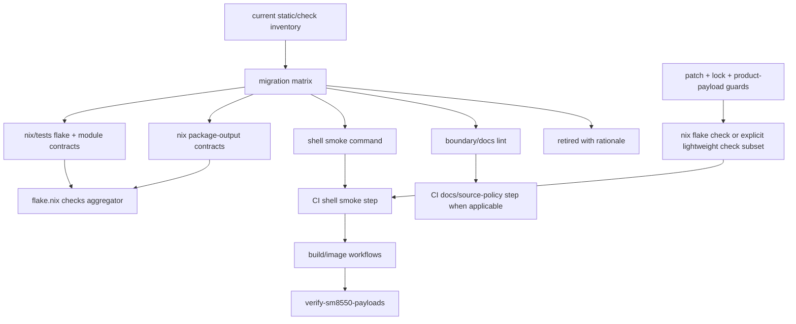

# refactor: Align test boundary checks

## Summary

Refactor the repo's check architecture so declarative Nix/build invariants live in focused `nix/tests/*.nix` flake checks, while real shell/runtime/artifact smoke stays in shell-owned commands. The first pass preserves existing safety coverage by migrating assertions in slices, keeping source-policy/docs checks as separate named lint surfaces when they remain necessary, keeping patch/lock/payload gates fail-closed, and updating CI/docs after the new check surface is stable.

---

## Problem Frame

The current check surface centralizes unrelated truth in `guest/scripts/static-checks.sh` and inline `flake.nix` logic: flake outputs, NixOS module wiring, generated systemd config, package output contracts, docs wording, shell syntax, and Steam runtime smoke all fail through shell greps. That violates the desired boundary: tests should live where the truth lives, so evaluated Nix facts are tested by Nix, runtime shell behavior is tested by shell, and documentation checks are not mixed into either.

---

## Requirements

- R1. Move Nix-owned invariants into `nix/tests/*.nix` checks exposed through `checks.<system>.*`: flake outputs, package attrs, derivation existence, NixOS module evaluation, generated systemd/tmpfiles config, image/platform wiring, build graph/package identity, store paths, and native build contracts.
- R2. Preserve shell-smoke tests only for real shell/runtime/artifact behavior: shell syntax/ShellCheck, package helper smokes against fixture directories, mutable artifact verification, and on-device/CI payload checks. If source-policy or docs checks remain automated, they must live in separate named lint/docs-contract surfaces rather than shell-smoke tests.
- R3. Split mixed checks without losing safety coverage, especially negative assertions currently guarding Korri dependency inversion, retired rootfs paths, session/runtime-dir anti-patterns, Steam storage/session boundaries, and host/product contract boundaries.
- R4. Keep CI/build safety sequencing fail-closed: patch application and patched-tree/lock validation must still happen before Docker/ROCKNIX image work; payload verification must still happen after image artifact creation.
- R5. Preserve compatibility for existing local/operator entry points during the migration, including current check attr names where practical and the packaged `guest/scripts/static-checks.sh` path until docs/substrate packaging move together.
- R6. Do not add TypeScript/Bun tooling in this refactor; the tracked repo has no TS runtime/domain surface today.
- R7. Update documentation so developers and operators can tell which command verifies source/Nix contracts, shell smoke, artifact payloads, and device soak behavior.

---

## Scope Boundaries

- Do not change production guest, package, image, or ROCKNIX build behavior except where check wiring requires a non-runtime refactor.
- Do not replace Docker/ROCKNIX image builds with Nix image builds.
- Do not remove `scripts/apply-rocknix-patches`, `scripts/verify-sm8550-contract`, `scripts/verify-sm8550-locks`, or `scripts/verify-sm8550-payloads` as part of the first migration.
- Do not fold image/tar/FAT/checksum artifact verification into source-only flake checks.
- Do not make `scripts/verify-korri-promotion-proof` part of the default pure flake check unless its impure/external inputs are redesigned.
- Do not run full SM8550 image-producing workflows as acceptance for the check-boundary refactor.
- Do not introduce a large generic Nix test framework before repetition proves it is needed.
- Do not add TypeScript/Bun tests or package manifests.

### Deferred to Follow-Up Work

- Pure Nix replacement for the ROCKNIX patch application contract, if pinned source/fetch/staging semantics are specified later.
- Redesign of `scripts/verify-korri-promotion-proof` into a pure pinned flake check; for now it remains a named manual/impure proof.
- Full renaming/removal of transitional check aliases after developers and CI have moved to the new commands.
- Broader docs linting strategy for non-packaged prose beyond safety-critical operator/product contract docs.

---

## Context & Research

### Relevant Code and Patterns

- `flake.nix` exposes `packages`, `nixosModules`, `lib`, `nixosConfigurations`, `checks`, and `formatter`; it currently also embeds `guest-input-boundary-contract` assertion logic inline.
- `guest/scripts/static-checks.sh` is the main violation: it greps flake shape, NixOS module semantics, package internals, docs wording, launch scripts, and Steam tests from one shell entry point.
- `packages/steam/tests/steam-guest-runtime-prep-smoke.sh` and `packages/steam/tests/steam-guest-run-smoke.sh` are good shell-smoke examples because they execute real helpers against temp fixture directories.
- `packages/steam/tests/steam-package-contract.sh` is mixed: missing-env/runtime behavior belongs in shell; README/manifest greps and built `$out` assertions belong elsewhere.
- `packages/cemu/package.nix` embeds build characterization/evidence checks in `installPhase`; some fail-fast install correctness is valid, but reusable package-output/native-build contracts should become named checks.
- `.github/workflows/preflight.yml` currently runs shell checks directly and does not install Nix before the proposed canonical flake gate.
- Image workflows and `scripts/build-sm8550` repeat the patch/contract/lock guard before expensive ROCKNIX work; those guards must remain in sequence while Nix checks are introduced.
- `scripts/verify-sm8550-payloads` validates real built artifacts and should stay as post-build artifact smoke.
- `product-payload.lock`, `scripts/render-product-payload`, `scripts/verify-product-payload`, and `scripts/tests/product-payload-contract.sh` are recent cheap pre-build guards and must be classified before CI guard blocks are rewritten.
- `docs/thinking/2026-05-26-test-boundary-placement-audit.md`, `docs/thinking/2026-05-26-test-boundary-repo-research.md`, and `docs/thinking/2026-05-26-test-boundary-flow-review.md` contain the detailed audit that this plan operationalizes.

### Institutional Learnings

- `docs/solutions/developer-experience/fast-iter-and-local-rocknix-build-2026-05-08.md` and `docs/ci/fast-builds.md` emphasize proving cheap source/package contracts before spending long SM8550 image-build time.
- `docs/solutions/developer-experience/nix-layer-9-nspawn-guest-proof-rocknix-2026-05-06.md` shows wrong-file patch mistakes are expensive; patch/path guardrails must remain early and explicit.
- `docs/contracts/layer14-main-space-contract.md` defines host/guest/product boundaries that should be encoded as evaluated Nix/package contracts where possible, not incidental greps.
- `docs/solutions/runtime-errors/sm8550-mkimage-vfat-logical-sector-size-too-small-2026-05-25.md` confirms image geometry and tar/checksum verification depend on produced artifacts and should remain post-build artifact checks.
- `docs/solutions/runtime-errors/guest-main-space-pipewire-runtime-dir-socket-vanish-rocknix-2026-05-24.md` is a reminder to migrate negative safety assertions, not just happy-path generated config.

### External References

- No external research is needed. This is a repo-specific Nix/Bash/CI boundary refactor with strong local evidence.

---

## Key Technical Decisions

- **Create `nix/tests/` as the Nix-owned check home:** Each focused file returns a derivation and receives explicit arguments from `flake.nix`; `flake.nix` becomes thin wiring rather than the test implementation surface.
- **Migrate by assertion inventory, not by deleting the monolith wholesale:** `guest/scripts/static-checks.sh` must be reduced only after a migration matrix records each current assertion's destination or retirement rationale.
- **Use evaluated values instead of source spelling:** Nix tests assert public flake outputs, package derivations, NixOS `config`, generated systemd attrs, tmpfiles rules, env, and built package outputs instead of grepping for exact Nix source fragments.
- **Keep shell smoke as a first-class consumer:** Steam helper smokes, shell syntax, ShellCheck, and artifact/payload verification remain shell because they exercise real shell scripts or mutable CI artifacts.
- **Separate docs/source-policy lint from Nix/runtime tests:** Safety-critical docs or source anti-pattern checks may remain automated, but in explicitly named boundary/docs checks rather than hidden inside guest runtime/static smoke.
- **Preserve existing guard order before optimizing purity:** Patch application and patched-tree/lock verification remain authoritative pre-build shell gates until a pure Nix replacement is intentionally designed.
- **Avoid expensive checks in the default gate unless already expected:** Default `nix flake check` should prioritize eval/lightweight contracts. Heavyweight package builds such as Cemu characterization must stay outside `checks.<system>` or the CI gate must build an explicit lightweight check subset, because every attr under `checks.<system>` is consumed by whole-flake `nix flake check`.

---

## Open Questions

### Resolved During Planning

- Should TypeScript/Bun tests be introduced? No. The tracked repo has no TypeScript or Node project surface.
- Should artifact payload verification move to Nix? No. It validates real generated tar/gzip/checksum/image artifacts and remains shell/post-build.
- Should the migration remove `guest/scripts/static-checks.sh` immediately? No. Keep a compatibility command/path while responsibilities are split and docs/substrate packaging are updated.
- Should `scripts/verify-korri-promotion-proof` run in default flake checks? No. It remains manual/explicit unless redesigned with pure pinned inputs.

### Deferred to Implementation

- Exact grouping of `nix/tests/*.nix` files may adjust while translating the assertion inventory, but each group must map to a clear contract area.
- Whether Cemu package characterization should remain outside default `checks.<system>` or CI should build an explicit lightweight check subset should be decided after seeing actual check cost during implementation.
- Exact Nix setup action/cache choice for GitHub Actions can follow repository preferences discovered during workflow editing.
- Which docs wording checks are safety-critical enough to automate should be decided through the migration matrix; non-contract prose can move to review.

---

## Output Structure

    nix/
      tests/
        helpers.nix                    # optional tiny assertion/runCommand helpers only if useful
        flake-surface-contract.nix
        guest-input-boundary-contract.nix
        guest-profile-contract.nix
        main-space-systemd-contract.nix
        audio-input-systemd-contract.nix
        steam-package-output-contract.nix
        cemu-package-contract.nix      # optional; only if kept out of default expensive CI or gated by explicit subset
    scripts/
      check-shell-smoke                # or equivalent stable shell-smoke entry point
      check-boundary-lint              # optional source-policy lint for non-evaluated anti-patterns
      check-docs-contract              # optional safety-doc contract lint
    docs/thinking/
      2026-05-26-test-boundary-migration-matrix.md

---

## High-Level Technical Design

> *This illustrates the intended approach and is directional guidance for review, not implementation specification. The implementing agent should treat it as context, not code to reproduce.*

---

## Implementation Units

### U1. Create the test-boundary migration matrix

**Goal:** Inventory every current assertion/check block and classify its new owner before moving code, so safety assertions are preserved intentionally.

**Requirements:** R1, R2, R3, R4, R5, R7

**Dependencies:** None

**Files:**
- Create: `docs/thinking/2026-05-26-test-boundary-migration-matrix.md`
- Reference: `guest/scripts/static-checks.sh`
- Reference: `packages/steam/tests/steam-package-contract.sh`
- Reference: `flake.nix`
- Reference: `.github/workflows/preflight.yml`
- Reference: `.github/workflows/build-sm8550.yml`
- Reference: `.github/workflows/build-image-only.yml`
- Reference: `.github/workflows/continue-sm8550-from-toolchain.yml`
- Reference: `.github/workflows/prepare-sm8550-base.yml`
- Reference: `scripts/build-sm8550`
- Reference: `scripts/verify-sm8550-contract`
- Reference: `scripts/verify-sm8550-locks`
- Reference: `scripts/verify-sm8550-payloads`
- Reference: `product-payload.lock`
- Reference: `scripts/render-product-payload`
- Reference: `scripts/verify-product-payload`
- Reference: `scripts/tests/product-payload-contract.sh`

**Approach:**
- Classify each assertion or check block into one destination: Nix eval, Nix package-output/native-build, shell smoke, source-policy boundary lint, docs contract, patch/lock verifier, artifact verifier, manual/impure proof, or retired with rationale.
- Preserve negative assertions explicitly in the matrix; they are the easiest to lose when replacing grep checks with evaluated config checks.
- Mark expensive package builds separately from eval-only checks so default CI does not accidentally become a long Cemu/package build lane.
- Capture transitional compatibility requirements for existing attr names and script paths.

**Execution note:** Characterization-first. Do not edit check behavior until the matrix identifies the intended destination for the block being moved.

**Patterns to follow:**
- `docs/thinking/2026-05-26-test-boundary-placement-audit.md` for violation grouping.
- `docs/thinking/2026-05-26-test-boundary-flow-review.md` for flow and sequencing hazards.

**Test scenarios:**
- Test expectation: none -- this unit creates a planning/traceability artifact, not executable behavior.

**Verification:**
- Every major block in `guest/scripts/static-checks.sh`, `packages/steam/tests/steam-package-contract.sh`, and the current product-payload guard path has a destination and no critical negative guard is silently dropped.

---

### U2. Extract inline flake contract into `nix/tests/`

**Goal:** Establish the new Nix test home by moving `guest-input-boundary-contract` out of `flake.nix` without changing its semantics.

**Requirements:** R1, R3, R5

**Dependencies:** U1

**Files:**
- Create: `nix/tests/guest-input-boundary-contract.nix`
- Create: `nix/tests/helpers.nix` *(optional, only if it keeps assertions clearer)*
- Modify: `flake.nix`
- Test: `nix/tests/guest-input-boundary-contract.nix`

**Approach:**
- Preserve the existing evaluated assertions over `baseConfiguration.config` and `devEnvConfiguration.config`.
- Keep the public check attr name `guest-input-boundary-contract` unchanged.
- Pass evaluated configs or explicit construction inputs into the imported test to avoid `self` recursion and accidental impure `selectDeviceProfileFromCompatible` evaluation.
- Keep helper code tiny: the existing `assertContract` / `builtins.throw` pattern is enough unless multiple tests prove a small helper is worthwhile.

**Patterns to follow:**
- Current inline `guest-input-boundary-contract` in `flake.nix`.
- Nix `runCommand` checks already used for flake checks.

**Test scenarios:**
- Happy path: the extracted check passes with the same evaluated udev/InputPlumber/WirePlumber/tmpfiles assertions as before.
- Edge case: importing the test does not evaluate `selectDeviceProfileFromCompatible` or require `ROCKNIX_GUEST_DEVICE_COMPATIBLE`.
- Error path: breaking one known input-boundary invariant causes the named check to fail with the same human-readable contract message.
- Integration: `flake.nix` remains a thin aggregator and exposes `checks.<system>.guest-input-boundary-contract` for both host systems.

**Verification:**
- The check attr remains available and equivalent after extraction.
- `flake.nix` no longer contains the assertion body for this contract.

---

### U3. Move flake, module, and generated systemd contracts to focused Nix checks

**Goal:** Replace shell/text assertions for Nix-owned flake and NixOS configuration truth with evaluated Nix checks.

**Requirements:** R1, R3, R5

**Dependencies:** U1, U2

**Files:**
- Create: `nix/tests/flake-surface-contract.nix`
- Create: `nix/tests/guest-profile-contract.nix`
- Create: `nix/tests/main-space-systemd-contract.nix`
- Create: `nix/tests/audio-input-systemd-contract.nix`
- Modify: `flake.nix`
- Modify: `guest/scripts/static-checks.sh`
- Test: `nix/tests/flake-surface-contract.nix`
- Test: `nix/tests/guest-profile-contract.nix`
- Test: `nix/tests/main-space-systemd-contract.nix`
- Test: `nix/tests/audio-input-systemd-contract.nix`

**Approach:**
- Move flake output checks from source greps to assertions over `self.packages.${system}`, `self.nixosModules`, `self.lib.deviceProfileByCompatible`, and relevant package derivations.
- Move module/profile checks to assertions over evaluated `nixosSystem.config`, including `services.*`, `systemd.services.*`, service env/orderings, tmpfiles rules, and generated config values.
- Preserve no-Korri/no-retired-output negative guards where they can be evaluated directly; source-policy-only guards move to U5 instead of staying hidden in a Nix contract.
- Keep check files focused by contract area rather than creating one new Nix monolith.
- Leave `guest/scripts/static-checks.sh` with a reduced role only after each migrated block has a passing Nix replacement.

**Patterns to follow:**
- `guest/modules/udev.nix`, `guest/modules/input.nix`, `guest/modules/audio.nix`, `guest/modules/session.nix`, `guest/modules/network.nix`, and `guest/profiles/main-space.nix` for evaluated option surfaces.
- `flake.nix` package/module/lib output shape.

**Test scenarios:**
- Happy path: flake-surface check verifies expected package attrs/aliases, module attrs, and device profile table by evaluated output, not source spelling.
- Happy path: guest-profile check verifies product-blind substrate config and absence of product/Korri imports where evaluable.
- Happy path: main-space/systemd checks verify service ordering, runtime-dir anchors, portal bootstrap, env, and tmpfiles rules from evaluated config.
- Edge case: a refactor that changes source formatting but preserves evaluated output keeps passing.
- Error path: removing a required systemd ordering or tmpfiles rule fails the relevant focused Nix check with a named invariant.
- Error path: reintroducing an evaluated Korri product dependency fails before shell smoke or image build.
- Integration: old shell blocks are removed or reduced only after equivalent Nix checks are wired into `checks.<system>`.

**Verification:**
- Nix-owned source greps disappear from `guest/scripts/static-checks.sh` or are represented in the migration matrix as intentionally retained source-policy lint.
- Focused check names make failures local to the contract area.

---

### U4. Split package-output contracts from shell runtime smokes

**Goal:** Put package derivation/output/native-build contracts in Nix checks while keeping real Steam helper behavior in shell tests.

**Requirements:** R1, R2, R3, R6

**Dependencies:** U1, U2

**Files:**
- Create: `nix/tests/steam-package-output-contract.nix`
- Create: `nix/tests/cemu-package-contract.nix` *(only if it stays out of default expensive CI, or if CI intentionally builds an explicit lightweight subset)*
- Modify: `flake.nix`
- Modify: `packages/steam/tests/steam-package-contract.sh`
- Reference: `packages/cemu/package.nix`
- Modify: `guest/scripts/static-checks.sh`
- Test: `nix/tests/steam-package-output-contract.nix`
- Test: `nix/tests/cemu-package-contract.nix`
- Test: `packages/steam/tests/steam-package-contract.sh`
- Test: `packages/steam/tests/steam-guest-runtime-prep-smoke.sh`
- Test: `packages/steam/tests/steam-guest-run-smoke.sh`

**Approach:**
- Move built Steam `$out/bin/*` and `$out/nix-support/rocknix-steam-bootstrap/manifest.txt` assertions into a Nix package-output check.
- Keep Steam missing-env and real helper execution scenarios in shell because they exercise script runtime behavior.
- Add Cemu wrapper/evidence/package-output checks over the existing derivation only where practical; do not refactor Cemu package internals in this plan, and do not put expensive Cemu builds under default `checks.<system>` if that violates the cheap-check boundary.
- Preserve current `steam-package-contract` check attr as a compatibility name if possible, but make its implementation match its owner: package output in Nix, shell behavior in shell smoke.
- Avoid adding TS/Bun tests; this repo has no TS runtime contract.

**Patterns to follow:**
- `packages/steam/tests/steam-guest-runtime-prep-smoke.sh` and `packages/steam/tests/steam-guest-run-smoke.sh` for valid shell runtime tests.
- `packages/steam/package.nix` and `packages/cemu/package.nix` for package output/evidence paths.

**Test scenarios:**
- Happy path: Steam package-output check proves required executables, resources, and manifest/evidence files exist in the built derivation output.
- Happy path: Steam shell smokes still verify `--check`, missing-env errors, non-mutation, runtime prep, and `--run` behavior against temp fixtures.
- Edge case: a system-specific package output such as `steam-arm64-fhs` is asserted only when the built package manifest claims it.
- Error path: missing Steam executable or evidence file fails the Nix package-output check rather than a shell grep over `package.nix`.
- Error path: helper runtime behavior regression fails the shell smoke rather than a Nix eval check.
- Integration: `guest/scripts/static-checks.sh` no longer dispatches package output assertions by grepping package source.

**Verification:**
- Package contracts run in the correct layer, and shell tests that remain all execute real shell behavior.
- No TypeScript/Bun tooling or tests are added.

---

### U5. Create explicit shell smoke, source-boundary lint, and docs-contract surfaces

**Goal:** Replace the remaining monolithic guest static script with clearly named non-Nix checks for shell behavior, source-policy anti-patterns, and safety-critical docs.

**Requirements:** R2, R3, R5, R7

**Dependencies:** U1, U3, U4

**Files:**
- Create: `scripts/check-shell-smoke` *(or an equivalent stable repo-level shell smoke entry point)*
- Create: `scripts/check-boundary-lint` *(optional if source-policy assertions remain automated)*
- Create: `scripts/check-docs-contract` *(optional if docs wording assertions remain automated)*
- Modify: `guest/scripts/static-checks.sh`
- Modify: `patches/rocknix/0006-rocknix-guest-substrate.patch` *(only if the packaged static-check path changes)*
- Modify: `packages/steam/tests/steam-package-contract.sh`
- Modify: `docs/contracts/layer14-soak-checklist.md`
- Test: `scripts/check-shell-smoke`
- Test: `scripts/check-boundary-lint`
- Test: `scripts/check-docs-contract`

**Approach:**
- Keep `guest/scripts/static-checks.sh` as a compatibility wrapper or reduced packaged-source smoke until the on-device substrate path and soak docs are updated together. The command must remain executable in the host-side shell environment used by the ROCKNIX substrate patch and must fail nonzero for supported packaged-source regressions.
- Move shell syntax/ShellCheck and real helper smoke dispatch into one stable shell-smoke command.
- Move source-policy checks that cannot be expressed through evaluated Nix values into an explicitly named boundary lint, with comments tying important anti-patterns to the migration matrix.
- Move only safety-critical packaged/operator docs assertions to a docs-contract command; retire brittle README/prose assertions that are not product artifacts, with rationale in the matrix.
- Do not let boundary/docs lint call Nix package checks or vice versa.

**Patterns to follow:**
- Existing `fail` helper and explicit messages in `guest/scripts/static-checks.sh`.
- Existing shell script style in `scripts/verify-sm8550-locks` and `scripts/verify-sm8550-payloads`.

**Test scenarios:**
- Happy path: shell-smoke command runs shell syntax/ShellCheck and Steam runtime smokes without asserting Nix source spelling.
- Happy path: compatibility `guest/scripts/static-checks.sh` path still exists and runs reduced host-shell-safe packaged-source smoke; it fails nonzero on supported packaged-source regressions and does not depend on on-device `nix flake check`.
- Edge case: source-policy lint catches a non-evaluable anti-pattern such as package scripts taking over session/product orchestration.
- Error path: stale docs path or safety-critical docs omission fails docs-contract check only if the matrix classifies it as safety-critical.
- Integration: `docs/contracts/layer14-soak-checklist.md` points operators to a command that actually exists after the split.

**Verification:**
- Remaining shell checks have names that match their responsibility.
- On-device/operator documentation is not left pointing at a removed or misleading command.

---

### U6. Update CI and build workflow gates around the new canonical checks

**Goal:** Make CI use the new check boundary while preserving existing patch/lock/build/payload safety sequencing.

**Requirements:** R1, R2, R4, R5, R7

**Dependencies:** U2, U3, U4, U5

**Files:**
- Modify: `.github/workflows/preflight.yml`
- Modify: `.github/workflows/build-sm8550.yml`
- Modify: `.github/workflows/prepare-sm8550-base.yml`
- Modify: `.github/workflows/continue-sm8550-from-toolchain.yml`
- Modify: `.github/workflows/build-image-only.yml`
- Modify: `scripts/build-sm8550`
- Reference: `scripts/apply-rocknix-patches`
- Reference: `scripts/verify-sm8550-contract`
- Reference: `scripts/verify-sm8550-locks`
- Reference: `scripts/verify-sm8550-payloads`
- Reference: `product-payload.lock`
- Reference: `scripts/render-product-payload`
- Reference: `scripts/verify-product-payload`
- Reference: `scripts/tests/product-payload-contract.sh`

**Approach:**
- Add explicit Nix setup to CI jobs that will run flake checks; current Ubuntu workflows cannot assume Nix is installed.
- In preflight, preserve current early patch/contract/lock/product-payload checks, then run canonical flake checks or an explicit lightweight check subset and shell smoke/boundary/docs checks as separate named steps.
- In long build workflows, keep the existing guard order before Docker/ROCKNIX work. Add new flake checks to image-producing lanes only when the migration matrix identifies an existing check in that lane being replaced; otherwise rely on preflight for source contracts and keep image lanes focused on build/payload validation.
- Keep `scripts/verify-sm8550-payloads` after image artifact creation; do not move it into source preflight.
- Preserve transitional check names or scripts that local users may call until docs are updated.

**Patterns to follow:**
- Existing guard blocks in all SM8550 workflows.
- `docs/ci/fast-builds.md` for cheap-vs-expensive lane separation.

**Test scenarios:**
- Happy path: PR preflight runs patch application, patched-tree contract, lock verification, product-payload verification, flake checks or an explicit lightweight check subset, and shell smoke in named steps.
- Edge case: CI Nix setup failure is isolated to the Nix check step and does not mask patch/lock failures.
- Edge case: long SM8550 workflows still fail before Docker work when patch/lock drift exists.
- Error path: a Nix module contract regression fails `nix flake check` before shell smoke or image build.
- Error path: a real payload artifact regression still fails `scripts/verify-sm8550-payloads` after image creation.
- Integration: local `scripts/build-sm8550` keeps the same safety order as workflows.

**Verification:**
- CI uses the canonical source-contract gate without dropping existing patch/lock/product-payload/payload checks.
- Preflight stays a cheap source/check lane, not an image build lane.

---

### U7. Update developer and operator documentation

**Goal:** Make the new check boundary durable and discoverable so future work puts tests in the right layer.

**Requirements:** R1, R2, R5, R6, R7

**Dependencies:** U3, U4, U5, U6

**Files:**
- Modify: `README.md`
- Modify: `guest/README.md`
- Modify: `packages/steam/README.md`
- Modify: `docs/ci/fast-builds.md`
- Modify: `docs/contracts/layer14-soak-checklist.md`
- Create or Modify: `docs/contracts/test-boundary-contract.md` *(optional if README coverage is too terse)*
- Test: `scripts/check-docs-contract` *(if U5 creates it)*

**Approach:**
- Document the rule of thumb: Nix tests for Nix/build truth, shell tests for shell/runtime/artifact smoke, TS/Bun only if a TS runtime surface exists later.
- List the canonical commands by consumer: local source-contract check, shell smoke, patch/lock pre-build guard, artifact payload verification, and on-device soak.
- Update stale references to monolithic `guest/scripts/static-checks.sh` or explain its compatibility-wrapper role.
- Keep docs aligned with the actual commands created in earlier units; do documentation last to avoid churn.

**Patterns to follow:**
- Existing README command sections.
- `docs/ci/fast-builds.md` for lane separation.
- `docs/contracts/layer14-soak-checklist.md` for operator-facing safety language.

**Test scenarios:**
- Happy path: a developer reading the README can choose the right command for source contracts vs shell smoke vs artifact verification.
- Happy path: operator soak docs reference an existing command after the static-check split.
- Edge case: docs explicitly say no TS/Bun tests exist today, preventing cargo-cult tooling additions.
- Error path: docs-contract check fails only on safety-critical stale command references, not broad prose style.

**Verification:**
- Documentation matches the implemented check names and preserves the test-placement policy as durable project guidance.

---

## System-Wide Impact

- **Interaction graph:** `flake.nix` becomes a check aggregator; `nix/tests/*.nix` owns Nix/build contracts; `guest/scripts/static-checks.sh` shrinks to compatibility shell/source smoke; CI workflows call separate patch/lock, flake, shell, docs/source, and payload gates.
- **Error propagation:** Failures should localize by contract area. A module/systemd failure should name a Nix check; a runtime shell helper failure should name a shell smoke; a payload issue should remain in post-build artifact verification.
- **State lifecycle risks:** Patch generation into `work/rocknix` remains mutable and must not be replaced prematurely by source-only Nix checks. Payload verification remains tied to produced CI artifacts.
- **API surface parity:** Public flake check attr names, local scripts, and on-device static-check paths need compatibility or documented replacement to avoid breaking local/operator flows.
- **Integration coverage:** CI must exercise the new check boundary in the same order local developers are told to use it: patch/lock guards, Nix checks, shell smoke, then image/payload gates only in image lanes.
- **Unchanged invariants:** Production package builds, guest modules, ROCKNIX patch application, Korri cutover defaults, SM8550 image payloads, and artifact verification semantics remain unchanged unless a unit explicitly marks a check-only refactor.

---

## Risks & Dependencies

| Risk | Mitigation |
|------|------------|
| Negative safety greps are lost during migration | U1 migration matrix must classify every assertion and preserve/retire each with rationale before edits. |
| `nix flake check` becomes too slow for preflight | Keep expensive package characterization outside default `checks.<system>`, or have CI build an explicit lightweight check subset instead of whole-flake check. |
| CI fails because Nix is unavailable on Ubuntu runners | U6 explicitly adds Nix setup before flake checks and isolates that step. |
| Extracted Nix tests introduce evaluation cycles | U2 passes explicit inputs/configs and avoids reading `self.checks` from test bodies. |
| On-device soak command breaks | U5 preserves a compatibility command/path or updates substrate docs and soak checklist together. |
| Patch/lock safety weakens while chasing purity | Keep current shell patch/lock verifiers authoritative in this refactor; pure Nix patch checks are deferred unless fully specified. |
| Docs checks become brittle prose policing | Automate only safety-critical docs/command contracts; move non-contract wording to review. |

---

## Alternative Approaches Considered

- **Rewrite all checks into Nix immediately:** Rejected because patch application, mutable artifact payload verification, and shell helper runtime behavior are not all Nix-owned truth.
- **Keep `guest/scripts/static-checks.sh` and only rename sections:** Rejected because it preserves the core boundary violation and source-spelling coupling.
- **Drop docs/source-policy checks entirely:** Rejected as a blanket move because some negative assertions and operator docs encode hard-won safety boundaries; they need explicit classification, not silent deletion.
- **Introduce TS/Bun tests for policy completeness:** Rejected because there is no TS runtime surface in the tracked repo.

---

## Phased Delivery

### Phase 1: Establish traceability and Nix test home

- Land U1 and U2. This creates the migration matrix and proves the `nix/tests/` import/wiring pattern with the existing evaluated input-boundary contract.

### Phase 2: Migrate contract owners

- Land U3 and U4 in small slices. Move flake/module/package contracts out of shell/source grep into focused Nix checks while keeping old entry points transitional.

### Phase 3: Split non-Nix checks and CI

- Land U5 and U6. Rename/reduce shell surfaces, preserve operator compatibility, and make CI call the canonical gate sequence.

### Phase 4: Documentation closeout

- Land U7 after command/check names settle. Update developer/operator docs and preserve the test-placement policy durably.

---

## Documentation / Operational Notes

- Update docs only after command names settle to avoid stale instructions.
- Treat `guest/scripts/static-checks.sh` as a compatibility path during the transition, especially for packaged substrate/on-device references; it should keep running host-shell-safe packaged-source smoke rather than becoming a no-op guidance message.
- Keep `scripts/verify-sm8550-payloads` documented as an image/artifact verifier, not a source-contract test.
- If expensive package checks are separated from default `nix flake check`, document the explicit command or CI lane maintainers should use for them.

---

## Sources & References

- Audit: `docs/thinking/2026-05-26-test-boundary-placement-audit.md`
- Repository research: `docs/thinking/2026-05-26-test-boundary-repo-research.md`
- Flow review: `docs/thinking/2026-05-26-test-boundary-flow-review.md`
- Inventory: `docs/thinking/2026-05-26-test-boundary-inventory.md`
- Learnings: `docs/thinking/2026-05-26-test-boundary-learnings.md`
- Current flake checks: `flake.nix`
- Current monolithic shell checks: `guest/scripts/static-checks.sh`
- Steam package tests: `packages/steam/tests/steam-package-contract.sh`, `packages/steam/tests/steam-guest-runtime-prep-smoke.sh`, `packages/steam/tests/steam-guest-run-smoke.sh`
- CI preflight/build workflows: `.github/workflows/preflight.yml`, `.github/workflows/build-sm8550.yml`, `.github/workflows/build-image-only.yml`, `.github/workflows/continue-sm8550-from-toolchain.yml`, `.github/workflows/prepare-sm8550-base.yml`
- Artifact verifier: `scripts/verify-sm8550-payloads`
- CI guidance: `docs/ci/fast-builds.md`
- Boundary contract: `docs/contracts/layer14-main-space-contract.md`
