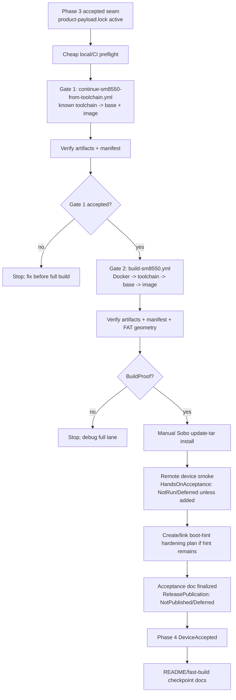
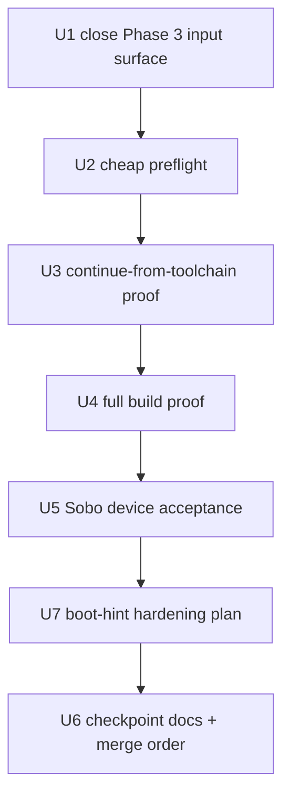

# feat: Prove SM8550 full-build release path

## Summary

Promote the product-payload SM8550 work from Phase 3's refreshed-base image-only proof to a release-path proof.

## Closeout

Phase 4 closes at `BuildProof + ArtifactVerified + DeviceAccepted` for sobo / Odin2Portal (`ayn,odin2portal`).

- Confidence gate: `continue-sm8550-from-toolchain.yml` run `26534216483` (product SHA `ea836506446619b805acc7954a190fdee95be446`).
- Authoritative full build: `build-sm8550.yml` run `26539625977` (same product SHA, same payload). Artifact `nix-on-rocks-sm8550-26539625977` verified locally including SM8550 FAT geometry and `--require-full-image`.
- Device acceptance: `docs/acceptance/sm8550-product-payload-full-build-sobo-2026-05-27.md`. Update tar consumed, KERNEL md5 `42386591bf1bda598f54693cda60a82f` and SYSTEM md5 `2fb7374a51673dc5976c29d808fba22c` match Gate 2 expected, ABL unchanged, host running, guest active, zero failed units, substrate revision and seed manifest match the Korri Odin2Portal payload.
- `HandsOnAcceptance`: `NotRun/Deferred`.
- `ReleasePublication`: `NotPublished/Deferred`.
- Update-lifecycle follow-up: `docs/plans/2026-05-27-002-fix-main-space-post-update-boot-hint-plan.md` covers the residual `/storage/.boot.hint=UPDATE` on Layer 14 main-space boot.
 Phase 4 runs two sequential Docker/ROCKNIX gates: first a cheaper `continue-sm8550-from-toolchain.yml` base+image proof, then the authoritative `build-sm8550.yml` full-chain proof if the first gate passes. Artifact verification and Sobo/Odin2Portal device acceptance remain separate gates, and the stale `/storage/.boot.hint=UPDATE` finding is carried as a hardening follow-up rather than a Phase 4 blocker.

---

## Problem Frame

Phase 3 proved the generic Korri product payload could flow through the SM8550 image path by building image artifacts from refreshed base/substrate artifacts, verifying them, installing the update tar on Sobo, and reaching a green remote portal/device smoke. That proves the active seam works, but it does not yet prove the full Docker/ROCKNIX release path from toolchain through base through image on the post-cutover code.

Phase 4 needs a cost-aware confidence ladder: avoid jumping straight to the longest build without an intermediate base+image proof, but still end with a full build before calling the release path accepted.

---

## Requirements

- R1. Treat Phase 3 as closed at `artifact-verified + remote device smoke accepted` for Sobo/Odin2Portal, not as hands-on acceptance of every runtime behavior.
- R2. Keep Docker/ROCKNIX as the SM8550 image backend; do not introduce Nix-built SM8550 image artifacts.
- R3. Use sequential build gates: `continue-sm8550-from-toolchain.yml` first, then `build-sm8550.yml` only after the cheaper proof passes.
- R4. Both image-producing gates must consume the active generic product payload facts for Korri Sobo/Odin2Portal from `product-payload.lock` and must run the existing payload/fetch/artifact verification surfaces.
- R5. Build-pass, artifact-verified, remote-device-smoke, hands-on acceptance, and release publication must remain distinct statuses in docs and operator communication. For Phase 4, `HandsOnAcceptance` is explicitly `NotRun/Deferred` unless an operator adds optional evidence, and `ReleasePublication` is explicitly `NotPublished/Deferred`.
- R6. Device acceptance for this phase targets Sobo/Odin2Portal (`odin2portal` / `ayn,odin2portal`) only. Thor acceptance remains separate.
- R7. `/storage/.boot.hint` remaining `UPDATE` after successful boot must be explicitly tracked as update-lifecycle hardening, with acceptance criteria, but must not block the full-build release proof unless it causes a runtime/update regression.
- R8. Any release-path documentation must preserve the current recovery boundary: update-tar install is the normal proof path; full-image/fastboot use remains gated by FAT label/logical-sector verification and existing fallback warnings.

---

## Scope Boundaries

- Do not change the product payload contract, rootfs seed facts, or Korri payload release in this phase unless a build gate exposes a concrete drift/defect.
- Do not weaken `scripts/verify-product-payload`, `scripts/verify-product-payload-fetches`, `scripts/verify-sm8550-payloads`, `scripts/verify-image-fat-sector-size`, or stale-base provenance checks.
- Do not use `build-image-only.yml` as the authoritative Phase 4 proof. It can remain a later packaging-only tool.
- Do not publish or recommend fastboot/full-image install unless the artifact set includes the full image and sidecar checksum, the SM8550 FAT geometry check is positively executed rather than skipped, and the docs preserve the UFS warning/recovery posture.
- Do not solve the `/storage/.boot.hint` lifecycle bug in the same unit as the build proof. Track and plan it separately so release proof and update hardening remain reviewable.
- Do not merge Korri and nix-on-rocks branches in an order that leaves `nix-on-rocks` pointing at unavailable Korri payload assets or Korri pointing at an unmerged substrate contract.

### Deferred to Follow-Up Work

- Implement an update-lifecycle fix for `/storage/.boot.hint=UPDATE` on the Layer 14 main-space boot path.
- Add boot logo/splash/custom branding payload assets after the full-build path is accepted.
- Add Thor-specific product payload intake and device acceptance.
- Design a public release channel if Actions artifacts are no longer sufficient for operator handoff. Phase 4 records `ReleasePublication: NotPublished/Deferred` rather than publishing a release tag.

---

## Context & Research

### Relevant Code and Workflows

- `product-payload.lock` contains the active Korri Phase 2 Sobo/Odin2Portal facts: Korri revision, product source SHA, promotion target, seed device/compatible/archive/SHA, and seed release URLs.
- `.github/workflows/continue-sm8550-from-toolchain.yml` rebuilds base+image from an existing toolchain artifact. It is the cheaper Phase 4 confidence gate.
- `.github/workflows/build-sm8550.yml` rebuilds Docker image, toolchain, base, and image. It is the authoritative full-chain proof gate.
- `.github/workflows/build-image-only.yml` is now guarded by `sm8550-base-provenance` and is not the Phase 4 proof target.
- `scripts/apply-rocknix-patches` stages the rendered product payload env into the patched `rocknix-guest-substrate` package.
- `scripts/verify-product-payload` proves lock, renderer, staged env, and package-visible values agree.
- `scripts/verify-product-payload-fetches` proves product source and seed bytes match the lock in network-capable image-producing lanes.
- `scripts/verify-sm8550-payloads` verifies update tar/image artifacts from active payload facts and calls `scripts/verify-image-fat-sector-size` when full images are present.
- `scripts/generate-manifest` records product authority, revision, source SHA, seed facts, patch-series hash, rendered-payload hash, and artifact checksums.
- `docs/ci/fast-builds.md` is the operator-facing build-lane reference and must be updated after Phase 4 acceptance.
- `README.md` contains the current accepted checkpoint and should be updated only after the final accepted gate.

### Existing Evidence to Carry Forward

- Phase 3 Korri payload release: `rocknix-product-payload-a3fabfd8a351`.
- Phase 3 Korri product revision: `a3fabfd8a35190cd23d027f4f8569bc11344a3d5`.
- Phase 3 source SHA256: `0dea10b50a12d2a96944d44d401d4786f95768d4e79df7a13a237d4fcef0f80d`.
- Phase 3 rootfs seed SHA256: `bdfe9a73acc327c77b3c813d7c284bfc4c182b930b436b24cdcfa878d73ccd0a`.
- Phase 3 image-only proof run: `26509482057`.
- Phase 3 fresh base run: `26505366012`.
- Phase 3 preflight run: `26505279214`.
- Phase 3 remote Sobo smoke returned to portal with host/guest failed units at zero.

### Institutional Learnings

- `docs/ci/fast-builds.md` and prior fast-build learnings distinguish image-only packaging from base/substrate rebuild proof. Phase 4 should not regress to stale-base image-only proof.
- `docs/solutions/runtime-errors/sm8550-mkimage-vfat-logical-sector-size-too-small-2026-05-25.md` establishes the full-image geometry risk. `scripts/verify-image-fat-sector-size` must stay in the artifact gate.
- `docs/contracts/HOW-TO-FALL-BACK.md` and recovery docs preserve two escape hatches: `/flash/rocknix.no-nspawn` and `rocknix.safe=1`. Phase 4 must not erode the recovery plane.
- Prior SM8550 acceptance docs use explicit build/device status vocabulary. Phase 4 should mirror that rather than collapsing CI and device acceptance into one status.
- Research found that `/storage/.boot.hint=UPDATE` is normally consumed by the legacy `003-upgrade` path under `rocknix.target`; the Layer 14 main-space boot path may bypass that consumer. Treat this as lifecycle hardening.

---

## Key Technical Decisions

- **Sequential gates, not one big swing:** run `continue-sm8550-from-toolchain.yml` first, then `build-sm8550.yml` if and only if the cheaper base+image proof passes.
- **Full build is the authoritative Phase 4 proof:** the continue-from-toolchain run is a confidence gate; final release-path acceptance requires `build-sm8550.yml` success plus artifact verification.
- **Update tar remains the device proof path:** use `/storage/.update/` update-tar validation for Sobo acceptance. Full-image artifacts are verified as build outputs but are not the default install path.
- **No new build scripts by default:** Phase 3 already added the required verifier surfaces. Phase 4 should mainly orchestrate, verify, and document, not add another layer of tooling.
- **Boot-hint cleanup is explicit follow-up:** the stale hint is real, but Phase 3 proved the update payload was consumed and the device booted cleanly. Create or link a hardening plan with acceptance criteria before checkpoint docs are updated, but do not treat the implementation fix as release-proof blocking.
- **Precise acceptance vocabulary:** call the result `BuildProof` after full CI artifact verification, `DeviceAccepted` only after Sobo update/reboot/runtime gates, and avoid `ReleaseCandidate` unless a release-channel/publishing decision is made.

---

## Open Questions

### Resolved During Planning

- Should Phase 4 use full `build-sm8550.yml` or `continue-sm8550-from-toolchain.yml`? Use both sequentially: continue-from-toolchain first, full build second.
- Does `/storage/.boot.hint=UPDATE` block Phase 4? Not by itself. It is tracked as update-lifecycle hardening unless it causes a concrete update/runtime regression.
- Should image-only be the Phase 4 proof? No. Phase 3 already used image-only with refreshed base; Phase 4 graduates to stronger gates.

### Deferred to Execution

- Exact run IDs and artifact hashes from the continue/full builds.
- Whether the full build completes within the expected time budget or exposes unrelated toolchain/base failures.
- Whether the post-full-build Sobo acceptance still leaves `/storage/.boot.hint=UPDATE` and whether a second reboot changes the state.

---

## High-Level Technical Design

---

## Implementation Units

### U1. Close Phase 3 and freeze the Phase 4 input surface

**Goal:** Record that Phase 3 is accepted at the correct confidence level and ensure Phase 4 starts from the exact product-payload state that passed remote device smoke.

**Requirements:** R1, R4, R5

**Dependencies:** None

**Files:**
- Modify: `docs/plans/2026-05-26-002-refactor-product-payload-image-consumption-plan.md`
- Reference: `product-payload.lock`
- Reference: `guest.lock`
- Reference: `docs/ci/fast-builds.md`

**Approach:**
- Update the Phase 3 plan status or closeout note to distinguish `artifact-verified + remote device smoke accepted` from hands-on acceptance.
- Preserve the active Korri/Sobo payload facts already in `product-payload.lock` and `guest.lock`; do not bump payload facts as part of Phase 4 setup.
- Add a short note that `/storage/.boot.hint=UPDATE` remains a follow-up hardening item, not a Phase 3 blocker.

**Test scenarios:**
- Happy path: Phase 3 closeout text names the exact status and does not imply full release acceptance.
- Error path: any attempted payload fact bump without new Korri release evidence is caught by lock/verifier checks.
- Integration: Phase 4 starts with the same product revision and seed SHA that were installed on Sobo in Phase 3.

**Verification:**
- `scripts/verify-product-payload`
- `scripts/verify-sm8550-locks`
- Review of Phase 3 closeout wording.

---

### U2. Run the cheap preflight gate before any Docker build

**Goal:** Prove the post-Phase-3 checkout is internally consistent and external payload bytes are reachable before spending build hours.

**Requirements:** R2, R4, R5

**Dependencies:** U1

**Files:**
- Reference: `.github/workflows/preflight.yml`
- Reference: `scripts/apply-rocknix-patches`
- Reference: `scripts/verify-sm8550-contract`
- Reference: `scripts/verify-sm8550-locks`
- Reference: `scripts/verify-product-payload`
- Reference: `scripts/verify-product-payload-fetches`
- Reference: `scripts/tests/product-payload-contract.sh`

**Approach:**
- Use the same offline and network-capable checks that the build lanes run.
- Treat `scripts/verify-product-payload-fetches` as required before image-producing lanes; a structural/offline skip is not enough for Phase 4 build approval.
- Do not dispatch Docker workflows until product lock, guest lock, rendered payload, staged env, and source/seed bytes are all consistent.

**Test scenarios:**
- Happy path: all cheap checks pass against the Phase 3 product payload facts.
- Error path: inaccessible source/seed URL fails before Docker work.
- Error path: lock drift between `product-payload.lock` and `guest.lock` fails before workflow dispatch.

**Verification:**
- Passing preflight run or equivalent local command evidence.
- Recorded output/links in the Phase 4 acceptance doc.

---

### U3. Gate 1: prove base+image via continue-from-toolchain

**Goal:** Run the lower-cost Docker/ROCKNIX proof that rebuilds base and image through the active product-payload seam before paying for a full toolchain rebuild.

**Requirements:** R2, R3, R4, R5

**Dependencies:** U2

**Files:**
- Reference: `.github/workflows/continue-sm8550-from-toolchain.yml`
- Reference: `scripts/ci-build-stage`
- Reference: `scripts/verify-sm8550-payloads`
- Reference: `scripts/generate-manifest`
- Reference: `docs/ci/fast-builds.md`

**Approach:**
- Dispatch `continue-sm8550-from-toolchain.yml` using the currently documented known-good toolchain unless the preflight evidence invalidates it.
- Require the workflow to run payload fetch checks before Docker work and artifact verification after image generation.
- Download or inspect the resulting artifact manifest and verify it reports the active product revision, source SHA, seed device, compatible string, seed archive, seed SHA, patch-series hash, and rendered payload hash.
- Stop if this gate fails; do not dispatch the full build until the cheaper proof is clean.

**Test scenarios:**
- Happy path: continue-from-toolchain produces `nix-on-rocks-sm8550-<run_id>` artifacts whose manifest matches `product-payload.lock`.
- Error path: artifact verification fails on missing seed payload, wrong seed SHA, missing `KERNEL`, or bad image geometry, and the phase stops.
- Edge case: toolchain artifact download fails or is no longer trusted; Phase 4 pauses to refresh or choose a new toolchain proof explicitly.

**Verification:**
- Successful `continue-sm8550-from-toolchain.yml` run.
- `scripts/verify-sm8550-payloads` success on produced artifacts.
- Manifest evidence recorded for Gate 1.

---

### U4. Gate 2: prove the full Docker SM8550 build lane

**Goal:** Run the authoritative full-chain Docker/ROCKNIX proof from Docker build image through toolchain, base, image, manifest, and payload verification.

**Requirements:** R2, R3, R4, R5, R8

**Dependencies:** U3

**Files:**
- Reference: `.github/workflows/build-sm8550.yml`
- Reference: `scripts/restore-ccache`
- Reference: `scripts/ci-build-stage`
- Reference: `scripts/verify-product-payload-fetches`
- Modify: `scripts/verify-sm8550-payloads`
- Reference: `scripts/verify-image-fat-sector-size`
- Reference: `scripts/generate-sm8550-base-provenance`
- Reference: `scripts/generate-manifest`

**Approach:**
- Dispatch `build-sm8550.yml` only after Gate 1 passes.
- Treat this as the Phase 4 `BuildProof` source of truth. Gate 1 evidence remains supporting confidence, not final proof.
- Require `scripts/verify-product-payload-fetches` before Docker work; `build-sm8550.yml` already runs this surface in each expensive job, and U4 records that output as part of full-build proof.
- Require artifact verification from the workflow and repeat local verification after artifact download when feasible.
- Require a full-build artifact set before full-image wording is recorded: exactly one update tar, tar sidecar SHA, full image `.img.gz`, image sidecar SHA, and manifest. Tighten `scripts/verify-sm8550-payloads` or add an explicit Phase 4 acceptance check so missing image artifacts do not silently skip gzip/FAT geometry verification.
- Confirm the full-build artifacts include valid update tar, checksum sidecars, image gzip integrity, expected seed payload, manifest evidence, and a non-skipped SM8550 FAT geometry proof for full image artifacts.

**Test scenarios:**
- Happy path: full build completes and uploads `nix-on-rocks-sm8550-<run_id>` with payload-aware manifest and verified artifacts.
- Error path: toolchain rebuild fails; Phase 4 remains below `BuildProof` and does not proceed to device update.
- Error path: full image FAT label/block-size verification fails or is skipped because the image artifact is missing; update-tar proof may still be inspected, but full-image release wording is blocked.
- Integration: the full build produces `sm8550-base-provenance` for future image-only lanes.

**Verification:**
- Successful `build-sm8550.yml` run.
- `scripts/verify-product-payload-fetches`, `scripts/verify-sm8550-payloads`, and `scripts/verify-image-fat-sector-size` success, with full image artifact presence confirmed.
- Manifest and artifact SHA evidence recorded.

---

### U5. Manually validate the full-build artifact on Sobo/Odin2Portal

**Goal:** Convert full-build `BuildProof` into Sobo/Odin2Portal `DeviceAccepted` evidence without conflating remote smoke with broader hands-on acceptance.

**Requirements:** R5, R6, R7, R8

**Dependencies:** U4

**Files:**
- Create: `docs/acceptance/sm8550-product-payload-full-build-sobo-2026-05-27.md`
- Reference: `docs/acceptance/sm8550-phase5-ci-and-device-acceptance-2026-05-20.md`
- Reference: `docs/acceptance/sm8550-device-acceptance-2026-05-22-thor.md`
- Reference: `docs/contracts/HOW-TO-FALL-BACK.md`
- Reference: `docs/contracts/layer14-soak-checklist.md`

**Approach:**
- Follow the existing custom-fork update-tar acceptance shape: preflight storage/battery/update-dir state, ABL skip precheck, host/device SHA checks, update-tar staging, reboot, recovery supervision, and post-reboot service gates. Include explicit ABL evidence using the stronger Thor acceptance pattern: packaged `abl_signed-SM8550.elf` hash, pre-install `abl_a`/`abl_b` hashes, confirmation that ABL update stays skipped without explicit opt-in, and post-install `abl_a`/`abl_b` hashes unchanged.
- Use the update tar as the device install path. Verify full image artifacts, but do not require fastboot/full-image flashing.
- After reboot, record host `OS_VERSION`, guest revision, seed manifest, failed units, portal/readiness, `/flash` and `/storage` labels, and ABL unchanged evidence.
- Track `/storage/.boot.hint` explicitly. If the runtime gates are green but the hint remains, record it as a follow-up caveat and link the hardening plan from U7; do not silently mark the legacy update lifecycle clean.
- Record `HandsOnAcceptance: NotRun/Deferred` by default. Screen/input/Korri launch/Moonlight smoke checks may be added as optional evidence, but they are not hidden prerequisites for Phase 4 `DeviceAccepted`.

**Test scenarios:**
- Happy path: update tar installs, Sobo returns to portal, host/guest failed units are zero, guest revision matches product payload, and seed manifest matches lock.
- Error path: `/storage/.update/` is not consumed or artifact SHA fails on-device; Phase 4 stops before `DeviceAccepted`.
- Error path: ABL differs unexpectedly or update attempts bootloader flashing without explicit opt-in; Phase 4 stops and follows recovery procedure.
- Edge case: `/storage/.boot.hint` remains after green runtime gates; acceptance doc records caveat and links the follow-up hardening plan.
- Edge case: no hands-on screen/input/Moonlight check is run; acceptance doc records `HandsOnAcceptance: NotRun/Deferred` rather than implying broader manual validation.

**Verification:**
- Completed acceptance doc with run IDs, artifact hashes, install evidence, and post-reboot evidence.
- Device state reaches `DeviceAccepted` for Sobo/Odin2Portal only.

---

### U6. Update checkpoint docs and PR/merge coordination

**Goal:** Make the accepted Phase 4 state discoverable and coordinate Korri/nix-on-rocks branch order without creating a dependency-direction loop.

**Requirements:** R5, R6, R8

**Dependencies:** U5, U7

**Files:**
- Modify: `README.md`
- Modify: `docs/ci/fast-builds.md`
- Modify: `docs/acceptance/sm8550-acceptance.md`
- Reference: `product-payload.lock`
- Reference: `guest.lock`

**Approach:**
- Update accepted checkpoint/status only after full build artifact verification, Sobo device acceptance, and creation/linking of the boot-hint hardening plan when the hint caveat is present.
- Record both Gate 1 and Gate 2 run IDs, but identify the full `build-sm8550.yml` run as the authoritative Phase 4 proof.
- Update `docs/ci/fast-builds.md` with the new toolchain/base/full-build evidence and any known-good artifacts that future image-only work may reuse.
- Coordinate merge order: Korri payload branch/release assets must remain available; nix-on-rocks should not merge a lock that points at unavailable payload assets; Korri should bump nix-on-rocks only after the substrate branch is merged or pinned.
- Record `ReleasePublication: NotPublished/Deferred`; do not add a release tag or public release-channel language in Phase 4.

**Test scenarios:**
- Happy path: docs identify latest accepted build/device proof and preserve older Phase 3 evidence as historical.
- Error path: docs do not claim Thor acceptance or public release status from a Sobo-only validation.
- Integration: future maintainers can find which run IDs and payload facts were accepted.

**Verification:**
- Review docs for accurate status vocabulary.
- Run docs/static checks already present in the repo.

---

### U7. Capture update-lifecycle hardening as a follow-up plan

**Goal:** Preserve the `/storage/.boot.hint=UPDATE` learning and define a safe follow-up without blocking the full-build proof.

**Requirements:** R7, R8

**Dependencies:** U5

**Files:**
- Create: `docs/plans/2026-05-27-002-fix-main-space-post-update-boot-hint-plan.md`
- Modify: `docs/acceptance/sm8550-product-payload-full-build-sobo-2026-05-27.md`
- Reference: `patches/rocknix/0006-rocknix-guest-substrate.patch`
- Reference: `docs/contracts/layer14-main-space-contract.md`
- Reference: `docs/contracts/HOW-TO-FALL-BACK.md`

**Approach:**
- Write a focused plan for a host-owned consumer of `/storage/.boot.hint=UPDATE` reachable from the Layer 14 main-space boot path.
- Revisit the Phase 4 acceptance doc after creating the follow-up plan so the caveat links to concrete hardening acceptance criteria before checkpoint docs are updated.
- Compare two candidate shapes: a new additive post-update oneshot before guest start, or extending legacy autostart to the graphical/main-space target.
- Preserve the recovery plane: do not delete or weaken `rocknix.target`, `rocknix-autostart.service`, `/flash/rocknix.no-nspawn`, or `rocknix.safe=1`.
- Include static checks and device acceptance criteria: post-update log/current-boot evidence and `test ! -e /storage/.boot.hint` after successful update boot.

**Test scenarios:**
- Happy path: follow-up plan makes stale boot-hint behavior measurable and assigns it to the host substrate.
- Error path: proposed cleanup would run `post-update` repeatedly or on stale hints without provenance; plan rejects or constrains that path.
- Integration: Phase 4 acceptance can link the follow-up plan instead of leaving the caveat in chat history.

**Verification:**
- Follow-up plan exists, contains acceptance criteria, and is referenced from the Phase 4 acceptance doc before `README.md` / `docs/ci/fast-builds.md` checkpoint updates land.

---

## Implementation Unit Dependency Graph

---

## System-Wide Impact

- **Build confidence:** Phase 4 upgrades confidence from refreshed-base image-only to base+image and full-chain Docker/ROCKNIX proof.
- **Operational clarity:** Future operators get a documented accepted full-build path, a known-good artifact checkpoint, explicit `ReleasePublication: NotPublished/Deferred`, and explicit `HandsOnAcceptance` status.
- **Dependency direction:** nix-on-rocks still consumes copied immutable payload facts and release assets; it does not import Korri.
- **Runtime safety:** Device acceptance stays tied to update-tar install and recovery supervision. Full-image artifacts remain gated by geometry checks and warnings.
- **Lifecycle debt:** `/storage/.boot.hint` is no longer an incidental observation; it becomes tracked substrate hardening work.

---

## Risks & Dependencies

| Risk | Mitigation |
|------|------------|
| Continue-from-toolchain passes but full build fails in toolchain stage | Treat Gate 1 as confidence only; final `BuildProof` requires full `build-sm8550.yml`. |
| Full build consumes many hours and fails late | Require cheap preflight and Gate 1 before dispatching full build. |
| Actions artifact expires before future operators need it | Record run IDs and checksums; keep Phase 4 `ReleasePublication: NotPublished/Deferred`; decide durable publication in a separate plan if needed. |
| Docs imply full-image fastboot is safe by default | Keep update-tar as the proof path and preserve FAT geometry / fallback warnings. |
| Sobo acceptance is mistaken for all-SM8550 acceptance | Name `odin2portal` / `ayn,odin2portal` in requirements, acceptance docs, and README status. |
| Stale `/storage/.boot.hint` causes a later surprise post-update on recovery boot | Create a dedicated hardening plan and link it from acceptance evidence. |
| Branch merge order breaks payload availability | Merge/pin only after Korri payload release assets and nix-on-rocks lock references are mutually valid. |

---

## Phased Delivery

### Phase 4A — Preflight and cheaper build proof

- Close Phase 3 at `artifact-verified + remote device smoke accepted`.
- Run cheap structural/network payload gates.
- Dispatch and verify `continue-sm8550-from-toolchain.yml`.
- Stop on any artifact, manifest, source/seed fetch, or geometry failure.

### Phase 4B — Authoritative full-build proof

- Dispatch `build-sm8550.yml` only after 4A passes.
- Verify full-build artifacts and manifest.
- Mark `BuildProof` only after full-build artifact verification passes.

### Phase 4C — Sobo/Odin2Portal device acceptance

- Install the full-build update tar on Sobo via the update-tar path.
- Run recovery/portal/service/seed/ABL checks.
- Record caveats, especially `/storage/.boot.hint` state.
- Record `HandsOnAcceptance: NotRun/Deferred` unless optional manual evidence is actually collected.
- Mark `DeviceAccepted` only for Sobo/Odin2Portal.

### Phase 4D — Checkpoint and handoff

- Write/link the boot-hint hardening follow-up plan before checkpoint docs are updated.
- Update `README.md`, `docs/ci/fast-builds.md`, and acceptance index/status docs.
- Coordinate PR merge order for Korri payload and nix-on-rocks substrate branches.
- Record `ReleasePublication: NotPublished/Deferred`; do not publish artifacts in this phase.

---

## Verification Surface Matrix

| Scope | Verification surface | Purpose |
|---|---|---|
| Pre-Docker structure | `scripts/apply-rocknix-patches`, `scripts/verify-sm8550-contract`, `scripts/verify-sm8550-locks`, `scripts/verify-product-payload`, `scripts/tests/product-payload-contract.sh` | Prove lock/render/staged-env/package agreement. |
| External payload bytes | `scripts/verify-product-payload-fetches` | Prove Korri source tarball and rootfs seed bytes match `product-payload.lock`. |
| Cheaper Docker proof | `.github/workflows/continue-sm8550-from-toolchain.yml` | Prove base+image rebuild through active payload seam before full build. |
| Full Docker proof | `.github/workflows/build-sm8550.yml` | Prove Docker image, toolchain, base, image, manifest, and payload verification end to end. |
| Artifact verification | `scripts/verify-sm8550-payloads`, `scripts/verify-image-fat-sector-size`, `nix-on-rocks-build-manifest.md` | Prove update tar/image contents, checksums, seed payload, manifest facts, expected full-build artifact presence, and non-skipped FAT geometry. |
| Device acceptance | Sobo update-tar install, recovery supervision, failed-unit checks, seed manifest, ABL checks | Prove the full-build artifact boots and runs on `ayn,odin2portal`. |
| Follow-up hardening | `docs/plans/2026-05-27-002-fix-main-space-post-update-boot-hint-plan.md` | Keep update lifecycle debt actionable and out of release-proof ambiguity before checkpoint docs are published. |
| Documentation | `README.md`, `docs/ci/fast-builds.md`, acceptance doc | Make accepted run IDs, artifact hashes, scope, `HandsOnAcceptance`, `ReleasePublication`, and caveats discoverable. |

---

## Documentation / Operational Notes

- Prefer `BuildProof` and `DeviceAccepted` language unless a durable release publishing flow is added in this phase.
- Preserve all Phase 3 run IDs as prior evidence, but make the full `build-sm8550.yml` run the Phase 4 proof anchor.
- The Sobo device acceptance doc should include the exact installed update tar name, tar SHA, `OS_VERSION`, guest revision, seed manifest, ABL evidence, and `/storage/.boot.hint` state.
- Hands-on input/Moonlight/runtime checks are not required for Phase 4; if skipped, record `HandsOnAcceptance: NotRun/Deferred` explicitly.
- Record `ReleasePublication: NotPublished/Deferred`; release publication requires a separate plan.
- Do not use stale image-only base artifacts for any post-Phase-4 payload/substrate change unless the provenance override is intentionally documented as packaging-only.

---

## Sources & References

- Phase 1 plan: `docs/plans/2026-05-26-001-refactor-product-payload-contract-plan.md`
- Phase 3 plan: `docs/plans/2026-05-26-002-refactor-product-payload-image-consumption-plan.md`
- Build lanes: `docs/ci/fast-builds.md`
- Host/guest contract: `docs/contracts/layer14-main-space-contract.md`
- Fallback contract: `docs/contracts/HOW-TO-FALL-BACK.md`
- Existing acceptance pattern: `docs/acceptance/sm8550-phase5-ci-and-device-acceptance-2026-05-20.md`
- Active payload lock: `product-payload.lock`
- Compatibility seed lock: `guest.lock`
- Full build workflow: `.github/workflows/build-sm8550.yml`
- Continue workflow: `.github/workflows/continue-sm8550-from-toolchain.yml`
- Artifact verifier: `scripts/verify-sm8550-payloads`
- FAT geometry verifier: `scripts/verify-image-fat-sector-size`
