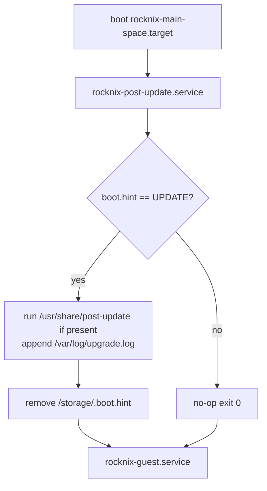
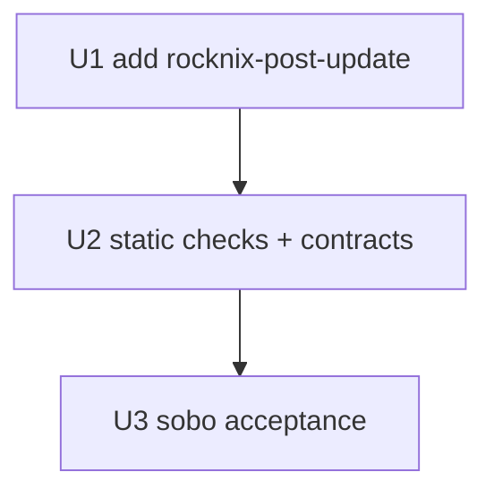

# fix: Consume /storage/.boot.hint on Layer 14 main-space post-update boot

## Summary

After a successful ROCKNIX SM8550 update is applied through the normal `/storage/.update/` path on a Layer 14 main-space install, `/storage/.boot.hint` remains set to `UPDATE` on next boot. The legacy `003-upgrade` autostart consumer is reachable only from `rocknix.target` via the autostart chain. Layer 14 boot uses `rocknix-main-space.target` as the host default, which does not invoke that consumer. The hint accumulates as stale state and can confuse later update lifecycle assumptions.

This plan adds a narrow host-owned post-update consumer reachable from the Layer 14 boot path. It runs at most once per `UPDATE` hint, captures evidence into the existing upgrade log surface, and removes the hint without touching guest state or the legacy `rocknix.target` autostart chain.

---

## Problem Frame

`/usr/lib/autostart/common/003-upgrade` reads `/storage/.boot.hint`, runs `/usr/share/post-update` if present, and removes the hint. It is only invoked from the autostart chain under `rocknix.target`. The Layer 14 default `rocknix-main-space.target` does not pull in that chain. A clean post-update boot therefore leaves `/storage/.boot.hint=UPDATE` in place. Observed on sobo after Phase 4 update install (`docs/acceptance/sm8550-product-payload-full-build-sobo-2026-05-27.md`).

Risks of leaving this unfixed:

- Future operator confusion when reading `/storage/.boot.hint` expecting a fresh-boot signal.
- Update-lifecycle tooling that assumes the hint clears after first boot may make incorrect assumptions.
- Any future host code that triggers behavior on a stale `UPDATE` hint would run on every boot until manually cleared.

---

## Requirements

- R1. After a successful Layer 14 main-space boot following a `/storage/.update/` install, `/storage/.boot.hint` must not remain set to `UPDATE`.
- R2. The consumer must be reachable from `rocknix-main-space.target` without depending on `rocknix.target` or the legacy autostart chain.
- R3. The consumer must run at most once per `UPDATE` hint occurrence and must be idempotent across reboots if no new update is staged.
- R4. The consumer must call `/usr/share/post-update` when that script exists, with the same error-handling posture as `003-upgrade` (log to `/var/log/upgrade.log`, do not block boot on script failure).
- R5. The recovery boundary must remain intact: `/flash/rocknix.no-nspawn` and `rocknix.safe=1` continue to route boot to the legacy ROCKNIX target, where the legacy autostart chain remains the authoritative consumer.
- R6. The fix must not run on a stale or unknown hint value. Only literal `UPDATE` content triggers consumption; any other content is left in place and logged.
- R7. The fix must not touch guest state, `/storage/.guest`, `/storage/nix-on-rock/`, ABL, fastboot, or the update tar.
- R8. The fix must come with acceptance evidence on Layer 14 sobo (Odin2Portal) confirming the hint is cleared after a successful update install.

---

## Scope Boundaries

- Do not delete, weaken, or replace `/usr/lib/autostart/common/003-upgrade`. Legacy boot continues to use it.
- Do not move post-update logic into the guest. The hint is a host substrate signal.
- Do not introduce a new release artifact or product payload contract change for this fix.
- Do not consume the hint speculatively. Only consume `UPDATE` immediately after a real update install.
- Do not couple this fix to the Phase 4 release-path proof. The Phase 4 acceptance ships with the caveat documented.

### Deferred to Follow-Up Work

- Replacing the legacy `003-upgrade` autostart entirely once Layer 14 main-space is the only supported boot path.
- Generalizing `/storage/.boot.hint` into a structured boot-stage event log if multiple boot-time consumers ever need it.
- Cross-device Thor acceptance for this fix (Thor uses a separate device acceptance lane).

---

## Context & Research

### Relevant Code

- `/usr/lib/autostart/common/003-upgrade` (legacy): reads `/storage/.boot.hint`, runs `/usr/share/post-update`, clears the hint. Only reachable from `rocknix.target` autostart.
- `patches/rocknix/0006-rocknix-guest-substrate.patch`: defines host-side `rocknix-*.service` units, `rocknix-main-space.target`, and `rocknix-recovery-toggle.service`.
- `docs/contracts/layer14-main-space-contract.md`: defines the host/guest split for Layer 14 boot.
- `docs/contracts/HOW-TO-FALL-BACK.md`: defines the recovery boundary that this fix must preserve.

### Existing Evidence

- Phase 4 Sobo acceptance recorded `/storage/.boot.hint=UPDATE` persisting after a clean main-space boot following a successful update install. KERNEL/SYSTEM hashes matched the Gate 2 expected values, ABL was unchanged, and the guest came up cleanly — the only residual issue was the stale hint.

### Institutional Learnings

- The Layer 14 main-space contract intentionally does not pull in the legacy autostart chain because the autostart chain owns appliance-level product behavior that the guest now owns.
- Recovery via `/flash/rocknix.no-nspawn` is required to remain functional. Any new host-owned service must not break recovery if it itself fails.

---

## Key Technical Decisions

- **New additive host service:** add `rocknix-post-update.service`, owned by the substrate patch, wanted by `rocknix-main-space.target`, ordered before `rocknix-guest.service`. This avoids touching the legacy autostart chain and keeps the consumer scoped to Layer 14.
- **Same behavior as `003-upgrade` minus the autostart context:** read `/storage/.boot.hint`, only act on literal `UPDATE`, call `/usr/share/post-update` if present, log to `/var/log/upgrade.log`, then remove the hint.
- **Failure-tolerant:** if `/usr/share/post-update` fails or is missing, log and still clear the hint. The hint is a one-shot signal, not a retry surface.
- **Idempotent boots:** if the hint is absent or not `UPDATE`, the service is a no-op. No state files are introduced beyond the hint itself.
- **Recovery boundary unchanged:** legacy `rocknix.target` boot still runs `003-upgrade`. Recovery flags do not depend on the new service.

---

## Open Questions

### Resolved During Planning

- Should this run inside the guest? No. The hint is a host signal about host substrate state.
- Should it replace `003-upgrade`? No. Keep recovery boot behavior identical.
- Should it gate update install? No. Install is initramfs-driven and already authoritative; this fix only consumes the post-install signal.
- Should the service be `Required` by the main-space target? No, `WantedBy` is sufficient and matches existing host-substrate unit posture.

### Deferred to Implementation

- Exact unit name: prefer `rocknix-post-update.service` unless naming review prefers a different identifier consistent with the rest of the host substrate units.
- Whether to also emit a structured journal record in addition to `/var/log/upgrade.log`.

---

## High-Level Technical Design

---

## Implementation Units

### U1. Add `rocknix-post-update.service` to the substrate patch

**Goal:** Provide a Layer 14 main-space consumer for `/storage/.boot.hint=UPDATE` that mirrors the legacy `003-upgrade` posture without modifying the autostart chain.

**Requirements:** R1, R2, R3, R4, R6, R7

**Dependencies:** None.

**Files:**
- Modify: `patches/rocknix/0006-rocknix-guest-substrate.patch`
- Reference: `/usr/lib/autostart/common/003-upgrade`
- Reference: `docs/contracts/layer14-main-space-contract.md`

**Approach:**
- Install `/usr/bin/rocknix-post-update` (host script) that:
  - exits cleanly if `/storage/.boot.hint` is absent or its trimmed content is not exactly `UPDATE`;
  - runs `/usr/share/post-update` if present, appending stdout/stderr to `/var/log/upgrade.log`;
  - logs `"post-update hook missing"` if the script is absent;
  - removes `/storage/.boot.hint` on success or after a logged hook failure;
  - never exits non-zero on missing hint, missing hook, or hook failure (boot must not be blocked).
- Install `/usr/lib/systemd/system/rocknix-post-update.service`:
  - `Type=oneshot`, `RemainAfterExit=yes`;
  - `ConditionPathExists=/storage/.boot.hint`;
  - `Before=rocknix-guest.service`;
  - `After=local-fs.target`;
  - `WantedBy=rocknix-main-space.target`;
  - `ExecStart=/usr/bin/rocknix-post-update`.
- Add an enablement symlink in the patched target wants so the service is active by default on SM8550 Layer 14 boot only.
- Do not modify `/usr/lib/autostart/common/003-upgrade`.

**Test scenarios:**
- Happy path: `/storage/.boot.hint=UPDATE` and `/usr/share/post-update` present → hook runs, log appended, hint removed.
- Happy path: `/storage/.boot.hint=UPDATE` and `/usr/share/post-update` absent → log records missing hook, hint removed.
- Error path: `/usr/share/post-update` exits non-zero → log records failure, hint removed (no boot block).
- No-op path: `/storage/.boot.hint` absent → service exits clean, no log entry, no FS mutation.
- No-op path: `/storage/.boot.hint` contains content other than `UPDATE` → hint left in place, log records skipped state, no FS mutation.
- Recovery path: boot with `/flash/rocknix.no-nspawn` → `rocknix-main-space.target` is not active, service does not run, legacy `003-upgrade` remains the consumer.

**Verification:**
- `scripts/apply-rocknix-patches` continues to apply cleanly.
- `scripts/verify-sm8550-contract` continues to pass.
- Patched `package.mk` consumes only the staged `product-payload.env`.

---

### U2. Static checks and contract coverage

**Goal:** Encode the new unit shape and script behavior in existing static-check surfaces so future changes do not regress R1–R7.

**Requirements:** R1, R2, R3, R4, R5, R6, R7

**Dependencies:** U1

**Files:**
- Modify: `work/rocknix/projects/ROCKNIX/packages/tools/rocknix-guest-substrate/tests/guest-substrate-static-checks.sh` (via the substrate patch)
- Modify: `scripts/verify-sm8550-contract`
- Reference: `nix/tests/main-space-systemd-contract.nix`

**Approach:**
- Static check verifies:
  - `/usr/lib/systemd/system/rocknix-post-update.service` ships with the substrate;
  - the service is wanted by `rocknix-main-space.target`;
  - the service is ordered `Before=rocknix-guest.service`;
  - the service does not appear in the legacy `rocknix.target` autostart chain;
  - `/usr/bin/rocknix-post-update` is installed and executable;
  - the legacy `003-upgrade` autostart entry is unchanged.
- `nix/tests/main-space-systemd-contract.nix` (or a sibling) asserts the new unit shape inside evaluated module config.

**Test scenarios:**
- Happy path: substrate patch ships the new unit, target wants it, ordering correct → all checks pass.
- Error path: patch drops `Before=rocknix-guest.service` → check fails with a clear message.
- Error path: legacy `003-upgrade` is modified → check fails (recovery boundary protected).

**Verification:**
- `scripts/verify-sm8550-contract`
- `nix flake check --no-write-lock-file --print-build-logs`
- `scripts/check-shell-smoke`
- `scripts/check-boundary-lint`
- `scripts/check-docs-contract`

---

### U3. Layer 14 device acceptance on sobo

**Goal:** Prove the fix on Layer 14 main-space boot for Odin2Portal without regressing Phase 4 acceptance.

**Requirements:** R1, R2, R3, R5, R6, R8

**Dependencies:** U1, U2

**Files:**
- Create: `docs/acceptance/sm8550-post-update-boot-hint-sobo-<date>.md`
- Reference: `docs/acceptance/sm8550-product-payload-full-build-sobo-2026-05-27.md`
- Reference: `docs/contracts/HOW-TO-FALL-BACK.md`

**Approach:**
- Build a new SM8550 image carrying the substrate patch update.
- Install through `/storage/.update/` on sobo.
- After reboot, capture:
  - `cat /storage/.boot.hint || echo absent` → `absent`.
  - `/var/log/upgrade.log` tail.
  - Host failed units, guest active, KERNEL/SYSTEM md5, ABL unchanged.
- Stage a synthetic stale hint with non-`UPDATE` content and reboot; verify the service is a no-op and the hint remains.
- Reboot with `/flash/rocknix.no-nspawn` and verify the legacy `003-upgrade` consumer still handles the hint when present.

**Test scenarios:**
- Happy path: clean update install ends with no hint and a `/var/log/upgrade.log` entry.
- No-op path: synthetic non-`UPDATE` content survives reboot untouched.
- Recovery path: recovery boot consumes the hint via legacy autostart, not the new service.

**Verification:**
- Acceptance doc with run IDs, artifact hashes, install evidence, post-reboot evidence, recovery-path evidence, and ABL unchanged.

---

## Implementation Unit Dependency Graph

---

## System-Wide Impact

- **Update lifecycle:** Layer 14 main-space boot becomes self-cleaning for `/storage/.boot.hint=UPDATE`.
- **Recovery posture:** unchanged. Legacy boot still owns the autostart consumer.
- **Substrate surface:** one new host service and one new host script; patched substrate evidence remains the source of truth.
- **Operator experience:** `/storage/.boot.hint` becomes a reliable fresh-update signal again.

---

## Risks & Dependencies

| Risk | Mitigation |
|------|------------|
| New service blocks boot if `/usr/share/post-update` hangs | Use `TimeoutStartSec`, log and continue, never exit non-zero. |
| Service runs in recovery and bypasses legacy consumer | Wired only to `rocknix-main-space.target`; recovery uses `rocknix.target`. |
| Stale `UPDATE` hint from non-update sources gets consumed | Only literal `UPDATE` triggers consumption; everything else is preserved and logged. |
| Static checks miss a future regression in the autostart chain | U2 asserts the legacy `003-upgrade` is unchanged. |
| Phase 4 release-path proof gets re-opened by this fix | Phase 4 is closed independently with the caveat. This fix ships separately and does not need to renegotiate Phase 4 acceptance. |

---

## Verification Surface Matrix

| Scope | Verification surface | Purpose |
|---|---|---|
| Patch correctness | `scripts/apply-rocknix-patches`, `scripts/verify-sm8550-contract`, substrate static checks | Prove the new unit/script ship correctly and recovery surfaces are unchanged. |
| Module/contract correctness | `nix/tests/main-space-systemd-contract.nix`, `scripts/check-shell-smoke`, `scripts/check-boundary-lint` | Prove unit shape and recovery boundary stay correct under refactors. |
| Device behavior | Sobo update install + reboot evidence | Prove `/storage/.boot.hint=UPDATE` is consumed and removed on Layer 14 main-space boot. |
| Recovery behavior | Recovery boot evidence | Prove legacy consumer still handles the hint when recovery is active. |
| Documentation | Acceptance doc + caveat resolution note in `docs/acceptance/sm8550-product-payload-full-build-sobo-2026-05-27.md` | Make resolution discoverable next to the original caveat. |

---

## Sources & References

- Phase 4 plan: `docs/plans/2026-05-27-001-feat-sm8550-full-build-release-proof-plan.md`
- Phase 4 acceptance: `docs/acceptance/sm8550-product-payload-full-build-sobo-2026-05-27.md`
- Layer 14 contract: `docs/contracts/layer14-main-space-contract.md`
- Recovery contract: `docs/contracts/HOW-TO-FALL-BACK.md`
- Legacy autostart consumer: `/usr/lib/autostart/common/003-upgrade`
- Substrate patch: `patches/rocknix/0006-rocknix-guest-substrate.patch`
