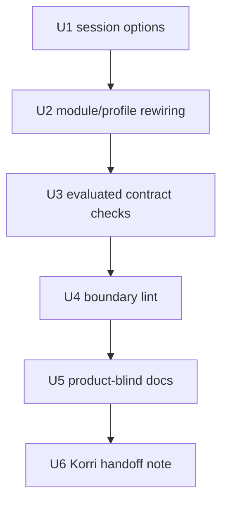

# refactor: Parameterize product-owned session unit boundaries

## Summary

Replace load-bearing Korri-specific session unit names in the nix-on-rocks substrate with explicit `rocknix.session.*Unit` options, then lock the boundary with evaluated contract checks, source lint guards, and a durable product-blind invariants contract. This is Swing 1 for the Korri ↔ nix-on-rocks boundary cleanup: it creates the foundation later package, launcher, branding, and dogfood-product swings depend on.

---

## Problem Frame

The substrate currently claims to be product-blind, but several runtime-critical modules still name Korri-owned systemd units directly. Those references affect cgroup selection, input ordering, portal/session startup, and contract checks, so a non-Korri product cannot safely consume the substrate without either matching Korri's unit names or accepting silent behavior drift.

---

## Requirements

- R1. The substrate exposes a typed, substrate-owned way for downstream products to declare their kiosk, compositor, and input-daemon unit names.
- R2. `guest/modules/` and `guest/profiles/` no longer hard-code Korri-owned service names for session ordering or cgroup lookup.
- R3. `guest/modules/input.nix` no longer inspects downstream product option trees such as `options.services ? korri`.
- R4. Existing substrate fallback behavior remains represented by substrate-owned defaults, especially `main-space-sway-kiosk.service`.
- R5. A headless/null shape is explicitly supported: when no downstream kiosk is configured, kiosk-ordering assertions skip or prove absence rather than failing.
- R6. Evaluated Nix contract checks prove the default substrate case, a downstream-configured product case, and the null/headless case.
- R7. Static lint fails if Korri service literals or Korri option-tree inspection return to substrate modules/profiles/contracts.
- R8. `docs/contracts/product-blind-invariants.md` defines product-blindness, current enforcement, and known outstanding violations for follow-up swings.
- R9. Existing product-shaped package, launcher, map, and branding migrations stay deferred to their already-captured backlog swings.
- R10. Korri's required downstream option-setting follow-up is visible and actionable, but not implemented in this nix-on-rocks plan.

---

## Scope Boundaries

- Do not move Steam, Cemu, Moonlight, InputPlumber maps, launchers, or boot-logo assets in this plan.
- Do not add Korri as a flake input, import Korri modules, or write `services.korri.*` options in nix-on-rocks.
- Do not redesign the substrate systemd topology; only replace product-owned names with declared substrate options.
- Do not add product-payload lock fields for unit names. Swing 1 uses NixOS module options, following the existing `rocknix.session.runtimeDir.uid` pattern.
- Do not make the dogfood second product here; this plan only creates the boundary it will later validate.

### Deferred to Follow-Up Work

- Korri repo follow-up: set the new session unit options in Korri's SM8550 guest composition (`nix/images/platforms/rocknix-sm8550.nix` or the current downstream option site) to `korri-kiosk.service`, `korri-compositor.service`, and `korri-inputd.service`.
- `task-021`: move boot-logo ownership out of substrate patches into Korri payload assets.
- `task-022`–`task-025`: migrate product-shaped packages/maps out of the substrate.
- `task-026`: migrate product-shaped launchers out of `guest/launchers/`.
- `task-029`: strip remaining product-specific positive lint assertions after the package/launcher moves land.
- `task-031`: dogfood the boundary with a stub second product.

---

## Context & Research

### Relevant Code and Patterns

- `guest/modules/session.nix` defines the existing `rocknix.session.runtimeDir.uid` option and owns `main-space-runtime-dir.service` ordering. This is the pattern to follow for new session handoff options.
- `guest/modules/input.nix` currently contains both the option-tree inspection anti-pattern (`options.services ? korri`) and the widest set of hardcoded Korri service names.
- `guest/modules/chipsets/sm8550/audio.nix` orders the Thor default-sink bootstrap before both the fallback kiosk and `korri-kiosk.service`; this is the audio-side peer of the portal/InputPlumber ordering seam.
- `guest/modules/lid.nix` embeds `korri-kiosk.service` as an unquoted cgroup path inside a generated shell script; lint must cover this shape, not only quoted Nix strings.
- `guest/profiles/rocknix-guest-base.nix` is the downstream product import contract and currently documents the old service-name-reference rationale in a comment.
- `nix/tests/audio-input-systemd-contract.nix` and `nix/tests/main-space-systemd-contract.nix` use evaluated NixOS configurations, imported from `flake.nix`, as contract sources of truth.
- `scripts/check-boundary-lint` already uses grep-based negative guards for dependency-direction and product-surface violations.
- `docs/contracts/layer14-main-space-contract.md` currently says runtime Korri service-name references are allowed; this must be updated so the contract set is not contradictory.

### Institutional Learnings

- `docs/migration/2026-05-22-korri-dependency-direction-violation.md` establishes the hard dependency rule: Korri may consume nix-on-rocks; nix-on-rocks must not consume Korri.
- `docs/contracts/layer14-main-space-contract.md` names `nixosModules.rocknix-guest-base` as the product-blind downstream import contract.
- Prior test-boundary work separated evaluated NixOS invariants from source-text lint: evaluated ordering belongs in `nix/tests/*.nix`; static anti-pattern detection belongs in `scripts/check-boundary-lint`.

### External References

- None. The required patterns are local NixOS module, flake-check, and contract-doc conventions already present in this repo.

---

## Key Technical Decisions

- **Use peer `rocknix.session.*Unit` options:** Add `rocknix.session.kioskUnit`, `rocknix.session.compositorUnit`, and `rocknix.session.inputdUnit` alongside `rocknix.session.runtimeDir.uid`. Peer options keep call sites short and match the backlog's acceptance criteria.
- **Default kiosk to the substrate fallback, not Korri:** `rocknix.session.kioskUnit` defaults to `"main-space-sway-kiosk.service"`; `null` means no kiosk/headless. `compositorUnit` and `inputdUnit` may default to `null` because the substrate fallback has no separate product compositor/inputd units beyond the kiosk unit and InputPlumber service.
- **Filter and de-duplicate optional unit lists:** Module call sites should build small role-specific lists from non-null configured options, with duplicates removed where the fallback kiosk fills more than one conceptual role.
- **Keep product names downstream-owned:** Korri restores its own ordering hints by setting the options in Korri, not by reintroducing Korri literals to nix-on-rocks.
- **Update old contract language in the same PR:** The existing Layer 14 contract explicitly permits Korri service-name references. Leaving it unchanged would contradict the new product-blind invariants doc and lint guards.

---

## Open Questions

### Resolved During Planning

- **Should unit names be payload fields or NixOS module options?** Use NixOS module options. These are session topology inputs consumed during NixOS evaluation, and the repo already uses `rocknix.session.runtimeDir.uid` for this class of setting.
- **Should `kioskUnit = null` be allowed?** Yes. It is the explicit headless/no-kiosk shape and must be covered by contract checks.
- **Should lint only catch quoted Korri service strings?** No. `lid.nix` currently uses an unquoted cgroup path, so lint also needs a path-oriented guard.

### Deferred to Implementation

- **Exact helper names for optional unit-list construction:** The implementer should choose the simplest local names that keep `session.nix`, `input.nix`, and `rocknix-guest-base.nix` readable.
- **Whether to create a small shared `sessionUnits` let binding in each file or repeat `lib.optional` expressions:** Decide while editing each module; the contract is behavior and clarity, not a mandated helper shape.

---

## High-Level Technical Design

> *This illustrates the intended approach and is directional guidance for review, not implementation specification. The implementing agent should treat it as context, not code to reproduce.*

| Mode | `kioskUnit` | `compositorUnit` | `inputdUnit` | Expected substrate behavior |
|---|---|---|---|---|
| Substrate fallback/default | `main-space-sway-kiosk.service` | `null` | `null` | Runtime-dir, D-Bus, portal, InputPlumber, and lid cgroup paths target the substrate-owned fallback kiosk where appropriate. |
| Downstream product configured | product kiosk unit | product compositor unit, if distinct | product inputd unit, if present | Product-owned units receive ordering hints through options; no Korri literals exist in substrate source. |
| Headless/no kiosk | `null` | `null` | `null` | Kiosk-specific ordering contributions are omitted; assertions prove absence/skips rather than requiring a product unit. |

Implementation dependency shape:

---

## Implementation Units

### U1. Add substrate session unit handoff options

**Goal:** Define the downstream session-unit contract in the substrate option namespace.

**Requirements:** R1, R4, R5

**Dependencies:** None

**Files:**
- Modify: `guest/modules/session.nix`
- Test: `nix/tests/audio-input-systemd-contract.nix`
- Test: `nix/tests/main-space-systemd-contract.nix`

**Approach:**
- Add `rocknix.session.kioskUnit`, `rocknix.session.compositorUnit`, and `rocknix.session.inputdUnit` as `nullOr str` options.
- Set `kioskUnit` default to `main-space-sway-kiosk.service`; reserve `null` for headless/no-kiosk.
- Set `compositorUnit` and `inputdUnit` defaults to `null` unless implementation discovers an existing substrate-owned unit that exactly matches the role.
- Keep descriptions explicit about ownership: downstream products publish unit names; substrate modules consume them.

**Patterns to follow:**
- `guest/modules/session.nix` option shape for `rocknix.session.runtimeDir.uid`.

**Test scenarios:**
- Happy path: default evaluated config exposes `rocknix.session.kioskUnit` as `main-space-sway-kiosk.service`.
- Edge case: a test configuration can override all three options to product-shaped service names without type errors.
- Edge case: a test configuration can set all three options to `null` without evaluation failure.

**Verification:**
- New options evaluate in default, downstream-configured, and null/headless configurations.

---

### U2. Replace Korri literals and option-tree inspection in modules/profiles

**Goal:** Make runtime ordering and cgroup lookup consume substrate options instead of Korri names or Korri option-tree probes.

**Requirements:** R2, R3, R4, R5

**Dependencies:** U1

**Files:**
- Modify: `guest/modules/session.nix`
- Modify: `guest/modules/input.nix`
- Modify: `guest/modules/chipsets/sm8550/audio.nix`
- Modify: `guest/modules/lid.nix`
- Modify: `guest/profiles/rocknix-guest-base.nix`
- Test: `nix/tests/audio-input-systemd-contract.nix`
- Test: `nix/tests/main-space-systemd-contract.nix`

**Approach:**
- Keep this and U3 as one green vertical slice during execution: removing module literals also requires retiring the two existing positive Korri-literal assertions, or `nix flake check --no-build` will fail at evaluation time before U3's expanded coverage lands.
- In `session.nix`, replace the hardcoded `korri-kiosk.service` runtime-dir ordering target with the configured kiosk unit when non-null.
- In `input.nix`, delete the `options` argument if no longer needed and remove `hasKorriKiosk`. Replace the broad `before` lists with role-specific optional unit lists derived from `kioskUnit`, `compositorUnit`, and `inputdUnit`.
- In `input.nix`, make fallback `main-space-sway-kiosk` InputPlumber ordering depend on the substrate fallback mode rather than on Korri option presence. Default mode should preserve fallback ordering; downstream-configured and null/headless modes should not accidentally force fallback-kiosk behavior.
- In `guest/modules/chipsets/sm8550/audio.nix`, replace the default-sink bootstrap's hardcoded `korri-kiosk.service` ordering target with the configured kiosk unit when non-null.
- In `lid.nix`, generate cgroup candidate paths from the configured kiosk/fallback unit list rather than hardcoding `/sys/fs/cgroup/system.slice/korri-kiosk.service`.
- In `lid.nix`, replace the same scripts' hardcoded `/run/user/0` Sway socket discovery with the existing `runtimeDir` binding so downstream `rocknix.session.runtimeDir.uid` products do not keep a silent lid-close/open DPMS bug.
- In `rocknix-guest-base.nix`, replace `korri-kiosk.service` in D-Bus and portal `before` / `after` / `partOf` lists with the configured kiosk unit when non-null.
- Update the stale comment in `rocknix-guest-base.nix` so it describes option-driven session handoff instead of allowed runtime Korri service-name references.

**Patterns to follow:**
- Local `lib.optional` / `lib.optionals` list construction in NixOS modules.
- Existing `pkgs.writeShellScript` interpolation in `lid.nix` for generated shell values.

**Test scenarios:**
- Happy path: default config still orders session D-Bus, portal bootstrap, InputPlumber, audio sink bootstrap, and runtime-dir around `main-space-sway-kiosk.service` where the fallback service is relevant.
- Happy path: downstream-configured config orders the same support services around product-provided unit names and contains no Korri strings.
- Edge case: null/headless config omits kiosk/compositor/inputd ordering contributions without evaluation failure.
- Error path: no module source under this unit still references `options.services ? korri` or `hasKorriKiosk`.
- Integration: fallback `main-space-sway-kiosk` receives `inputplumber.service` `wants`/`after` in default mode and does not receive that fallback wiring in downstream-configured mode.

**Verification:**
- All known Korri service literal sites in `guest/modules/session.nix`, `guest/modules/input.nix`, `guest/modules/chipsets/sm8550/audio.nix`, `guest/modules/lid.nix`, and `guest/profiles/rocknix-guest-base.nix` are removed or replaced by option-driven expressions.

---

### U3. Expand evaluated contract checks for default, configured, and headless modes

**Goal:** Prove the new option contract from evaluated NixOS config, not by source inspection alone.

**Requirements:** R4, R5, R6

**Dependencies:** U1, U2

**Files:**
- Modify: `flake.nix`
- Modify: `nix/tests/audio-input-systemd-contract.nix`
- Modify: `nix/tests/main-space-systemd-contract.nix`
- Test: `nix/tests/audio-input-systemd-contract.nix`
- Test: `nix/tests/main-space-systemd-contract.nix`

**Approach:**
- Add cheap eval-only configurations in `flake.nix` for downstream-configured and null/headless cases, following the existing `baseConfiguration` pattern.
- Use `lib.mkForce` for any test-only hostname overrides to avoid colliding with `rocknix-guest-base.nix`'s default hostname.
- Pass the new configurations into the two existing systemd contract checks rather than creating a parallel check surface unless the file becomes unreadable.
- Replace positive Korri-literal assertions with assertions against configured option values.
- Cover every behavior-bearing site from U2 that is visible through evaluated NixOS module attributes: runtime-dir `before`, session D-Bus `before`, portal `after`, portal `partOf`, InputPlumber `before`, raw-gamepad hider `before`, audio sink bootstrap `before`, and fallback `main-space-sway-kiosk` InputPlumber wiring.
- Treat `lid.nix`'s generated shell-script text as source-lint coverage, not evaluated contract coverage, unless implementation deliberately exposes a module attribute for the cgroup candidate list.

**Patterns to follow:**
- `flake.nix` `baseConfiguration` / `mainSpaceConfiguration` definitions and check imports.
- `nix/tests/helpers.nix` `assertContract` and `runAssertions` shape.

**Test scenarios:**
- Happy path: default config asserts `kioskUnit` is the substrate fallback and fallback-kiosk ordering remains present.
- Happy path: downstream-configured config asserts product unit names appear in each intended ordering surface.
- Edge case: null/headless config asserts kiosk-specific contributions are absent or skipped with a clear assertion message.
- Edge case: null/default configs assert `korri-kiosk.service`, `korri-compositor.service`, and `korri-inputd.service` are absent from evaluated ordering lists.
- Integration: default config proves `main-space-sway-kiosk.{wants,after}` contains `inputplumber.service`; downstream-configured config proves that fallback-only wiring is not applied by product sniffing.

**Verification:**
- The Nix checks fail if any U2 ordering surface omits the configured product unit or retains a Korri literal.

---

### U4. Add static boundary lint for service literals and option-tree inspection

**Goal:** Prevent future source-level reintroduction of the product couplings this plan removes.

**Requirements:** R2, R3, R7

**Dependencies:** U3

**Files:**
- Modify: `scripts/check-boundary-lint`

**Approach:**
- Add a guard for quoted Korri service literals in `guest/modules/`, `guest/profiles/`, and `nix/tests/`. This depends on U3 because the existing contract tests currently contain the literals being retired.
- Add a second guard for unquoted cgroup/path-style Korri service references, covering the shape currently present in `lid.nix`.
- Add a guard for `options.services ? korri`, `options.services.*korri`, and `hasKorriKiosk` in substrate modules/profiles.
- Scope guards to load-bearing substrate source and contract checks, not historical docs or migration notes that intentionally discuss the old violation.
- Keep existing product-specific positive assertions for Steam/Cemu/launcher code until their own migration swings remove the files they guard.

**Patterns to follow:**
- Existing `! grep ... || fail "..."` style in `scripts/check-boundary-lint`.

**Test scenarios:**
- Happy path: post-U2 source passes the new lint guards.
- Error path: a quoted `"korri-kiosk.service"` seeded in a scratch module fails lint.
- Error path: an unquoted `/sys/fs/cgroup/.../korri-kiosk.service` seeded in a scratch module fails lint.
- Error path: a seeded `options.services ? korri` or `hasKorriKiosk` expression fails lint.

**Verification:**
- Static lint protects both quoted Nix string and unquoted generated-shell-path reintroductions.

---

### U5. Write and cross-link the product-blind invariants contract

**Goal:** Make the boundary rule durable and resolve conflicting contract prose.

**Requirements:** R8, R9

**Dependencies:** U3, U4

**Files:**
- Create: `docs/contracts/product-blind-invariants.md`
- Modify: `docs/contracts/layer14-main-space-contract.md`
- Modify: `README.md`
- Modify: `guest/profiles/rocknix-guest-base.nix`
- Modify: `scripts/check-boundary-lint`
- Modify: `scripts/check-docs-contract`

**Approach:**
- Create a concise contract doc naming the product-blind invariants from the backlog: no product identifiers in load-bearing substrate code, no downstream option-tree inspection, no product-specific positive contract assertions, no product packages, no product launchers, no product branding in substrate patches, and product knowledge flowing only through substrate options or payload contracts.
- Include an enforcement table mapping each invariant to the current guard: evaluated Nix checks, `check-boundary-lint`, file-presence/content checks, or known future guard.
- Include a known outstanding violations section for follow-up tasks `task-021`–`task-026`, `task-029`, and `task-031`.
- Update `layer14-main-space-contract.md` to remove the sentence that allows runtime `korri-kiosk.service` references and point to the new invariants doc.
- Add a concise README pointer to `docs/contracts/product-blind-invariants.md` in the existing contract/onboarding area so downstream product authors can discover the rule.
- Update the `rocknix-guest-base.nix` header/commentary to reference the product-blind invariants contract; U2 owns the code-level stale-comment rewrite, U5 owns the durable doc cross-link.
- Update the top comment of `scripts/check-boundary-lint` to point at the new contract so future lint additions have a written source of truth.
- Add a docs contract anchor so the new invariants doc cannot disappear silently.
- Keep docs examples decision-level; do not turn the contract into an implementation plan.

**Patterns to follow:**
- Existing `docs/contracts/layer14-main-space-contract.md` tone and structure.
- Existing `scripts/check-docs-contract` anchor style.

**Test scenarios:**
- Happy path: docs contract check sees the product-blind invariants doc and required anchors.
- Error path: removing the invariants doc or its key anchor fails the docs contract check.
- Error path: retaining the old Layer 14 prose that permits Korri service-name references is caught either by review or a targeted docs guard.

**Verification:**
- Contract docs no longer contradict lint: service-name literals are parameterized, not allowed as product references.

---

### U6. Record Korri-side handoff and close the backlog dependency chain

**Goal:** Make the downstream Korri option-setting follow-up clear enough that Swing 1 does not leave an invisible integration gap.

**Requirements:** R10

**Dependencies:** U5

**Files:**
- Modify: `docs/migration/2026-05-22-korri-dependency-direction-violation.md`
- Reference: Korri repo `nix/images/platforms/rocknix-sm8550.nix`
- Reference: Korri backlog `task-032`

**Approach:**
- Add a short Swing 1 addendum to the migration doc naming the new `rocknix.session.*Unit` options and explaining that downstream products own their unit names.
- State the Korri follow-up explicitly: Korri sets the three options to its kiosk/compositor/inputd units in the same Korri PR that bumps to the nix-on-rocks revision containing this change. If that atomic bump is not practical, document the safe sequence and the temporary InputPlumber ordering race risk.
- Cross-reference the relevant Korri backlog item rather than creating a second duplicate item unless implementation discovers no durable Korri-side tracker exists.

**Patterns to follow:**
- Existing migration doc style in `docs/migration/2026-05-22-korri-dependency-direction-violation.md`.

**Test scenarios:**
- Test expectation: none for runtime behavior -- this is documentation/handoff only.
- Documentation check: migration note names all three option keys and the downstream ownership rule.

**Verification:**
- A Korri maintainer can read the migration addendum and know exactly which downstream options must be set in the follow-up PR.

---

## System-Wide Impact

- **Interaction graph:** NixOS module options in `session.nix` feed session ordering in `session.nix`, `input.nix`, `guest/modules/chipsets/sm8550/audio.nix`, `lid.nix`, and `rocknix-guest-base.nix`; evaluated contracts and lint guard both enforce the resulting boundary.
- **Error propagation:** Bad option values surface as NixOS eval/type errors or failed contract assertions, not silent product-name fallbacks.
- **State lifecycle risks:** Portal stop-propagation via `partOf` and lid-close cgroup selection must stay covered because they affect runtime cleanup, not just startup order.
- **API surface parity:** The new options are a downstream-facing NixOS module contract; docs, migration notes, and Korri follow-up must all use the same option names.
- **Integration coverage:** Unit-level source greps are insufficient. The configured and null/headless NixOS evaluations prove cross-module behavior.
- **Unchanged invariants:** nix-on-rocks still must not import Korri; package/launcher/branding migrations remain separate swings; substrate-owned fallback units such as `main-space-sway-kiosk.service` remain valid substrate identifiers.

---

## Risks & Dependencies

| Risk | Mitigation |
|---|---|
| Contract docs contradict each other | Update `layer14-main-space-contract.md` in U5 and add a docs-contract anchor. |
| Lint misses unquoted generated-shell references | Add a separate cgroup/path-style Korri service guard in U4. |
| `hasKorriKiosk` replacement changes fallback input readiness | Add evaluated assertions for default and downstream-configured `main-space-sway-kiosk` InputPlumber wiring in U3. |
| Test-only configurations fail due to hostname option collisions | Use `lib.mkForce` in the added `flake.nix` test configuration modules. |
| Korri follow-up drifts after substrate PR lands | U6 names the concrete risk: until Korri sets the options, `korri-kiosk.service` can lose InputPlumber ordering and race controller readiness. Prefer a same-PR Korri flake bump plus option-setting change; create a new backlog item only if no durable tracker exists at implementation time. |
| Follow-up swings depend on a vague invariant | U5 names known outstanding violations and maps each to the corresponding backlog task. |

---

## Documentation / Operational Notes

- `docs/contracts/product-blind-invariants.md` becomes the canonical product-blind boundary contract.
- `docs/contracts/layer14-main-space-contract.md` remains the Layer 14 runtime contract but should delegate product-blind naming rules to the new contract doc.
- The migration doc should be used as the handoff surface for Korri maintainers because it already records the dependency-direction inversion.
- No deployment rollout is required for nix-on-rocks alone, but the Korri follow-up should land before declaring the boundary arc complete.

---

## Sources & References

- Origin backlog item: Korri `backlog/task-032 - parameterize-substrate-kiosk-coupling-and-write-product-blind-contract.md`
- Related code: `guest/modules/session.nix`
- Related code: `guest/modules/input.nix`
- Related code: `guest/modules/chipsets/sm8550/audio.nix`
- Related code: `guest/modules/lid.nix`
- Related code: `guest/profiles/rocknix-guest-base.nix`
- Related checks: `nix/tests/audio-input-systemd-contract.nix`
- Related checks: `nix/tests/main-space-systemd-contract.nix`
- Related lint: `scripts/check-boundary-lint`
- Related docs: `docs/contracts/layer14-main-space-contract.md`
- Related docs: `docs/migration/2026-05-22-korri-dependency-direction-violation.md`
