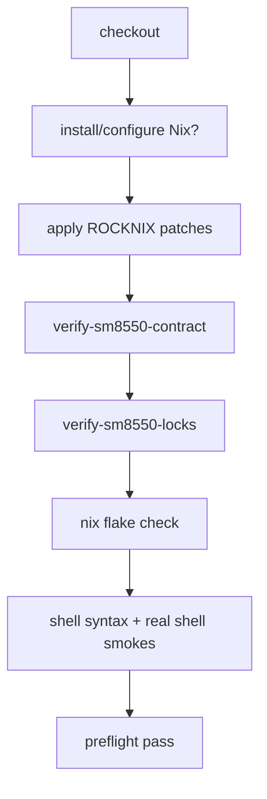

# Flow review — test/check placement refactor

Scope reviewed: root `flake.nix`, `guest/scripts/static-checks.sh`, Steam package tests, CI workflows, SM8550 verify scripts, and current docs/thinking notes for the test-boundary refactor. No implementation changes were made.

## User Flows

1. **Local developer source-contract check**
   - Entry point: README/guest README validation commands, or a developer running preflight-equivalent checks before pushing.
   - Decision points:
     - Does the developer need only source/Nix contract validation, or also patched ROCKNIX/artifact validation?
     - Is Nix installed locally, and should the command build package outputs or only evaluate contracts?
   - Happy path: run canonical `nix flake check --no-write-lock-file --print-build-logs` for Nix-owned invariants, then run a small shell smoke/syntax command for real shell behavior.
   - Terminal states: pass; Nix contract failure with named check; shell smoke failure; skipped expensive image/artifact validation by design.

2. **Implementer migrates `guest-input-boundary-contract` out of `flake.nix`**
   - Entry point: edit `flake.nix:213-243` and create `nix/tests/guest-input-boundary-contract.nix`.
   - Happy path: keep the same evaluated assertions over `baseConfiguration` and `devEnvConfiguration`, but move the body to `nix/tests/`; `flake.nix` only wires a check attr with the same name.
   - Terminal states: check still passes with identical semantics; failure if the imported test creates a self-reference/cycle or accidentally evaluates impure `selectDeviceProfileFromCompatible`.

3. **Implementer splits `guest/scripts/static-checks.sh`**
   - Entry point: current monolithic `checks.static` and CI `guest/scripts/static-checks.sh` calls.
   - Decision points:
     - Can the invariant be proven from evaluated flake/package/NixOS config?
     - Is it a real shell/runtime smoke?
     - Is it a docs/patch/lock/artifact check outside Nix evaluation?
   - Happy path: flake shape, module/systemd/tmpfiles/package-output contracts move to focused `nix/tests/*.nix`; Steam runtime-prep/run smokes remain shell; docs wording moves to a dedicated docs contract or review-only path.
   - Terminal states: migrated Nix check failure; retained shell smoke failure; deliberately removed brittle wording assertion.

4. **CI preflight after refactor**

   - Entry point: `.github/workflows/preflight.yml` on PR/push/manual.
   - Current pattern: no Nix install; direct shell calls to `scripts/apply-rocknix-patches`, `scripts/verify-sm8550-contract`, `scripts/verify-sm8550-locks`, `bash -n scripts/*`, and `guest/scripts/static-checks.sh`.
   - Happy path: preflight gains explicit Nix setup and calls the canonical flake checks without dropping patch/lock guards.
   - Terminal states: Nix unavailable/setup failure; patch application failure; lock/package mismatch; Nix check failure; shell smoke failure.

5. **SM8550 build/image workflows after refactor**
   - Entry point: `build-sm8550.yml`, `prepare-sm8550-base.yml`, `continue-sm8550-from-toolchain.yml`, `build-image-only.yml`, or local `scripts/build-sm8550`.
   - Happy path: retain the existing cheap guard order before Docker/ROCKNIX work, then continue to build stages, then keep `scripts/verify-sm8550-payloads` after image/manifest production.
   - Terminal states: early patch/lock/Nix contract failure; Docker/build failure; post-build payload failure.

6. **Steam package validation after split**
   - Entry point: package changes under `packages/steam/`.
   - Happy path: Nix package-output check builds/inspects `$out/bin/*` and `$out/nix-support/rocknix-steam-bootstrap/manifest.txt`; shell smokes execute real scripts against temp fixture trees for missing-env, `--check`, mutation, and `--run` behavior.
   - Terminal states: Nix package-output mismatch; shell runtime behavior regression.

7. **Operator/device soak validation**
   - Entry point: `docs/contracts/layer14-soak-checklist.md` currently directs operators to `/usr/lib/rocknix-guest-substrate/guest/scripts/static-checks.sh` on device.
   - Happy path after refactor is unspecified: either a reduced packaged shell smoke remains at that path, or the soak checklist changes to a new packaged command.
   - Terminal states: on-device command missing; on-device check no longer covers required packaged-source sanity; docs point to stale path.

## Gaps

### Critical

1. **CI cannot simply switch to `nix flake check` without installing Nix.**
   - Missing: `.github/workflows/preflight.yml` and the build workflows do not currently set up Nix; grep found no `install-nix`/Cachix/Determinate setup. Today they work with shell and Docker only.
   - Why it matters: the proposed canonical gate will fail before exercising any tests on GitHub-hosted Ubuntu runners unless the plan specifies Nix installation, experimental features, cache policy, and whether this applies to preflight only or every build job.
   - Existing pattern/default: keep shell guard steps as-is, add an explicit Nix setup step before flake checks, and start in preflight before duplicating in long build jobs.

2. **Patch/lock safety sequencing is underspecified.**
   - Missing: where `scripts/apply-rocknix-patches`, `scripts/verify-sm8550-contract`, and `scripts/verify-sm8550-locks` sit relative to new flake checks, especially if a future `nix/tests/rocknix-patch-contract.nix` also applies patches.
   - Why it matters: `verify-sm8550-locks` requires generated `work/rocknix/.../package.mk`; `apply-rocknix-patches` also stages contract docs into the patched tree. Running Nix checks first, or replacing the shell patch flow too early, can drop the current fail-closed guard before Docker work.
   - Existing pattern/default: preserve `apply patches -> verify patched contract -> verify locks` before any Docker/image stage; make Nix checks additive until the Nix patch-contract check proves identical patched-tree and staged-doc behavior.

3. **The on-device packaged check contract may break.**
   - Missing: whether `/usr/lib/rocknix-guest-substrate/guest/scripts/static-checks.sh` remains, is renamed, or is replaced. The soak checklist explicitly requires it.
   - Why it matters: operators and the ROCKNIX packaged source use that path as a device-side sanity check. Removing or shrinking it without a replacement creates a stale acceptance flow even if CI passes.
   - Existing pattern/default: keep a compatibility command at the same path that runs only packaged shell/source smoke, or update both the substrate packaging patch and soak checklist in the same unit.

4. **Migration could lose negative safety assertions.**
   - Missing: a one-to-one inventory of current positive and negative assertions from `static-checks.sh` and their destinations. The script has many critical negative guards: no Korri imports, no retired rootfs aliases, no hardcoded `/dev/uinput c 10 223`, no `/run/user/0` env hardcoding, no Steam session/storage policy, no host reclaim docs regressions.
   - Why it matters: moving only happy-path evaluated values will miss anti-pattern regressions that were added from hard-won runtime incidents.
   - Existing pattern/default: require a migration matrix with statuses: `moved to Nix eval`, `kept as shell grep because source/policy-only`, `moved to docs contract`, or `intentionally retired with rationale`.

5. **Cost boundary for package-output checks is not defined.**
   - Missing: which checks are allowed to build heavy packages in preflight. Steam is already built by `checks.steam-package-contract`; Cemu has expensive build/characterization logic in `installPhase`, and adding it to `nix flake check` may make cheap CI no longer cheap.
   - Why it matters: docs emphasize avoiding long SM8550/build loops for source contracts. If `nix flake check` starts compiling Cemu or cross-building aarch64 outputs on x86, preflight can become too slow or fail for the wrong reason.
   - Existing pattern/default: separate eval-only NixOS/flake checks from package-output checks, and wire expensive package builds only where package changes or explicit package lanes need them.

### Important

6. **The `nix/tests/*.nix` test interface is not specified.**
   - Missing: expected import arguments, whether tests return derivations or assertion data, and how common helpers are shared.
   - Why it matters: ad hoc imports can create cycles through `self`, duplicate configuration construction, or make tests hard to compose per system.
   - Existing pattern/default: mirror the current inline `assertContract` + `builtins.toFile` + `pkgs.runCommand` style; pass `{ self, nixpkgs, system, pkgs, lib, configurations ? ... }` explicitly; avoid a generic framework unless repetition proves it useful.

7. **Extracting `guest-input-boundary-contract` can create evaluation cycles.**
   - Missing: whether `baseConfiguration` and `devEnvConfiguration` remain in `flake.nix`, move into the test, or become shared helper values.
   - Why it matters: a test imported from `flake.nix` that reads `self.checks` or re-enters `outputs` can recurse; a test that reconstructs configs differently can silently change coverage.
   - Existing pattern/default: keep the exact config construction near the check wiring for the first extraction, pass evaluated configs into the imported test, and only refactor shared config helpers afterward.

8. **Pure vs impure patch/Korri proof boundary is unresolved.**
   - Missing: whether `scripts/verify-korri-promotion-proof` becomes a flake check, remains a named manual/impure proof, or is split. It currently does network-like flake metadata/eval and is only indirectly guarded by static greps.
   - Why it matters: putting impure external Korri resolution in `nix flake check` can make the canonical source gate flaky; leaving it only as a grep can miss real target drift.
   - Existing pattern/default: keep it separate from cheap pure checks unless it is redesigned with pinned inputs/fixed-output sources; document it as an explicit manual/impure proof.

9. **Docs contract ownership is ambiguous.**
   - Missing: which docs wording checks are product artifacts worth automating. Current `static-checks.sh` checks README, retired rootfs seed workflow text, Layer 6-14 docs, HOW-TO-FALL-BACK, and performance-audit wording.
   - Why it matters: removing all docs greps may drop host/product safety docs that `apply-rocknix-patches` stages into the substrate package; keeping them in guest shell keeps the layering violation.
   - Existing pattern/default: create a separate `docs-contract` check for docs that are packaged or referenced by host substrate; retire only non-contract wording checks.

10. **Per-system behavior is not defined.**
   - Missing: which checks run on `x86_64-linux` vs `aarch64-linux`, and whether CI runs current-system only or all systems. The flake exposes both host systems, while target NixOS configs are `aarch64-linux`.
   - Why it matters: a package-output check that expects `steam-arm64-fhs` must account for its aarch64-only behavior; an all-systems check on x86 can fail or become too expensive.
   - Existing pattern/default: keep eval contracts system-independent where possible; make package-output checks conditional in the same way `steam-package-contract.sh` currently conditionally checks `steam-arm64-fhs` only when the manifest claims it.

11. **Shell smoke split does not name the replacement command.**
   - Missing: whether `guest/scripts/static-checks.sh` becomes `guest/scripts/shell-smoke.sh`, `scripts/check-shell-syntax`, a `nix/tests/shell-smoke.nix` wrapper, or several package-local commands.
   - Why it matters: CI/docs/users need a stable command; without one, implementers may leave duplicated calls or remove smokes from CI accidentally.
   - Existing pattern/default: keep package-local Steam smokes under `packages/steam/tests/`; add one repo-level shell check command that only dispatches shell syntax and real shell behavior.

12. **Build workflow update scope is broader than preflight.**
   - Missing: exact workflow/script list for updates. The current guard block appears in `preflight.yml`, `build-sm8550.yml` multiple jobs, `prepare-sm8550-base.yml`, `continue-sm8550-from-toolchain.yml`, `build-image-only.yml`, and local `scripts/build-sm8550`.
   - Why it matters: if only preflight changes, long-running manual workflows can accept drift that PR preflight would reject, or vice versa.
   - Existing pattern/default: update every existing block that already runs `verify-sm8550-locks`; do not add artifact verification to source-only preflight.

13. **`flake.nix` check name compatibility is not addressed.**
   - Missing: whether existing check attrs `static`, `steam-package-contract`, and `guest-input-boundary-contract` remain as aliases during the transition.
   - Why it matters: docs, local habits, and any external consumers may call `nix build .#checks.<system>.static` or `.steam-package-contract`.
   - Existing pattern/default: preserve old check names as thin aliases or transitional aggregators for one refactor, then document any rename.

14. **Boundary checks that are source-level by nature need a home.**
   - Missing: treatment for rules such as “packages must not import devices,” “Steam scripts must not contain `/storage`/`systemctl`/`swaymsg`,” or “flake must not include Korri input.” Some are not fully represented in evaluated NixOS config.
   - Why it matters: forcing them into Nix eval may make them weaker; deleting them removes important architecture guardrails.
   - Existing pattern/default: keep a small, explicitly named boundary lint for source-policy anti-patterns, separate from shell runtime smoke.

### Minor

15. **Documentation examples will become stale unless updated last and comprehensively.**
   - Missing: README, guest README, package READMEs, soak checklist, and active acceptance docs still point to old commands.
   - Why it matters: users will keep running `guest/scripts/static-checks.sh` after the canonical gate changes.
   - Existing pattern/default: update docs after check names settle; include both cheap source checks and artifact/device gates.

16. **Failure-message conventions are not stated for Nix checks.**
   - Missing: Nix check failure messages should retain the clarity of existing Bash `fail` strings.
   - Why it matters: splitting one monolith into many checks improves localization only if each assertion names the contract and expected value.
   - Existing pattern/default: keep `assertContract condition "human-readable invariant"` style and name each flake check by contract area.

17. **No TypeScript/Bun path should be introduced.**
   - Missing: the plan mentions TS/Bun policy in research, but this repo has no TS/Node surface.
   - Why it matters: adding JS tooling for “test placement” would create unrelated maintenance work.
   - Existing pattern/default: do not add TS/Bun tests for this refactor.

## Questions

1. **Should CI preflight install Nix and run `nix flake check`, or should it build specific `checks.x86_64-linux.*` attrs?**
   - Stakes: blocks implementation of CI changes; GitHub runners currently have no Nix setup.
   - Default assumption: install Nix in preflight and run `nix flake check --no-write-lock-file --print-build-logs` for current system only, plus explicit package checks only when needed.

2. **What is the required guard order in preflight and build workflows after the refactor?**
   - Stakes: patch/lock drift must still fail before Docker/ROCKNIX builds and before artifact upload.
   - Default assumption: `apply-rocknix-patches -> verify-sm8550-contract -> verify-sm8550-locks -> nix flake check -> shell smoke/syntax` for preflight; same patch/lock guard remains before each image/build stage.

3. **What command should replace the on-device `/usr/lib/rocknix-guest-substrate/guest/scripts/static-checks.sh` soak step?**
   - Stakes: current Layer 14 soak checklist and packaged substrate expectations break if the script is removed or renamed.
   - Default assumption: keep that path as a reduced compatibility shell smoke until the substrate package and soak docs are updated together.

4. **Which current `static-checks.sh` assertions are allowed to be retired rather than moved?**
   - Stakes: prevents accidental deletion of negative safety checks added for known incidents.
   - Default assumption: none are retired without a migration matrix entry and rationale.

5. **Should expensive package-output checks such as Cemu build characterization run in default `nix flake check`?**
   - Stakes: can turn cheap preflight into a long build and blur source-contract vs package-build validation.
   - Default assumption: default flake check includes eval and lightweight package-output checks only; expensive package builds are separate named checks or package-specific CI.

6. **Should the ROCKNIX patch contract be converted to a pure Nix check in this refactor, or left as shell preflight for now?**
   - Stakes: affects network/purity, duplicate patch application, and doc staging behavior.
   - Default assumption: leave shell patch application/verification as the authoritative pre-build guard in this refactor; add a Nix patch-contract only after its source/fetch/staging semantics are specified.

7. **What is the import contract for files under `nix/tests/*.nix`?**
   - Stakes: avoids cycles and inconsistent check implementations.
   - Default assumption: each file returns a derivation and accepts explicit `{ pkgs, lib, self, system, ... }` arguments; common helpers stay tiny and local.

8. **Should `scripts/verify-korri-promotion-proof` become part of canonical automation?**
   - Stakes: it is meaningful but currently impure/heavier than cheap static checks.
   - Default assumption: keep it manual/explicit and documented; do not run it in default flake check until pure inputs are available.

9. **Which docs are contract artifacts that need automated checks?**
   - Stakes: docs staged into ROCKNIX substrate are operational safety artifacts, but generic wording greps are brittle.
   - Default assumption: automate only packaged/operator contract docs (`layer14-main-space-contract.md`, `layer14-soak-checklist.md`, `HOW-TO-FALL-BACK.md`, retired rootfs workflow notice if still safety-critical); move the rest to review.

10. **Do old check attr names need a compatibility window?**
    - Stakes: avoids breaking local commands and any external consumers.
    - Default assumption: keep `guest-input-boundary-contract` name; keep `static` as a transitional aggregate or alias to the new shell/source check for one cycle; replace `steam-package-contract` with a same-named Nix package-output check if possible.

## Recommended Next Steps

1. Before implementation, create a migration matrix for `guest/scripts/static-checks.sh` covering every assertion block and destination: Nix eval, Nix package-output, shell smoke, boundary lint, docs contract, patch/lock verifier, or retired.
2. Decide Questions 1-3 before touching CI or renaming scripts; they affect every user flow.
3. Extract `guest-input-boundary-contract` first with no semantic changes and keep its check attr name unchanged.
4. Add a minimal `nix/tests/` interface and one or two focused checks before moving broad static blocks; verify with `nix build .#checks.$(nix eval --raw --impure --expr builtins.currentSystem).guest-input-boundary-contract` or equivalent.
5. Keep patch/lock/payload shell verifiers in place during the first refactor. Do not replace `scripts/verify-sm8550-payloads`; it is a post-image artifact gate.
6. Add CI Nix setup explicitly in preflight, then run the canonical flake check alongside existing patch/lock guards. Expand to long build workflows only after preflight is stable.
7. Preserve or deliberately replace the on-device packaged static-check path and update `docs/contracts/layer14-soak-checklist.md` in the same change.
8. Update README/guest README/package docs last, after command names and compatibility aliases are settled.
